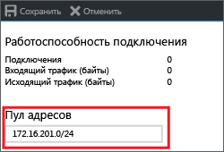

# <a name="configure-a-point-to-site-connection-to-a-vnet-using-native-azure-certificate-authentication-azure-portal"></a>Настройка подключения "точка — сеть" к виртуальной сети с использованием собственной аутентификации Azure на основе сертификата и портала Azure

В этой статье показано, как создать виртуальную сеть с подключением "точка — сеть" в модели развертывания Resource Manager с помощью портала Azure. В этой конфигурации для аутентификации используются сертификаты. При такой конфигурации проверку сертификата выполняет VPN-шлюз Azure, а не сервер RADIUS. Эту конфигурацию также можно создать с помощью разных средств или моделей развертывания, выбрав вариант из следующего списка:

> [!div class="op_single_selector"]
> * [Портал Azure](vpn-gateway-howto-point-to-site-resource-manager-portal.md)
> * [PowerShell](vpn-gateway-howto-point-to-site-rm-ps.md)
> * [Портал Azure (классический)](vpn-gateway-howto-point-to-site-classic-azure-portal.md)
>
>

VPN-шлюз типа "точка — сеть" (P2S) позволяет создать безопасное подключение к виртуальной сети с отдельного клиентского компьютера. VPN-подключения типа "точка — сеть" (P2S) эффективны для подключения к виртуальной сети из удаленного расположения, например, если вы дома или на конференции. Такая конфигурация также эффективна для использования вместо VPN-подключения типа "сеть — сеть" при наличии небольшого количества клиентов, которым требуется подключение к виртуальной сети. VPN-подключение "точка — сеть" устанавливается на устройствах Windows и Mac.

Клиенты могут использовать один из следующих способов аутентификации при подключении:

* сервер RADIUS;
* собственная аутентификация Azure на основе сертификата с использованием VPN-шлюза.

В этой статье описано, как настроить конфигурацию для подключений "точка — сеть" с использованием собственной аутентификации Azure на основе сертификата. См. дополнительные сведения об [использовании сервера RADIUS для аутентификации пользователей при подключении "точка — сеть"](point-to-site-how-to-radius-ps.md).


Для подключения типа "точка — сеть" не требуется VPN-устройство или общедоступный IP-адрес. Подключение "точка — сеть" — это VPN-подключение по протоколу SSTP (Secure Socket Tunneling Protocol) или IKEv2.

* SSTP представляет собой VPN-туннель на основе SSL, который поддерживается только на клиентских платформах Windows. Этот туннель проходит через брандмауэры и является отличным вариантом для подключения к Azure из любого расположения. На стороне сервера поддерживается SSTP версии 1.0, 1.1 и 1.2. Какую версию использовать, решает клиент. Для Windows 8.1 и более поздних версий по умолчанию используется SSTP версии 1.2.

* IKEv2 VPN — решение VPN на основе стандартов IPsec. IKEv2 VPN можно использовать для подключения с устройств Mac (OSX версии 10.11 и выше).

Для собственной аутентификации Azure на основе сертификата при подключениях "точка — сеть" необходимо следующее:

* VPN-шлюз с маршрутизацией на основе маршрутов.
* Открытый ключ (CER-файл) для корневого сертификата, импортированный в Azure. Сразу после передачи сертификат считается доверенным сертификатом и используется для проверки подлинности.
* Сертификат клиента создается из корневого сертификата и устанавливается на каждом клиентском компьютере, подключающемся к виртуальной сети. Этот сертификат используется для проверки подлинности клиента.
* Конфигурация VPN-клиента. Файлы конфигурации VPN-клиента содержат информацию, необходимую для подключения клиента к виртуальной сети. Эти файлы позволяют настроить существующий VPN-клиент, предоставляемый в операционной системе. Перед подключением каждый клиент нужно настроить, используя параметры в файлах конфигурации.

См. дополнительные сведения о [VPN-подключениях "точка — сеть"](point-to-site-about.md).

#### <a name="example"></a>Примеры значений

Следующие значения можно использовать для создания тестовой среды или для лучшего понимания примеров в этой статье.

* **Имя виртуальной сети:** VNet1
* **Адресное пространство:** 192.168.0.0/16<br>В этом примере мы используем только одно адресное пространство, но для виртуальной сети можно настроить несколько.
* **Имя подсети:** FrontEnd
* **Диапазон адресов подсети:** 192.168.1.0/24
* **Подписка**. Если у вас есть несколько подписок, убедитесь, что используется правильная.
* **Группа ресурсов:** TestRG
* **Расположение:** восточная часть США.
* **Подсеть шлюза:** 192.168.200.0/24<br>
* **DNS-сервер:** (необязательный) IP-адрес DNS-сервера, который нужно использовать для разрешения имен.
* **Имя шлюза виртуальной сети:** VNet1GW
* **Тип шлюза:** VPN
* **Тип VPN:** на основе маршрутов
* **Имя общедоступного IP-адреса:** VNet1GWpip
* **Тип подключения:** "точка — сеть"
* **Пул адресов клиента:** 172.16.201.0/24<br>VPN-клиенты, подключающиеся к виртуальной сети с помощью этого подключения типа "точка — сеть", получают IP-адреса из пула адресов клиента.

## <a name="createvnet"></a>1. Создать виртуальную сеть

Прежде чем начать, убедитесь в том, что у вас есть подписка Azure. Если у вас нет подписки Azure, вы можете [активировать преимущества для подписчиков MSDN](https://azure.microsoft.com/pricing/member-offers/msdn-benefits-details) или [зарегистрировать бесплатную учетную запись](https://azure.microsoft.com/pricing/free-trial).
[!INCLUDE [Basic Point-to-Site VNet](../../includes/vpn-gateway-basic-p2s-vnet-rm-portal-include.md)]

## <a name="gatewaysubnet"></a>2. Добавление подсети шлюза

Прежде чем подключать шлюз к виртуальной сети, нужно создать подсеть шлюза для виртуальной сети, к которой необходимо подключиться. Службы шлюза используют IP-адреса, указанные в подсети шлюза. По возможности создайте подсеть шлюза с использованием блока CIDR с маской /28 или /27, чтобы обеспечить достаточно IP-адресов для удовлетворения будущих дополнительных требований к конфигурации.

[!INCLUDE [vpn-gateway-add-gwsubnet-rm-portal](../../includes/vpn-gateway-add-gwsubnet-p2s-rm-portal-include.md)]

## <a name="dns"></a>3. Выбор DNS-сервера (необязательно)

После создания виртуальной сети можно добавить IP-адрес DNS-сервера для обработки разрешения имен. DNS-сервер не является обязательным для этой конфигурации, но он потребуется при разрешении имен. Если указать значение, DNS-сервер не создается. Необходимо указать IP-адрес DNS-сервера, который может разрешать имена для ресурсов, к которым вы подключаетесь. В этом примере мы использовали частный IP-адрес, но, скорее всего, это не IP-адрес DNS-сервера. Подставьте собственные значения. Указанное значение используется для ресурсов, развертываемых в виртуальной сети, а не для подключений типа "точка — сеть" или VPN-клиентов.

[!INCLUDE [vpn-gateway-add-dns-rm-portal](../../includes/vpn-gateway-add-dns-rm-portal-include.md)]

## <a name="creategw"></a>4. Создание шлюза виртуальной сети

[!INCLUDE [create-gateway](../../includes/vpn-gateway-add-gw-p2s-rm-portal-include.md)]

## <a name="generatecert"></a>5. Создайте сертификаты.

Сертификаты используются в Azure для проверки подлинности клиентов, подключающихся к виртуальной сети с помощью подключения "точка — сеть". После получения корневого сертификата необходимо [отправить](#uploadfile) сведения об открытом ключе в Azure. После этого действия корневой сертификат считается "доверенным" в Azure для подключения к виртуальной сети через подключение типа "точка — сеть". Необходимо также создать сертификат клиента на основе доверенного корневого сертификата, а затем установить их на каждом клиентском компьютере. Сертификат клиента используется для проверки подлинности клиента, когда он инициирует подключение к виртуальной сети. 

### <a name="getcer"></a>1. Получение CER-файла для корневого сертификата

[!INCLUDE [root-certificate](../../includes/vpn-gateway-p2s-rootcert-include.md)]

### <a name="generateclientcert"></a>2. Создание сертификата клиента

[!INCLUDE [generate-client-cert](../../includes/vpn-gateway-p2s-clientcert-include.md)]

## <a name="addresspool"></a>6. Добавление пула адресов клиента

Пул адресов клиента представляет собой диапазон частных IP-адресов, указанных вами. Клиенты, которые подключаются через подключение типа "точка — сеть", получают IP-адреса из этого диапазона. Используйте диапазон частных IP-адресов, не пересекающихся с локальным расположением, из которого будет выполняться подключение, или виртуальной сетью, к которой вы хотите подключиться.

1. После создания шлюза виртуальной сети перейдите к разделу **Параметры** на странице шлюза виртуальной сети. В разделе **Параметры** щелкните **Point-to-site configuration** (Конфигурация "точка — сеть"), чтобы открыть страницу **Point-to-site configuration** (Конфигурация "точка — сеть").

  
2. На странице **Point-to-Site-Configuration** (Конфигурация "точка — сеть") можно удалить автоматически заполненный диапазон, а затем добавить диапазон частных IP-адресов, который вы хотите использовать. Щелкните **Сохранить**, чтобы проверить и сохранить настройки.

  

## <a name="uploadfile"></a>7. Отправка данных об открытом ключе корневого сертификата

После создания шлюза нужно передать сведения об открытом ключе доверенного корневого сертификата в Azure. После отправки общедоступных данных сертификата Azure сможет использовать их для проверки подлинности клиентов, на которых установлен клиентский сертификат, созданный из доверенного корневого сертификата. Всего вы можете отправить до 20 дополнительных доверенных корневых сертификатов.

1. Сертификаты добавляются на страницу **Point-to-site configuration** (Конфигурация "точка — сеть") в колонку **Корневой сертификат**.  
2. Корневой сертификат необходимо экспортировать в виде CER-файла X.509 в кодировке Base64. Это позволит открыть сертификат в текстовом редакторе.
3. Откройте сертификат в текстовом редакторе, например в блокноте. При копировании данных сертификата обязательно скопируйте текст как одну непрерывную строку без символов возврата каретки и перевода строки. Может потребоваться изменить параметры представления в текстовом редакторе, чтобы показать символы или показать все знаки и просмотреть символы возврата каретки и перевода строки. Скопируйте только указанный ниже раздел как одну непрерывную строку.

  
4. Вставьте данные сертификата в поле **Данные общедоступного сертификата**. Введите имя сертификата в поле **Имя**, затем нажмите кнопку **Сохранить**. Вы можете добавить до 20 доверенных корневых сертификатов.

  

## <a name="installclientcert"></a>8. Установка экспортированного сертификата клиента

Если вы хотите создать подключение типа "точка — сеть" на клиентском компьютере, отличном от того, который использовался для создания сертификатов клиентов, необходимо установить сертификат клиента. При установке сертификата клиента потребуется пароль, созданный при экспорте сертификата клиента.

Убедитесь, что сертификат клиента был экспортирован как PFX-файл вместе со всей цепочкой сертификатов (это значение по умолчанию). В противном случае данные корневого сертификата будут отсутствовать на клиентском компьютере и клиент не сможет пройти проверку должным образом.

Дополнительные сведения см. в руководстве по [установке сертификата клиента](point-to-site-how-to-vpn-client-install-azure-cert.md).

## <a name="clientconfig"></a>9. Создание и установка пакета конфигурации VPN-клиента

Файлы конфигурации VPN-клиента содержат параметры для настройки устройств, которые подключаются к виртуальной сети с использованием подключения типа "точка — сеть". Дополнительные сведения см. в инструкциях по [созданию и установке файлов конфигурации VPN-клиента для собственной аутентификации Azure на основе сертификата при подключениях типа "точка — сеть"](point-to-site-vpn-client-configuration-azure-cert.md).

## <a name="connect"></a>10. Подключение к Azure

### <a name="to-connect-from-a-windows-vpn-client"></a>Подключение из VPN-клиента для Windows

1. Чтобы подключиться к виртуальной сети, откройте VPN-подключения на клиентском компьютере и найдите созданное VPN-подключение. Его имя совпадает с названием вашей виртуальной сети. Щелкните **Подключить**. Может появиться всплывающее сообщение об использовании сертификата. В таком случае щелкните **Продолжить**, чтобы использовать более высокий уровень привилегий.

2. На странице состояния **подключения** щелкните **Подключить**. Если появится окно **Выбор сертификата**, убедитесь в том, что отображается сертификат клиента, с помощью которого вы хотите подключиться к сети. Если окно не появится, выберите нужный сертификат в раскрывающемся списке и нажмите кнопку **ОК**.

  
3. Теперь подключение установлено.

  

#### <a name="troubleshoot-windows-p2s-connections"></a>Устранение неполадок с подключением Windows типа "точка — сеть"

[!INCLUDE [verifies client certificates](../../includes/vpn-gateway-certificates-verify-client-cert-include.md)]

### <a name="to-connect-from-a-mac-vpn-client"></a>Подключение из VPN-клиента для Mac

В диалоговом окне Network (Сеть) найдите необходимый клиентский профиль и нажмите кнопку **Connect** (Подключиться).

  

## <a name="verify"></a>Проверка подключения

Эти инструкции применимы к клиентам Windows.

1. Чтобы проверить, активно ли VPN-подключение, откройте окно командной строки от имени администратора и выполните команду *ipconfig/all*.
2. Просмотрите результаты. Обратите внимание, что полученный вами IP-адрес — это один из адресов в пуле адресов VPN-клиента подключения "точка–cеть", указанном в конфигурации. Вы должны увидеть результат, аналогичный приведенному ниже.

  ```
  PPP adapter VNet1:
      Connection-specific DNS Suffix .:
      Description.....................: VNet1
      Physical Address................:
      DHCP Enabled....................: No
      Autoconfiguration Enabled.......: Yes
      IPv4 Address....................: 172.16.201.3(Preferred)
      Subnet Mask.....................: 255.255.255.255
      Default Gateway.................:
      NetBIOS over Tcpip..............: Enabled
  ```

## <a name="connectVM"></a>Подключение к виртуальной машине

Эти инструкции применимы к клиентам Windows.

[!INCLUDE [Connect to a VM](../../includes/vpn-gateway-connect-vm-p2s-include.md)]

## <a name="add"></a>Добавление и удаление доверенного корневого сертификата

Вы можете добавлять доверенные корневые сертификаты в Azure, а также удалять их из Azure. При удалении корневого сертификата клиенты, использующие сертификат, созданный из этого корневого сертификата, не смогут пройти проверку подлинности и поэтому не смогут подключиться. Чтобы клиенты могли проходить аутентификацию и подключаться, необходимо установить новый сертификат клиента, созданный на основе корневого сертификата, который является доверенным для Azure (то есть он передан в Azure).

### <a name="to-add-a-trusted-root-certificate"></a>Добавление доверенного корневого сертификата

В Azure можно добавить до 20 CER-файлов доверенных корневых сертификатов. Дополнительные сведения см. в разделе [Отправка доверенного корневого сертификата](#uploadfile) в этой статье.

### <a name="to-remove-a-trusted-root-certificate"></a>Удаление доверенного корневого сертификата

1. Чтобы удалить доверенный корневой сертификат, перейдите на страницу **Point-to-site configuration** (Конфигурация "точка — сеть") вашего шлюза виртуальной сети.
2. В разделе страницы**Root certificate** (Корневой сертификат) найдите сертификат, который требуется удалить.
3. Нажмите кнопку с многоточием рядом с сертификатом, а затем щелкните "Удалить".

## <a name="revokeclient"></a>Отмена сертификата клиента

Можно отозвать сертификаты клиента. Список отзыва сертификатов позволяет выборочно запрещать подключение типа "точка-сеть" на основе отдельных сертификатов клиента. Эта процедура отличается от удаления доверенного корневого сертификата. При удалении доверенного корневого сертификата (CER-файл) из Azure будет запрещен доступ для всех сертификатов клиента, созданных на основе отозванного корневого сертификата или подписанных им. Отзыв сертификата клиента, а не корневого сертификата, позволяет по-прежнему использовать другие сертификаты, созданные на основе корневого сертификата, для проверки подлинности.

Обычно корневой сертификат используется для управления доступом на уровнях группы или организации, а отозванный сертификат клиента — для точного контроля доступа для отдельных пользователей.

### <a name="revoke-a-client-certificate"></a>Отзыв сертификата клиента

Вы можете отозвать сертификат клиента, добавив отпечаток в список отзыва.

1. Получите отпечаток сертификата клиента. Дополнительные сведения см. в статье [Практическое руководство. Извлечение отпечатка сертификата](https://msdn.microsoft.com/library/ms734695.aspx).
2. Скопируйте данные в текстовый редактор и удалите все пробелы, чтобы предоставить отпечаток в виде непрерывной строки.
3. Перейдите к странице шлюза виртуальной сети **Point-to-site-configuration** (Конфигурация "точка — сеть"). Это та же колонка, которая использовалась для [отправки доверенного корневого сертификата](#uploadfile).
4. В разделе **Отозванные сертификаты** введите понятное имя сертификата (это не должно быть общее имя).
5. Скопируйте и вставьте строку отпечатка в поле **Отпечаток**.
6. Отпечаток будет проверен и автоматически добавлен в список отзыва. На экране появится сообщение о том, что список обновляется. 
7. После применения изменений сертификат больше не будет использоваться для подключения. Клиенты, пытающиеся подключиться с помощью этого сертификата, получат сообщение, что он недействителен.

## <a name="faq"></a>Часто задаваемые вопросы о подключениях типа "точка — сеть"

[!INCLUDE [Point-to-Site FAQ](../../includes/vpn-gateway-faq-p2s-azurecert-include.md)]

## <a name="next-steps"></a>Дополнительная информация
Установив подключение, можно добавить виртуальные машины в виртуальные сети. Дополнительные сведения о виртуальных машинах см. [здесь](https://docs.microsoft.com/azure/#pivot=services&panel=Compute). Дополнительные сведения о сетях и виртуальных машинах см. в статье [Azure и Linux: обзор сетей виртуальных машин](../virtual-machines/linux/azure-vm-network-overview.md).
