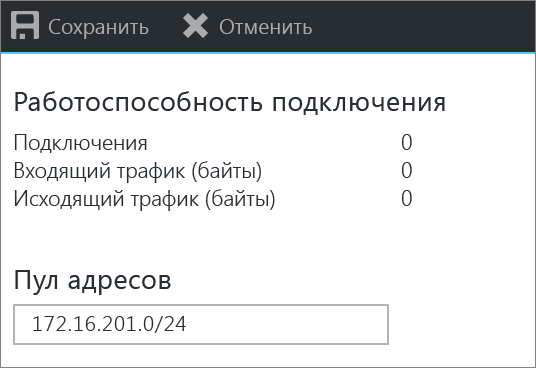
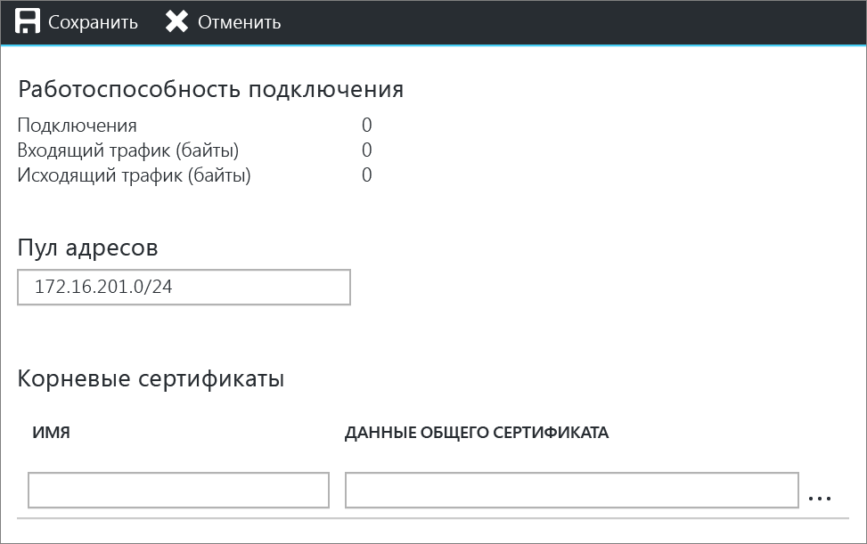
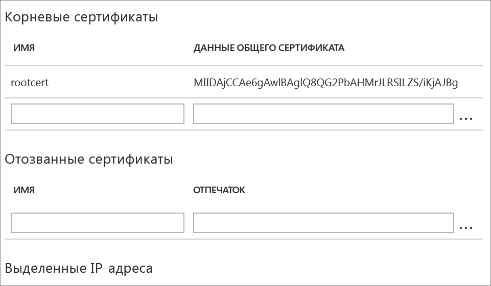

# Настройка подключения типа "точка — сеть" к виртуальной сети с помощью портала Azure
> [!div class="op_single_selector"]
> * [Resource Manager — портал Azure](vpn-gateway-howto-point-to-site-resource-manager-portal.md)
> * [Resource Manager — PowerShell](vpn-gateway-howto-point-to-site-rm-ps.md)
> * [Классическая модель — портал Azure](vpn-gateway-howto-point-to-site-classic-azure-portal.md)
> 
> 

Конфигурация типа "точка — сеть" позволяет создать безопасное подключение к виртуальной сети с отдельного клиентского компьютера. Это эффективное решение для подключения к виртуальной сети из удаленного расположения, например, если вы находитесь дома или на конференции либо если подключение к виртуальной сети требуется всего нескольким клиентам. 

Для подключения типа "точка–сеть" не требуется VPN-устройство или общедоступный IP-адрес. VPN-подключение сначала устанавливается с локального клиентского компьютера. Дополнительные сведения о подключениях типа "точка — сеть" см. в статьях [VPN-шлюз: вопросы и ответы](vpn-gateway-vpn-faq.md#point-to-site-connections) и [Планирование и проектирование VPN-шлюза](vpn-gateway-plan-design.md).

В этой статье рассматривается создание виртуальной сети с подключением типа "точка — сеть" в модели развертывания Resource Manager с помощью портала Azure.

### Модели и методы развертывания для подключений типа "точка — сеть"
[!INCLUDE [deployment models](../../includes/vpn-gateway-deployment-models-include.md)]

В следующей таблице представлены две модели развертывания и доступные методы развертывания для конфигурации "точка — сеть". Когда появится статья с руководством по конфигурации, мы разместим прямую ссылку на нее в этой таблице.

[!INCLUDE [vpn-gateway-clasic-rm](../../includes/vpn-gateway-table-point-to-site-include.md)]

## Базовый рабочий процесс

### Примеры значений
* **Имя: VNet1**.
* **Адресное пространство: 192.168.0.0/16**. В этом примере мы используем только одно адресное пространство, но для виртуальной сети можно настроить несколько.
* **Имя подсети: FrontEnd**.
* **Диапазон адресов подсети: 192.168.1.0/24**.
* **Подписка**. Если у вас есть несколько подписок, убедитесь, что используется правильная.
* **Группа ресурсов: TestRG**.
* **Расположение: восточная часть США**.
* **Подсеть шлюза: 192.168.200.0/24**.
* **Имя шлюза виртуальной сети: VNet1GW**.
* **Тип шлюза: VPN**.
* **Тип VPN: на основе маршрутов**.
* **Общедоступный IP-адрес: VNet1GWpip**.
* **Тип подключения: "точка — сеть"**.
* **Пул адресов клиента: 172.16.201.0/24**. VPN-клиенты, подключающиеся к виртуальной сети с помощью этого подключения типа "точка — сеть", получают IP-адреса из пула адресов клиента.

## Подготовка
* Убедитесь в том, что у вас уже есть подписка Azure. Если у вас нет подписки Azure, вы можете [активировать преимущества для подписчиков MSDN](https://azure.microsoft.com/pricing/member-offers/msdn-benefits-details/) или [зарегистрировать бесплатную учетную запись](https://azure.microsoft.com/pricing/free-trial/).

## Часть 1. Создание виртуальной сети
Если вы создаете эту конфигурацию в качестве упражнения, можно использовать [примеры значений](#example).

[!INCLUDE [vpn-gateway-basic-vnet-rm-portal](../../includes/vpn-gateway-basic-vnet-rm-portal-include.md)]

### 2) Добавление дополнительного адресного пространства и подсетей
После создания виртуальной сети в нее можно добавить дополнительное адресное пространство и подсети.

[!INCLUDE [vpn-gateway-additional-address-space](../../includes/vpn-gateway-additional-address-space-include.md)]

### 3. Создание подсети шлюза
Прежде чем подключать шлюз к виртуальной сети, нужно создать подсеть шлюза для виртуальной сети, к которой необходимо подключиться. По возможности рекомендуется создать подсеть шлюза с использованием блока CIDR с маской /28 или /27, чтобы обеспечить достаточно IP-адресов для удовлетворения дополнительных будущих требований к конфигурации.

Снимки экрана в этом разделе предоставляются в качестве справочного примера. Используйте диапазон адресов подсети шлюза, соответствующий необходимым значениям для вашей конфигурации.

#### Создание подсети шлюза
[!INCLUDE [vpn-gateway-add-gwsubnet-rm-portal](../../includes/vpn-gateway-add-gwsubnet-rm-portal-include.md)]

### 4. Выбор DNS-сервера (необязательно)
[!INCLUDE [vpn-gateway-add-dns-rm-portal](../../includes/vpn-gateway-add-dns-rm-portal-include.md)]

## Часть 2. Создание шлюза виртуальной сети
Для подключений типа "точка — сеть" требуются следующие параметры.

* Тип шлюза: VPN.
* Тип VPN: на основе маршрутов.

### Создание шлюза виртуальной сети
[!INCLUDE [vpn-gateway-add-gw-rm-portal](../../includes/vpn-gateway-add-gw-rm-portal-include.md)]

## Часть 3. Создание сертификатов
Сертификаты используются в Azure для проверки подлинности VPN-клиентов в VPN-подключениях типа "точка — сеть". Данные общедоступного сертификата (а не закрытый ключ) экспортируются в виде CER-файла X.509 в кодировке Base-64 из корневого сертификата, созданного с помощью корпоративного решения, или самозаверяющего корневого сертификата. Затем данные общедоступного сертификата импортируются из корневого сертификата в Azure. Кроме того, нужно создать сертификат клиента из корневого сертификата для клиентов. Для каждого клиента, которому нужно подключаться к виртуальной сети с помощью подключения типа "точка — сеть", требуется установить сертификат клиента, созданный из корневого сертификата.

### 1. Получение CER-файла для корневого сертификата
Если вы пользуетесь корпоративным решением центра сертификации, можно использовать существующую цепочку сертификатов. В противном случае можно создать самозаверяющий корневой сертификат. Один из способов создания самозаверяющего сертификата — средство makecert.

* Если используется корпоративная система для создания сертификатов, необходимо получить CER-файл для нужного корневого сертификата. 
* Если вы не планируете использовать корпоративное решение для создания сертификатов, нужно создать самозаверяющий корневой сертификат. Действия для Windows 10 см. в статье [Работа с самозаверяющими сертификатами для подключений типа "точка — сеть"](vpn-gateway-certificates-point-to-site.md).

1. Чтобы получить CER-файл из сертификата, откройте файл **certmgr.msc** и найдите корневой сертификат. Щелкните самозаверяющий корневой сертификат правой кнопкой мыши, выберите пункт **Все задачи**, а затем — **Экспорт**. Откроется **мастера экспорта сертификатов**.
2. В мастере нажмите кнопку **Далее**, выберите **Нет, не экспортировать закрытый ключ** и снова нажмите кнопку **Далее**.
3. На странице **Формат экспортируемого файла** выберите **Файлы X.509 (.CER) в кодировке Base-64**. Затем щелкните **Далее**. 
4. На странице **Имя экспортируемого файла** нажмите кнопку **Обзор**, чтобы перейти в расположение для экспорта сертификата. В поле **Имя файла**введите имя для файла сертификата. Нажмите кнопку **Далее**.
5. Нажмите кнопку **Готово** , чтобы экспортировать сертификат.

### 2. Создание сертификата клиента
Можно создать уникальный сертификат для каждого клиента, который будет подключаться, или использовать один сертификат для нескольких клиентов. Преимущество уникальных клиентских сертификатов заключается в том, что при необходимости можно отозвать один сертификат. В противном случае, если все используют один и тот же сертификат клиента и нужно отозвать сертификат для одного клиента, потребуется создать и установить новые сертификаты для всех клиентов, которые используют сертификат для проверки подлинности.

* При использовании корпоративного решения для создания сертификатов создайте сертификат клиента с общим именем в формате 'name@yourdomain.com',, а не в формате "доменное_имя\имя_пользователя". 
* Дополнительные сведения об использовании самозаверяющего сертификата для создания сертификата клиента см. в статье [Работа с самозаверяющими сертификатами для подключений типа "точка — сеть"](vpn-gateway-certificates-point-to-site.md).

### 3. Экспорт сертификата клиента
Этот сертификат требуется для проверки подлинности. После создания сертификата клиента его нужно экспортировать. Позже этот сертификат устанавливается на каждый клиентский компьютер.

1. Для экспорта сертификата клиента можно использовать команду *certmgr.msc*. Щелкните правой кнопкой мыши сертификат, который нужно экспортировать, щелкните **Все задачи** и выберите **Экспорт**.
2. Экспортируйте сертификат клиента с закрытым ключом. Это *PFX* -файл. Обязательно запишите или запомните пароль (ключ), который задали для этого сертификата.

## Часть 4. Добавление пула адресов клиента
1. После создания шлюза виртуальной сети перейдите к разделу **Параметры** в колонке шлюза виртуальной сети. В разделе **Параметры** щелкните **Конфигурация "точка — сеть"**, чтобы открыть колонку **Конфигурация**.
   
    
2. **Пул адресов** — это пул IP-адресов, из которого клиенты, осуществляющие подключение, получают IP-адрес. Добавьте пул адресов и щелкните **Сохранить**.
   
    

## Часть 5. Отправка CER-файла корневого сертификата
После создания шлюза CER-файл для доверенного корневого сертификата можно отправить в Azure. Вы можете отправить файлы для 20 корневых сертификатов. Не отправляйте закрытый ключ для корневого сертификата в Azure. После отправки CER-файла он используется в Azure для проверки подлинности клиентов, подключающихся к виртуальной сети.

1. Перейдите к колонке **Конфигурация "точка — сеть"**. CER-файлы необходимо добавить в раздел **Корневой сертификат** этой колонки.
   
    
2. Корневой сертификат необходимо экспортировать в виде CER-файла X.509 в кодировке Base64. Это позволит открыть сертификат в текстовом редакторе.
3. Откройте сертификат в текстовом редакторе, например в блокноте. Скопируйте только следующий раздел:
   
    
4. Вставьте данные сертификата в раздел **Данные общедоступного сертификата** на портале. Укажите имя сертификата в области **Имя** и щелкните **Сохранить**. Вы можете добавить до 20 доверенных корневых сертификатов.
   
    

## Часть 6. Скачивание и установка пакета конфигурации VPN-клиента
На клиентах с подключением к Azure типа "точка — сеть" должны быть установлены сертификат клиента и пакет конфигурации VPN-клиента. Для клиентов Windows доступны пакеты конфигурации VPN-клиента. 

Пакет VPN-клиента содержит данные для настройки программного обеспечения VPN-клиента, встроенного в Windows. Конфигурация зависит от сети VPN, к которой необходимо подключиться. Пакет не устанавливает никакого дополнительного программного обеспечения. Дополнительные сведения см. в статье [VPN-шлюз: вопросы и ответы](vpn-gateway-vpn-faq.md#point-to-site-connections).

1. В колонке **Конфигурация "точка — сеть"** щелкните **Download VPN client** (Скачать VPN-клиент), чтобы открыть колонку **Download VPN client** (Скачивание VPN-клиента).
   
    
2. Выберите соответствующий для клиента пакет, а затем щелкните **Скачать**. Для 64-разрядных клиентов выберите **AMD64**, а для 32-разрядных — **x86**.
3. Установите пакет на клиентском компьютере. При появлении всплывающего окна SmartScreen щелкните **Дополнительно**, а затем выберите **Выполнить в любом случае**, чтобы установить пакет.
4. На клиентском компьютере перейдите в раздел **Параметры сети** и щелкните **VPN**. Вы увидите подключение в списке. Оно будет содержать имя виртуальной сети, подключение к которой будет установлено, и выглядеть примерно так: 
   
    

## Часть 7. Установка сертификата клиента
Для прохождения проверки подлинности каждому клиентскому компьютеру требуется сертификат клиента. При установке сертификата клиента потребуется пароль, созданный при экспорте сертификата клиента.

1. Скопируйте PFX-файл на клиентский компьютер.
2. Дважды щелкните PFX-файл, чтобы установить его. Не меняйте место установки.

## Часть 8. Подключение к Azure
1. Чтобы подключиться к виртуальной сети, откройте VPN-подключения на клиентском компьютере и найдите созданное VPN-подключение. Его имя совпадает с названием вашей виртуальной сети. Щелкните **Подключить**. Может появиться всплывающее сообщение об использовании сертификата. В таком случае щелкните **Продолжить** , чтобы использовать более высокий уровень привилегий. 
2. На странице состояния **подключения** щелкните **Подключить**. Если появится окно **Выбор сертификата** , убедитесь в том, что отображается сертификат клиента, с помощью которого вы хотите подключиться к сети. Если окно не появится, выберите нужный сертификат в раскрывающемся списке и нажмите кнопку **ОК**.
   
    
3. Теперь следует установить подключение.
   
    

## Часть 9. Проверка подключения
1. Чтобы проверить, активно ли VPN-подключение, откройте окно командной строки от имени администратора и выполните команду *ipconfig/all*.
2. Просмотрите результаты. Обратите внимание, что полученный вами IP-адрес — это один из адресов в пуле адресов VPN-клиента подключения "точка–cеть", указанном в конфигурации. Результаты должны выглядеть примерно так:
   
        PPP adapter VNet1:
            Connection-specific DNS Suffix .:
            Description.....................: VNet1
            Physical Address................:
            DHCP Enabled....................: No
            Autoconfiguration Enabled.......: Yes
            IPv4 Address....................: 172.16.201.3(Preferred)
            Subnet Mask.....................: 255.255.255.255
            Default Gateway.................:
            NetBIOS over Tcpip..............: Enabled

## Добавление и удаление доверенного корневого сертификата
Можно удалить доверенный корневой сертификат из Azure. При удалении доверенного сертификата сертификаты клиента, созданные на его основе, не смогут подключаться к Azure с использованием подключения типа "точка — сеть". Чтобы клиенты снова смогли подключаться, необходимо установить новый сертификат клиента, созданный на основе доверенного сертификата в Azure.

Управление списком отозванных сертификатов клиента осуществляется в колонке **Конфигурация "точка — сеть"**. Это колонка, которая использовалась для [передачи доверенного корневого сертификата](#uploadfile).

## Управление списком отозванных сертификатов клиента
Можно отозвать сертификаты клиента. Список отзыва сертификатов позволяет выборочно запрещать подключение типа "точка-сеть" на основе отдельных сертификатов клиента. При удалении корневого сертификата (CER-файл) из Azure будет запрещен доступ для всех сертификатов клиента, созданных на основе отозванного корневого сертификата или подписанных им. Вы можете отозвать определенный сертификат клиента, если он не является корневым. В таком случае другие сертификаты, созданные на основе корневого сертификата, по-прежнему будут действовать. 

Обычно корневой сертификат используется для управления доступом на уровнях группы или организации, а отозванный сертификат клиента — для точного контроля доступа для отдельных пользователей.

Управление списком отозванных сертификатов клиента осуществляется в колонке **Конфигурация "точка — сеть"**. Это колонка, которая использовалась для [передачи доверенного корневого сертификата](#uploadfile).

## Дальнейшие действия
Вы можете добавить виртуальную машину в виртуальную сеть. Инструкции см. в статье о [создании виртуальной машины](../virtual-machines/virtual-machines-windows-hero-tutorial.md).

<!--HONumber=Nov16_HO2-->

