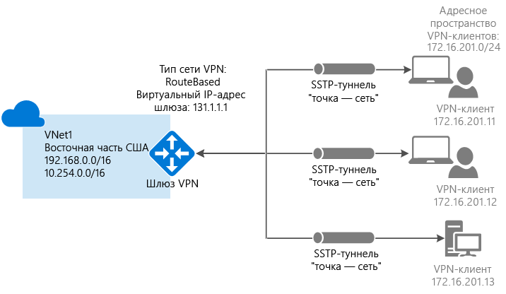

# <a name="configure-a-point-to-site-connection-to-a-vnet-using-powershell"></a>Настройка подключения типа "точка — сеть" к виртуальной сети с помощью PowerShell


В этой статье показано, как создать виртуальную сеть с подключением типа "точка — сеть" в модели развертывания Resource Manager с помощью PowerShell. Эту конфигурацию также можно создать с помощью разных средств или моделей развертывания, выбрав вариант из следующего списка:

> [!div class="op_single_selector"]
> * [Resource Manager — портал Azure](vpn-gateway-howto-point-to-site-resource-manager-portal.md)
> * [Resource Manager — PowerShell](vpn-gateway-howto-point-to-site-rm-ps.md)
> * [Классическая модель — портал Azure](vpn-gateway-howto-point-to-site-classic-azure-portal.md)
>
>

Конфигурация типа "точка — сеть" позволяет создать безопасное подключение к виртуальной сети с отдельного клиентского компьютера. Это эффективное решение для подключений типа "точка — сеть" к виртуальной сети из удаленного расположения, например, если вы находитесь дома или на конференции, или если подключение к виртуальной сети требуется всего нескольким клиентам. VPN-подключение типа "точка — сеть" инициируется клиентским компьютером с помощью собственного VPN-клиента Windows. Для проверки подлинности подключений клиентов используются сертификаты. 



Для подключения типа "точка — сеть" не требуется VPN-устройство или общедоступный IP-адрес. Подключение типа "точка — сеть" — это VPN-подключение по протоколу SSTP (Secure Socket Tunneling Protocol). На стороне сервера поддерживается SSTP версии 1.0, 1.1 и 1.2. Какую версию использовать, решает клиент. Для Windows 8.1 и более поздних версий по умолчанию используется SSTP версии 1.2. Дополнительные сведения о подключениях типа "точка — сеть" см. в разделе [Часто задаваемые вопросы о подключениях типа "точка — сеть"](#faq) в конце этой статьи.

Для подключений типа "точка — сеть" требуется следующее:

* VPN-шлюз с маршрутизацией на основе маршрутов.
* Открытый ключ (CER-файл) для корневого сертификата, импортированный в Azure. Он считается доверенным сертификатом и используется для проверки подлинности.
* Сертификат клиента создается из корневого сертификата и устанавливается на каждом подключаемом клиентском компьютере. Этот сертификат используется для проверки подлинности клиента.
* Пакет конфигурации VPN-клиента необходимо создать и установить на каждом подключаемом клиентском компьютере. Пакет конфигурации клиента настраивает собственный VPN-клиент, находящийся в операционной системе, используя данные, необходимые для подключения к виртуальной сети.


## <a name="before-beginning"></a>Подготовка

* Убедитесь в том, что у вас уже есть подписка Azure. Если у вас нет подписки Azure, вы можете [активировать преимущества для подписчиков MSDN](https://azure.microsoft.com/pricing/member-offers/msdn-benefits-details) или [зарегистрировать бесплатную учетную запись](https://azure.microsoft.com/pricing/free-trial).
* Установите последнюю версию командлетов PowerShell для Azure Resource Manager. Дополнительные сведения об установке командлетов PowerShell см. в статье [Overview of Azure PowerShell](/powershell/azure/overview) (Обзор Azure PowerShell).

### <a name="example"></a>Примеры значений

Эти примеры значений можно использовать для создания тестовой среды или анализа примеров из этой стать. Переменные присваиваются в части [1](#declare) этой статьи. Вы можете использовать эти пошаговые инструкции, используя указанные в них значения, или же изменить значения в соответствии со своей средой. 

* **Имя: VNet1**.
* **Адресное пространство: 192.168.0.0/16** и **10.254.0.0/16**.<br>Чтобы продемонстрировать, что эта конфигурация будет работать с несколькими адресными пространствами, в этом примере мы используем несколько адресных пространств. Однако это необязательно для этой конфигурации.
* **Имя подсети: FrontEnd**.
  * **Диапазон адресов подсети: 192.168.1.0/24**.
* **Имя подсети: BackEnd.**
  * **Диапазон адресов подсети: 10.254.1.0/24.**
* **Имя подсети: GatewaySubnet.**<br>Имя подсети *GatewaySubnet* обязательно для работы VPN-шлюза.
  * **Диапазон адресов подсети шлюза: 192.168.200.0/24.** 
* **Пул адресов VPN-клиента: 172.16.201.0/24.**<br>VPN-клиенты, подключающиеся к виртуальной сети с помощью этого подключения типа "точка — сеть", получают IP-адреса из пула адресов VPN-клиента.
* **Подписка**. Если у вас есть несколько подписок, убедитесь, что используется правильная.
* **Группа ресурсов: TestRG**.
* **Расположение: восточная часть США**.
* **DNS-сервер: IP-адрес** DNS-сервера, который нужно использовать для разрешения имен.
* **Имя шлюза: Vnet1GW**.
* **Имя общедоступного IP-адреса: VNet1GWPIP**.
* **Тип VPN: RouteBased.** 

## <a name="declare"></a>1. Вход и настройка переменных

В этом разделе мы выполним вход и объявим значения для этой конфигурации. Объявленные значения используются в примерах скриптов. Измените значения в соответствии со своей средой. Также можно использовать объявленные значения и выполнить эти шаги в качестве упражнения.

1. Откройте консоль PowerShell с повышенными привилегиями и войдите в свою учетную запись Azure. Командлет запрашивает учетные данные входа. После выполнения входа он скачивает параметры учетной записи, чтобы они были доступны в Azure PowerShell.

  ```powershell
  Login-AzureRmAccount
  ```
2. Получите список подписок Azure.

  ```powershell
  Get-AzureRmSubscription
  ```
3. Укажите подписку, которую нужно использовать.

  ```powershell
  Select-AzureRmSubscription -SubscriptionName "Name of subscription"
  ```
4. Объявите переменные, которые вы хотите использовать. Используйте следующий пример, подставив собственные значения в соответствующих параметрах.

  ```powershell
  $VNetName  = "VNet1"
  $FESubName = "FrontEnd"
  $BESubName = "Backend"
  $GWSubName = "GatewaySubnet"
  $VNetPrefix1 = "192.168.0.0/16"
  $VNetPrefix2 = "10.254.0.0/16"
  $FESubPrefix = "192.168.1.0/24"
  $BESubPrefix = "10.254.1.0/24"
  $GWSubPrefix = "192.168.200.0/26"
  $VPNClientAddressPool = "172.16.201.0/24"
  $RG = "TestRG"
  $Location = "East US"
  $DNS = "8.8.8.8"
  $GWName = "VNet1GW"
  $GWIPName = "VNet1GWPIP"
  $GWIPconfName = "gwipconf"
  ```

## <a name="ConfigureVNet"></a>2. Настройка виртуальной сети

1. Создайте группу ресурсов.

  ```powershell
  New-AzureRmResourceGroup -Name $RG -Location $Location
  ```
2. Создайте конфигурации подсети для виртуальной сети, присвоив им имена *FrontEnd*, *BackEnd* и *GatewaySubnet*. Эти префиксы должны быть частью объявленного адресного пространства виртуальной сети.

  ```powershell
  $fesub = New-AzureRmVirtualNetworkSubnetConfig -Name $FESubName -AddressPrefix $FESubPrefix
  $besub = New-AzureRmVirtualNetworkSubnetConfig -Name $BESubName -AddressPrefix $BESubPrefix
  $gwsub = New-AzureRmVirtualNetworkSubnetConfig -Name $GWSubName -AddressPrefix $GWSubPrefix
  ```
3. Создание виртуальной сети. <br>DNS-сервер можно не использовать. Если указать это значение, DNS-сервер не создается. Пакет конфигурации клиента, который будет создан позже, будет содержать IP-адрес DNS-сервера, указанный в этом параметре. Если в будущем потребуется обновить список DNS-серверов, вы можете создать и установить новые пакеты конфигурации VPN-клиента, в которых будет отображен новый список. Необходимо указать DNS-сервер, который может разрешать имена для ресурсов, к которым вы подключаетесь. В этом примере мы использовали общедоступный IP-адрес. Подставьте собственные значения.

  ```powershell
  New-AzureRmVirtualNetwork -Name $VNetName -ResourceGroupName $RG -Location $Location -AddressPrefix $VNetPrefix1,$VNetPrefix2 -Subnet $fesub, $besub, $gwsub -DnsServer $DNS
  ```
4. Укажите переменные для созданной виртуальной сети.

  ```powershell
  $vnet = Get-AzureRmVirtualNetwork -Name $VNetName -ResourceGroupName $RG
  $subnet = Get-AzureRmVirtualNetworkSubnetConfig -Name "GatewaySubnet" -VirtualNetwork $vnet
  ```
5. VPN-шлюз должен иметь общедоступный IP-адрес. Сначала запросите ресурс IP-адреса, а затем укажите его при создании шлюза виртуальной сети. IP-адрес динамически назначается ресурсу при создании VPN-шлюза. В настоящее время VPN-шлюз поддерживает только *динамическое* выделение общедоступных IP-адресов. Вы не можете запросить назначение статического общедоступного IP-адреса. Однако это не означает, что IP-адрес изменяется после назначения VPN-шлюзу. Общедоступный IP-адрес изменяется только после удаления и повторного создания шлюза. При изменении размера, сбросе или других внутренних операциях обслуживания или обновления IP-адрес VPN-шлюза не изменяется.

  Запросите динамически назначенный общедоступный IP-адрес.

  ```powershell
  $pip = New-AzureRmPublicIpAddress -Name $GWIPName -ResourceGroupName $RG -Location $Location -AllocationMethod Dynamic
  $ipconf = New-AzureRmVirtualNetworkGatewayIpConfig -Name $GWIPconfName -Subnet $subnet -PublicIpAddress $pip
  ```

## <a name="Certificates"></a>3. Создание сертификатов

Сертификаты используются в Azure для проверки подлинности VPN-клиентов в VPN-подключениях типа "точка — сеть". Необходимо отправить сведения об открытом ключе корневого сертификата в Azure. После этого открытый ключ считается доверенным. Сертификаты клиентов должны создаваться из доверенного корневого сертификата, а затем устанавливаться на каждом клиентском компьютере в хранилище сертификатов Certificates-Current User/Personal. Сертификат используется для проверки подлинности клиента, когда он инициирует подключение к виртуальной сети. Дополнительные сведения о создании и установке сертификатов см. в статье [Создание самозаверяющего корневого сертификата для подключений типа "точка — сеть" с помощью PowerShell](vpn-gateway-certificates-point-to-site.md).

### <a name="cer"></a>Шаг 1. Получение CER-файла для корневого сертификата

[!INCLUDE [vpn-gateway-basic-vnet-rm-portal](../../includes/vpn-gateway-p2s-rootcert-include.md)]


### <a name="generate"></a>Шаг 2. Создание сертификата клиента

[!INCLUDE [vpn-gateway-basic-vnet-rm-portal](../../includes/vpn-gateway-p2s-clientcert-include.md)]

## <a name="upload"></a>4. Подготовка CER-файла корневого сертификата к передаче

Подготовьтесь к передаче CER-файла (который содержит сведения об открытом ключе) доверенного корневого сертификата в Azure. Не отправляйте закрытый ключ для корневого сертификата в Azure. После отправки CER-файла Azure сможет использовать его для проверки подлинности клиентов, на которых установлен клиентский сертификат, созданный из доверенного корневого сертификата. При необходимости позже можно отправить дополнительные файлы доверенных корневых сертификатов (не более 20). В этом разделе вы объявите CER-файл корневого сертификата, который будет связан с VPN-шлюзом, который вы создадите в следующем разделе.

1. Объявите переменную для имени сертификата, заменив существующее значение собственным.

  ```powershell
  $P2SRootCertName = "P2SRootCert.cer"
  ```
2. Добавьте собственный путь к файлу, а затем выполните командлеты.

  ```powershell
  $filePathForCert = "C:\cert\P2SRootCert.cer"
  $cert = new-object System.Security.Cryptography.X509Certificates.X509Certificate2($filePathForCert)
  $CertBase64 = [system.convert]::ToBase64String($cert.RawData)
  $p2srootcert = New-AzureRmVpnClientRootCertificate -Name $P2SRootCertName -PublicCertData $CertBase64
  ```

## <a name="creategateway"></a>5. Создание VPN-шлюза

Настройте и создайте шлюз для своей виртуальной сети.

* У параметра *-GatewayType* должно быть значение **Vpn**, а у параметра *-VpnType* — **RouteBased**.
* В этом примере открытый ключ для корневого сертификата связывается с VPN-шлюзом с использованием переменной $p2srootcert, указанной в предыдущем разделе.
* В этом примере пул адресов VPN-клиента объявляется как [переменная](#declare) на шаге 1. Пул адресов VPN-клиента представляет собой диапазон, из которого VPN-клиенты будут получать IP-адреса при подключении. Используйте диапазон частных IP-адресов, который не пересекается с локальным расположением, из которого будет выполняться подключение, или с виртуальной сетью, к которой вы хотите подключиться.
* Создание VPN-шлюза может занять до 45 минут в зависимости от выбранного [номера SKU шлюза](vpn-gateway-about-vpn-gateway-settings.md).

```powershell
New-AzureRmVirtualNetworkGateway -Name $GWName -ResourceGroupName $RG `
-Location $Location -IpConfigurations $ipconf -GatewayType Vpn `
-VpnType RouteBased -EnableBgp $false -GatewaySku Standard `
-VpnClientAddressPool $VPNClientAddressPool -VpnClientRootCertificates $p2srootcert
```

## <a name="clientconfig"></a>6. Скачивание пакета конфигурации VPN-клиента

Для подключения к виртуальной сети с помощью VPN-подключения типа "точка — сеть" для каждого клиента необходимо установить пакет конфигурации для собственного VPN-клиента Windows. Пакет конфигурации настраивает собственный VPN-клиент Windows с использованием параметров, необходимых для подключения к виртуальной сети. Если для вашей виртуальной сети указан DNS-сервер, пакет содержит IP-адрес DNS-сервера, который будет использоваться клиентом для разрешения имен. Если вы решите изменить указанный DNS-сервер позже, после создания пакета конфигурации клиента, обязательно создайте новый пакет конфигурации клиента для установки на клиентских компьютерах.

На каждом клиентском компьютере можно использовать один и тот же пакет конфигурации VPN-клиента при условии, что его версия соответствует архитектуре клиента. Список поддерживаемых клиентских операционных систем см. в разделе [Часто задаваемые вопросы о подключениях типа "точка — сеть"](#faq) в конце этой статьи.

1. После создания шлюза можно создать и скачать пакет конфигурации клиента. В этом примере будет скачан пакет для 64-разрядных клиентов. Чтобы скачать 32-разрядный клиент, замените Amd64 на x86. Пакет для VPN-клиента также можно скачать на портале Azure.

  ```powershell
  Get-AzureRmVpnClientPackage -ResourceGroupName $RG `
  -VirtualNetworkGatewayName $GWName -ProcessorArchitecture Amd64
  ```
2. Скопируйте и вставьте эту ссылку в веб-браузер (без кавычек), чтобы скачать пакет. 
3. Скачайте и установите пакет на клиентском компьютере. При появлении всплывающего окна SmartScreen щелкните **Дополнительно**, а затем выберите **Выполнить в любом случае**. Вы также можете сохранить пакет для установки на других клиентских компьютерах.
4. На клиентском компьютере перейдите в раздел **Параметры сети** и щелкните **VPN**. Для VPN-подключения отображается имя виртуальной сети, к которой оно устанавливается.

## <a name="clientcertificate"></a>7. Установка экспортированного сертификата клиента

Если вы хотите создать подключение типа "точка — сеть" на клиентском компьютере, отличном от того, который использовался для создания сертификатов клиентов, необходимо установить сертификат клиента. При установке сертификата клиента потребуется пароль, созданный при экспорте сертификата клиента. Обычно для этого нужно просто дважды щелкнуть сертификат и установить его. Дополнительные сведения см. в разделе [Установка экспортированного сертификата клиента](vpn-gateway-certificates-point-to-site.md#install).

## <a name="connect"></a>8. Подключение к Azure
1. Чтобы подключиться к виртуальной сети, откройте VPN-подключения на клиентском компьютере и найдите созданное VPN-подключение. Его имя совпадает с названием вашей виртуальной сети. Щелкните **Подключить**. Может появиться всплывающее сообщение об использовании сертификата. В таком случае щелкните **Продолжить**, чтобы использовать более высокий уровень привилегий. 
2. На странице состояния **подключения** щелкните **Подключить**. Если появится окно **Выбор сертификата** , убедитесь в том, что отображается сертификат клиента, с помощью которого вы хотите подключиться к сети. Если окно не появится, выберите нужный сертификат в раскрывающемся списке и нажмите кнопку **ОК**.

  
3. Теперь подключение установлено.

  

Если возникают проблемы с подключением, проверьте следующее:

- Откройте раздел **Управление сертификатами пользователей** и перейдите к пункту **Доверенные корневые центры сертификации\Сертификаты**. Убедитесь, что корневой сертификат есть в списке. В противном случае проверка подлинности не будет выполнена. При экспорте PFX-файла сертификата клиента с использованием значения по умолчанию "Включить по возможности все сертификаты в путь сертификации" также экспортируются данные корневого сертификата. При установке сертификата клиента корневой сертификат также устанавливается на клиентском компьютере. 

- Если используется сертификат, который был выдан с помощью корпоративного ЦС, и при аутентификации возникли проблемы, проверьте порядок прохождения аутентификации в сертификате клиента. Проверить список этапов аутентификации можно, дважды щелкнув сертификат клиента и выбрав **Сведения > Улучшенный ключ**. Убедитесь, что первым в списке отображается пункт "Проверка подлинности клиента" . В противном случае потребуется выдать сертификат клиента на основе шаблона User, в котором пункт "Проверка подлинности клиента" указан первым в списке.  

## <a name="verify"></a>9. Проверка подключения

1. Чтобы проверить, активно ли VPN-подключение, откройте окно командной строки от имени администратора и выполните команду *ipconfig/all*.
2. Просмотрите результаты. Обратите внимание, что полученный вами IP-адрес — это один из адресов в пуле адресов VPN-клиента подключения "точка–cеть", указанном в конфигурации. Вы должны увидеть результат, аналогичный приведенному ниже.

  ```
  PPP adapter VNet1:
      Connection-specific DNS Suffix .:
      Description.....................: VNet1
      Physical Address................:
      DHCP Enabled....................: No
      Autoconfiguration Enabled.......: Yes
      IPv4 Address....................: 172.16.201.3(Preferred)
      Subnet Mask.....................: 255.255.255.255
      Default Gateway.................:
      NetBIOS over Tcpip..............: Enabled
  ```


## <a name="connectVM"></a>Подключение к виртуальной машине

[!INCLUDE [Connect to a VM](../../includes/vpn-gateway-connect-vm-p2s-include.md)]

## <a name="addremovecert"></a>Добавление и удаление корневого сертификата

Вы можете добавлять доверенные корневые сертификаты в Azure, а также удалять их из Azure. При удалении корневого сертификата клиенты, использующие сертификат, созданный из этого корневого сертификата, не смогут пройти проверку подлинности и поэтому не смогут подключиться. Чтобы клиенты могли проходить аутентификацию и подключаться, необходимо установить новый сертификат клиента, созданный на основе корневого сертификата, который является доверенным для Azure (то есть он передан в Azure).

### <a name="to-add-a-trusted-root-certificate"></a>Добавление доверенного корневого сертификата

В Azure можно добавить до 20 CER-файлов корневых сертификатов. Ниже описано, как добавить корневой сертификат:

1. Создайте корневой сертификат и подготовьте его к добавлению в Azure. Экспортируйте открытый ключ как CER-файл X.509 в кодировке Base-64 и откройте его в текстовом редакторе. Скопируйте значения, как показано в следующем примере.

  

  > [!NOTE]
  > При копировании данных сертификата обязательно скопируйте текст как одну непрерывную строку без символов возврата каретки и перевода строки. Может потребоваться изменить параметры представления в текстовом редакторе, чтобы показать символы или показать все знаки и просмотреть символы возврата каретки и перевода строки.
  >
  >

2. Укажите имя сертификата и сведения о ключе как значения переменных. Подставьте собственные значения, как показано в следующем примере.

  ```powershell
  $P2SRootCertName2 = "ARMP2SRootCert2.cer"
  $MyP2SCertPubKeyBase64_2 = "MIIC/zCCAeugAwIBAgIQKazxzFjMkp9JRiX+tkTfSzAJBgUrDgMCHQUAMBgxFjAUBgNVBAMTDU15UDJTUm9vdENlcnQwHhcNMTUxMjE5MDI1MTIxWhcNMzkxMjMxMjM1OTU5WjAYMRYwFAYDVQQDEw1NeVAyU1Jvb3RDZXJ0MIIBIjANBgkqhkiG9w0BAQEFAAOCAQ8AMIIBCgKCAQEAyjIXoWy8xE/GF1OSIvUaA0bxBjZ1PJfcXkMWsHPzvhWc2esOKrVQtgFgDz4ggAnOUFEkFaszjiHdnXv3mjzE2SpmAVIZPf2/yPWqkoHwkmrp6BpOvNVOpKxaGPOuK8+dql1xcL0eCkt69g4lxy0FGRFkBcSIgVTViS9wjuuS7LPo5+OXgyFkAY3pSDiMzQCkRGNFgw5WGMHRDAiruDQF1ciLNojAQCsDdLnI3pDYsvRW73HZEhmOqRRnJQe6VekvBYKLvnKaxUTKhFIYwuymHBB96nMFdRUKCZIiWRIy8Hc8+sQEsAML2EItAjQv4+fqgYiFdSWqnQCPf/7IZbotgQIDAQABo00wSzBJBgNVHQEEQjBAgBAkuVrWvFsCJAdK5pb/eoCNoRowGDEWMBQGA1UEAxMNTXlQMlNSb290Q2VydIIQKazxzFjMkp9JRiX+tkTfSzAJBgUrDgMCHQUAA4IBAQA223veAZEIar9N12ubNH2+HwZASNzDVNqspkPKD97TXfKHlPlIcS43TaYkTz38eVrwI6E0yDk4jAuPaKnPuPYFRj9w540SvY6PdOUwDoEqpIcAVp+b4VYwxPL6oyEQ8wnOYuoAK1hhh20lCbo8h9mMy9ofU+RP6HJ7lTqupLfXdID/XevI8tW6Dm+C/wCeV3EmIlO9KUoblD/e24zlo3YzOtbyXwTIh34T0fO/zQvUuBqZMcIPfM1cDvqcqiEFLWvWKoAnxbzckye2uk1gHO52d8AVL3mGiX8wBJkjc/pMdxrEvvCzJkltBmqxTM6XjDJALuVh16qFlqgTWCIcb7ju"
  ```
3. Добавьте новый корневой сертификат. Можно добавлять только один сертификат за раз.

  ```powershell
  Add-AzureRmVpnClientRootCertificate -VpnClientRootCertificateName $P2SRootCertName2 -VirtualNetworkGatewayname "VNet1GW" -ResourceGroupName "TestRG" -PublicCertData $MyP2SCertPubKeyBase64_2
  ```
4. Чтобы проверить, добавлен ли новый сертификат должным образом, воспользуйтесь приведенным ниже примером.

  ```powershell
  Get-AzureRmVpnClientRootCertificate -ResourceGroupName "TestRG" `
  -VirtualNetworkGatewayName "VNet1GW"
  ```

### <a name="to-remove-a-root-certificate"></a>Удаление корневого сертификата

1. Объявите переменные.

  ```powershell
  $GWName = "Name_of_virtual_network_gateway"
  $RG = "Name_of_resource_group"
  $P2SRootCertName2 = "ARMP2SRootCert2.cer"
  $MyP2SCertPubKeyBase64_2 = "MIIC/zCCAeugAwIBAgIQKazxzFjMkp9JRiX+tkTfSzAJBgUrDgMCHQUAMBgxFjAUBgNVBAMTDU15UDJTUm9vdENlcnQwHhcNMTUxMjE5MDI1MTIxWhcNMzkxMjMxMjM1OTU5WjAYMRYwFAYDVQQDEw1NeVAyU1Jvb3RDZXJ0MIIBIjANBgkqhkiG9w0BAQEFAAOCAQ8AMIIBCgKCAQEAyjIXoWy8xE/GF1OSIvUaA0bxBjZ1PJfcXkMWsHPzvhWc2esOKrVQtgFgDz4ggAnOUFEkFaszjiHdnXv3mjzE2SpmAVIZPf2/yPWqkoHwkmrp6BpOvNVOpKxaGPOuK8+dql1xcL0eCkt69g4lxy0FGRFkBcSIgVTViS9wjuuS7LPo5+OXgyFkAY3pSDiMzQCkRGNFgw5WGMHRDAiruDQF1ciLNojAQCsDdLnI3pDYsvRW73HZEhmOqRRnJQe6VekvBYKLvnKaxUTKhFIYwuymHBB96nMFdRUKCZIiWRIy8Hc8+sQEsAML2EItAjQv4+fqgYiFdSWqnQCPf/7IZbotgQIDAQABo00wSzBJBgNVHQEEQjBAgBAkuVrWvFsCJAdK5pb/eoCNoRowGDEWMBQGA1UEAxMNTXlQMlNSb290Q2VydIIQKazxzFjMkp9JRiX+tkTfSzAJBgUrDgMCHQUAA4IBAQA223veAZEIar9N12ubNH2+HwZASNzDVNqspkPKD97TXfKHlPlIcS43TaYkTz38eVrwI6E0yDk4jAuPaKnPuPYFRj9w540SvY6PdOUwDoEqpIcAVp+b4VYwxPL6oyEQ8wnOYuoAK1hhh20lCbo8h9mMy9ofU+RP6HJ7lTqupLfXdID/XevI8tW6Dm+C/wCeV3EmIlO9KUoblD/e24zlo3YzOtbyXwTIh34T0fO/zQvUuBqZMcIPfM1cDvqcqiEFLWvWKoAnxbzckye2uk1gHO52d8AVL3mGiX8wBJkjc/pMdxrEvvCzJkltBmqxTM6XjDJALuVh16qFlqgTWCIcb7ju"
  ```
2. Удалите сертификат.

  ```powershell
  Remove-AzureRmVpnClientRootCertificate -VpnClientRootCertificateName $P2SRootCertName2 -VirtualNetworkGatewayName $GWName -ResourceGroupName $RG -PublicCertData $MyP2SCertPubKeyBase64_2
  ```
3. Используйте приведенный ниже пример, чтобы убедиться, что сертификат успешно удален.

  ```powershell
  Get-AzureRmVpnClientRootCertificate -ResourceGroupName "TestRG" `
  -VirtualNetworkGatewayName "VNet1GW"
  ```

## <a name="revoke"></a>Отзыв сертификата клиента

Можно отозвать сертификаты клиента. Список отзыва сертификатов позволяет выборочно запрещать подключение типа "точка-сеть" на основе отдельных сертификатов клиента. Эта процедура отличается от удаления доверенного корневого сертификата. При удалении доверенного корневого сертификата (CER-файл) из Azure будет запрещен доступ для всех сертификатов клиента, созданных на основе отозванного корневого сертификата или подписанных им. Отзыв сертификата клиента, а не корневого сертификата, позволяет по-прежнему использовать другие сертификаты, созданные на основе корневого сертификата, для проверки подлинности.

Обычно корневой сертификат используется для управления доступом на уровнях группы или организации, а отозванный сертификат клиента — для точного контроля доступа для отдельных пользователей.

### <a name="to-revoke-a-client-certificate"></a>Отзыв сертификата клиента

1. Получите отпечаток сертификата клиента. Дополнительные сведения см. в статье [Практическое руководство. Извлечение отпечатка сертификата](https://msdn.microsoft.com/library/ms734695.aspx).
2. Скопируйте данные в текстовый редактор и удалите все пробелы, чтобы предоставить отпечаток в виде непрерывной строки. Далее он будет объявлен в качестве переменной.
3. Объявите переменные. Обязательно объявите отпечаток, полученный на предыдущем шаге.

  ```powershell
  $RevokedClientCert1 = "NameofCertificate"
  $RevokedThumbprint1 = "‎51ab1edd8da4cfed77e20061c5eb6d2ef2f778c7"
  $GWName = "Name_of_virtual_network_gateway"
  $RG = "Name_of_resource_group"
  ```
4. Добавьте отпечаток в список отозванных сертификатов. После добавления отпечатка отобразится Succeeded.

  ```powershell
  Add-AzureRmVpnClientRevokedCertificate -VpnClientRevokedCertificateName $RevokedClientCert1 `
  -VirtualNetworkGatewayName $GWName -ResourceGroupName $RG `
  -Thumbprint $RevokedThumbprint1
  ```
5. Убедитесь, что отпечаток добавлен в список отзыва сертификатов.

  ```powershell
  Get-AzureRmVpnClientRevokedCertificate -VirtualNetworkGatewayName $GWName -ResourceGroupName $RG
  ```
6. Теперь сертификат нельзя использовать для подключения. Клиенты, пытающиеся подключиться с помощью этого сертификата, получат сообщение, что он недействителен.

### <a name="to-reinstate-a-client-certificate"></a>Возобновление использования сертификата клиента

Можно возобновить использование сертификата клиента, удалив отпечаток из списка отозванных сертификатов клиента.

1. Объявите переменные. Обязательно объявите правильный отпечаток сертификата, который требуется возобновить.

  ```powershell
  $RevokedClientCert1 = "NameofCertificate"
  $RevokedThumbprint1 = "‎51ab1edd8da4cfed77e20061c5eb6d2ef2f778c7"
  $GWName = "Name_of_virtual_network_gateway"
  $RG = "Name_of_resource_group"
  ```
2. Удалите отпечаток сертификата из списка отзыва сертификатов.

  ```powershell
  Remove-AzureRmVpnClientRevokedCertificate -VpnClientRevokedCertificateName $RevokedClientCert1 `
  -VirtualNetworkGatewayName $GWName -ResourceGroupName $RG -Thumbprint $RevokedThumbprint1
  ```
3. Проверьте, удален ли отпечаток из списка отозванных отпечатков.

  ```powershell
  Get-AzureRmVpnClientRevokedCertificate -VirtualNetworkGatewayName $GWName -ResourceGroupName $RG
  ```

## <a name="faq"></a>Часто задаваемые вопросы о подключениях типа "точка — сеть"

[!INCLUDE [Point-to-Site FAQ](../../includes/vpn-gateway-point-to-site-faq-include.md)]

## <a name="next-steps"></a>Дальнейшие действия
Установив подключение, можно добавить виртуальные машины в виртуальные сети. Дополнительные сведения о виртуальных машинах см. [здесь](https://docs.microsoft.com/azure/#pivot=services&panel=Compute). Дополнительные сведения о сетях и виртуальных машинах см. в статье [Azure и Linux: обзор сетей виртуальных машин](../virtual-machines/linux/azure-vm-network-overview.md).
