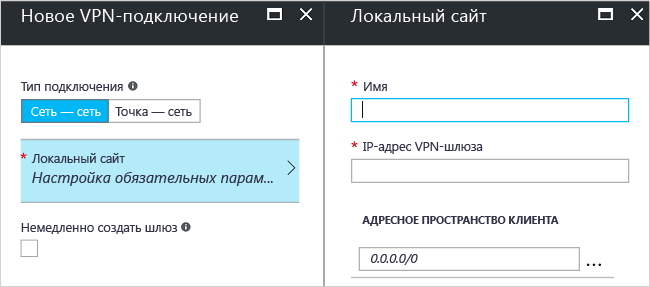

# <a name="create-a-site-to-site-connection-using-the-azure-portal-classic"></a>Создание подключения типа "сеть — сеть" с помощью классического портала Azure

[!INCLUDE [deployment models](../../includes/vpn-gateway-classic-deployment-model-include.md)]

В этой статье показано, как с помощью портала Azure создать подключение типа "сеть — сеть" с использованием VPN-шлюза между вашей локальной сетью к виртуальной. Приведенные в этой статье инструкции относятся к классической модели развертывания. Эту конфигурацию также можно создать с помощью разных средств или моделей развертывания, выбрав вариант из следующего списка:

> [!div class="op_single_selector"]
> * [портал Azure](vpn-gateway-howto-site-to-site-resource-manager-portal.md)
> * [PowerShell](vpn-gateway-create-site-to-site-rm-powershell.md)
> * [ИНТЕРФЕЙС КОМАНДНОЙ СТРОКИ](vpn-gateway-howto-site-to-site-resource-manager-cli.md)
> * [Портал Azure (классический)](vpn-gateway-howto-site-to-site-classic-portal.md)
> 
>

Подключение VPN-шлюза типа "сеть — сеть" используется для подключения между локальной сетью и виртуальной сетью Azure через туннель VPN по протоколу IPsec/IKE (IKEv1 или IKEv2). Для этого типа подключения требуется локальное VPN-устройство, которому назначен внешний общедоступный IP-адрес. Дополнительные сведения о VPN-шлюзах см. в [этой статье](vpn-gateway-about-vpngateways.md).


## <a name="before-you-begin"></a>Перед началом работы

Перед началом настройки убедитесь, что удовлетворены следующие требования:

* Убедитесь, что выбрана классическая модель развертывания. Если вы хотите работать в модели развертывания Resource Manager, см. статью [Создание подключения типа "сеть — сеть" на портале Azure](vpn-gateway-howto-site-to-site-resource-manager-portal.md). Мы рекомендуем по возможности использовать модель развертывания с помощью Resource Manager.
* Убедитесь, что у вас есть совместимое VPN–устройство и пользователь, который может настроить его. Дополнительные сведения о совместимых устройствах VPN и их настройке см. в [этой статье](vpn-gateway-about-vpn-devices.md).
* Убедитесь, что у вас есть общедоступный IPv4–адрес для вашего VPN–устройства. Этот IP-адрес не может располагаться вне преобразования сетевых адресов (NAT).
* Если вы не знаете диапазоны IP-адресов в своей конфигурации локальной сети, найдите того, кто сможет предоставить вам нужную информацию. При создании этой конфигурации необходимо указать префиксы диапазона IP-адресов, которые Azure будет направлять к локальному расположению. Ни одна из подсетей локальной сети не может перекрывать виртуальные подсети, к которым вы хотите подключиться.
* Сейчас, чтобы указать общий ключ и создать подключение VPN-шлюза, требуется PowerShell. Установите последнюю версию командлетов PowerShell для управления службами Azure. Подробнее: [Установка и настройка Azure PowerShell](/powershell/azure/overview). Если вы работаете с этой конфигурацией в PowerShell, убедитесь, что вы запустили ее от имени администратора. 

### <a name="values"></a>Примеры значений конфигурации для этого упражнения

В примерах этой статьи мы используем следующие значения. Эти значения можно использовать для создания тестовой среды или для лучшего понимания примеров в этой статье.

* **Имя виртуальной сети:** TestVNet1
* **Адресное пространство:** 
  * 10.11.0.0/16;
  * 10.12.0.0/16 (необязательно для этого упражнения).
* **Подсети:**
  * FrontEnd: 10.11.0.0/24
  * BackEnd: 10.12.0.0/24 (необязательно для этого упражнения).
* **Подсеть шлюза:** 10.11.255.0/27.
* **Группа ресурсов:** TestRG1
* **Расположение:** восточная часть США.
* **DNS-сервер:**  10.11.0.3 (необязательно для этого упражнения).
* **Имя локального сайта:** Site2.
* **Адресное пространство клиента:** Это адресное пространство, которое находится на локальном сайте.

## <a name="CreatVNet"></a>1. Создать виртуальную сеть

При создании виртуальной сети для подключения типа "сеть — сеть" убедитесь, что указанные адресные пространства не перекрывают адресные пространства клиента для локальных сайтов, к которым необходимо подключиться. В таком случае подключение не будет работать правильно.

* Если у вас уже есть виртуальная сеть, проверьте совместимость параметров со структурой VPN-шлюза. Обратите особое внимание на подсети, которые могут пересекаться с другими сетями. 

* Если у вас нет виртуальной сети, создайте ее. Снимки экрана приведены в качестве примеров. Обязательно подставьте собственные значения.

### <a name="to-create-a-virtual-network"></a>Создание виртуальной сети

1. В браузере откройте [портал Azure](http://portal.azure.com) и при необходимости войдите с помощью учетной записи Azure.
2. В нижней части страницы нажмите кнопку **+**. В поле **Поиск по Marketplace** введите "Виртуальная сеть". Найдите **Виртуальная сеть** в результатах поиска и щелкните ее, чтобы открыть страницу **Виртуальная сеть**.

  
3. В нижней части колонки "Виртуальная сеть" в раскрывающемся списке **Выберите модель развертывания** выберите **Классическая** и нажмите кнопку **Создать**.

  
4. В колонке **Create virtual network (classic)** (Создание виртуальной сети (классической)) настройте параметры виртуальной сети. На этой странице добавьте первое адресное пространство и единый диапазон адресов подсети. После создания виртуальной сети вернитесь назад и добавьте дополнительные подсети и адресные пространства.

  
5. Убедитесь, что вы используете правильную **подписку** . Подписки можно менять с помощью раскрывающегося списка.
6. Щелкните **Группа ресурсов** и либо выберите имеющуюся, либо создайте группу ресурсов. Чтобы создать группу, введите ее имя. Дополнительные сведения о группах ресурсов см. в разделе "Группы ресурсов" [обзора Azure Resource Manager](../azure-resource-manager/resource-group-overview.md#resource-groups).
7. Затем выберите параметры **расположения** для виртуальной сети. Расположение определяет, где будут находиться ресурсы, развертываемые в этой виртуальной сети.
8. Для быстрого перехода к виртуальной сети с панели мониторинга выберите **Закрепить на информационной панели**. Нажмите кнопку **Создать**, чтобы создать виртуальную сеть.

  
9. После того как вы нажмете кнопку "Создать", на панели мониторинга появится плитка, отражающая ход создания виртуальной сети. Когда виртуальная сеть будет создана, плитка изменится.

  

## <a name="additionaladdress"></a>2. Добавление дополнительного адресного пространства

После создания виртуальной сети можно добавить дополнительное адресное пространство. Это необязательно для конфигурации S2S. Если требуется несколько адресных пространств, сделайте следующее:

1. Найдите виртуальные сети на портале.
2. На странице виртуальной сети в разделе **Параметры** щелкните **Адресное пространство**.
3. На странице "Адресное пространство" щелкните **+ Добавить** и введите дополнительное адресное пространство.

## <a name="dns"></a>3. Выбор DNS-сервера

Необязательно настраивать параметры DNS при настройке соединения типа "сеть — сеть". Однако DNS необходима для разрешения имен. Если указать значение, DNS-сервер не создается. Необходимо указать IP-адрес DNS-сервера, который может разрешать имена для ресурсов, к которым вы подключаетесь. В качестве примера параметров мы использовали частный IP-адрес. Этот IP-адрес, скорее всего, отличается от IP-адреса вашего DNS-сервера. Подставьте собственные значения.

После создания виртуальной сети можно добавить IP-адрес DNS-сервера для обработки разрешения имен. Откройте параметры виртуальной сети, щелкните "DNS-серверы" и добавьте IP-адрес DNS-сервера, который нужно использовать для разрешения имен.

1. Найдите виртуальные сети на портале.
2. В колонке виртуальной сети в разделе **Параметры** щелкните **DNS-серверы**.
3. Добавьте DNS-сервер.
4. Чтобы сохранить параметры, нажмите кнопку **Сохранить** в верхней части страницы.

## <a name="localsite"></a>4. Настройка локального сайта

Термин "локальный сайт" обычно означает локальное расположение. Он содержит IP-адрес VPN-устройства, для которого будет создано подключение, и диапазоны IP-адресов, которые будут использоваться для передачи трафика через VPN-шлюз к VPN-устройству.

1. На портале перейдите к виртуальной сети, для которой необходимо создать шлюз.
2. На странице виртуальной сети в колонке **Обзор** в разделе "VPN-подключения" щелкните **Шлюз**, чтобы открыть колонку **Новое VPN-подключение**.

  
3. На странице **Новое VPN-подключение** выберите **Сеть — сеть**.
4. Щелкните **Локальный сайт > Настройка обязательных параметров**, чтобы открыть колонку **Локальный сайт**. Настройте параметры и нажмите кнопку **ОК**, чтобы сохранить их.
  - **Имя.** Создайте имя локального сайта, чтобы упростить идентификацию.
  - **IP-адрес VPN-шлюза.** Это общедоступный IP-адрес VPN-устройства для локальной сети. Для VPN-устройства требуется общедоступный IP-адрес IPv4. Укажите допустимый общедоступный IP-адрес VPN-устройства, к которому необходимо подключиться. Он не может быть скрыт за NAT и должен быть доступен для Azure. Если вы не знаете IP-адрес VPN-устройства, можно всегда указать значение заполнителя (при условии, что он имеет формат допустимого общедоступного IP-адреса) и изменить его в будущем.
  - **Адресное пространство клиента.** Укажите диапазон IP-адресов, которые нужно перенаправлять в локальную сеть через этот шлюз. Можно добавить несколько диапазонов пространства адресов. Убедитесь, что указанные диапазоны не перекрывают диапазоны других сетей, к которым подключена ваша виртуальная сеть, или диапазоны адресов самой виртуальной сети.

  

## <a name="gatewaysubnet"></a>5. Настройка подсети шлюза

Необходимо создать подсеть шлюза для VPN-шлюза. Подсеть шлюза содержит IP-адреса, которые используются службами VPN-шлюза.

1. На странице **Новое VPN-подключение** установите флажок **Немедленно создать шлюз**. Появится страница "Дополнительная настройка шлюза". Если не установить флажок, колонка настройки подсети шлюза не появится.

  
2. Чтобы открыть страницу **Конфигурация шлюза**, нажмите **Дополнительные настройки шлюза — Subnet, size, and routing type** (Подсеть, размер и тип маршрутизации).
3. На странице **Конфигурация шлюза** щелкните **Подсеть — Настройка обязательных параметров**, чтобы открыть страницу **Добавить подсеть**.

  
4. На странице **Добавить подсеть** добавьте подсеть шлюза. Размер указанной подсети шлюза зависит от конфигурации VPN-шлюза, которую вы хотите создать. Несмотря на то, что можно создавать подсеть шлюза размером /29, мы рекомендуем использовать /27 или /28. При этом создается большая подсеть, которая включает в себя больше адресов. Использование более крупной подсети для шлюза позволяет создавать достаточное число IP-адресов с учетом возможных конфигураций в будущем.

  

## <a name="sku"></a>6. Указание SKU и типа VPN

1. Выберите **размер** шлюза. Это SKU шлюза, который будет использоваться для создания шлюза виртуальной сети. На портале SKU по умолчанию — **Базовый**. Классические VPN-шлюзы используют старые (устаревшие версии) SKU. Дополнительные сведения об устаревших версиях SKU шлюза см. в статье [Работа со SKU шлюза виртуальной сети (старые версии SKU)](vpn-gateway-about-skus-legacy.md).

  
2. Выберите **тип маршрутизации** для шлюза. Его также называют типом VPN. Важен правильный выбор типа шлюза, поскольку нельзя изменить тип шлюза. VPN-устройство должно быть совместимым с выбранным типом маршрутизации. Дополнительные сведения о VPN-шлюзах см. в статье [Сведения о параметрах конфигурации VPN-шлюза](vpn-gateway-about-vpn-gateway-settings.md#vpntype). В статье могут упоминаться такие типы VPN, как RouteBased и PolicyBased. RouteBased соответствует динамическому VPN-подключению, а PolicyBased — статическому.
3. Нажмите кнопку **ОК**, чтобы сохранить настройки.
4. В нижней части страницы **Новое VPN-подключение** нажмите кнопку **ОК**, чтобы приступить к созданию шлюза виртуальной сети. В зависимости от выбранного номера SKU создание шлюза виртуальной сети может занять до 45 минут.

## <a name="vpndevice"></a>7. Настройка устройства VPN

Для подключения типа "сеть — сеть" к локальной сети требуется VPN-устройство. На этом этапе мы настроим VPN-устройство. Чтобы настроить локальное VPN-устройство, вам потребуется следующее:

- Общий ключ. Это тот же общий ключ, который указывается при создании VPN-подключения "сеть — сеть". В наших примерах мы используем простые общие ключи. Для практического использования рекомендуется создавать более сложные ключи.
- Общедоступный IP-адрес шлюза виртуальной сети. Общедоступный IP-адрес можно просмотреть с помощью портала Azure, PowerShell или CLI.

[!INCLUDE [vpn-gateway-configure-vpn-device-rm](../../includes/vpn-gateway-configure-vpn-device-rm-include.md)]

## <a name="CreateConnection"></a>8. Создание подключения
На этом этапе вы устанавливаете общий ключ и создаете подключение. Установите ключ, использованный в конфигурации VPN-устройства.

> [!NOTE]
> В настоящее время этот этап недоступен на портале Azure. Необходимо использовать версию командлетов Azure PowerShell для управления службами.
>

### <a name="step-1-connect-to-your-azure-account"></a>Шаг 1. Подключение к учетной записи Azure

1. Откройте консоль PowerShell с повышенными правами и подключитесь к своей учетной записи. Для подключения используйте следующий пример кода:

  ```powershell
  Add-AzureAccount
  ```
2. Просмотрите подписки учетной записи.

  ```powershell
  Get-AzureSubscription
  ```
3. При наличии нескольких подписок выберите подписку, которую вы хотите использовать.

  ```powershell
  Select-AzureSubscription -SubscriptionId "Replace_with_your_subscription_ID"
  ```

### <a name="step-2-set-the-shared-key-and-create-the-connection"></a>Шаг 2. Установка общего ключа и создание подключения

При работе с PowerShell и классической моделью развертывания имена ресурсов на портале могут отличаться от имен, которые ожидает Azure при использовании PowerShell. Чтобы экспортировать файл конфигурации сети для получения точных значений имен, сделайте следующее.

1. Создайте каталог на компьютере, а затем экспортируйте в него файл конфигурации сети. В этом примере файл конфигурации сети экспортируется в каталог C:\AzureNet.

  ```powershell
  Get-AzureVNetConfig -ExportToFile C:\AzureNet\NetworkConfig.xml
  ```
2. Откройте файл конфигурации сети с помощью редактора XML и проверьте значения имен LocalNetworkSite и VirtualNetworkSite. Измените пример с учетом необходимых значений. Если указывается имя с пробелами, заключите его в одиночные кавычки.

3. Установите общий ключ и создайте подключение. -SharedKey — это значение, которое следует создать и задать. В примере мы использовали abc123, но вы можете создать и использовать что-нибудь посложнее. Важно, чтобы заданное здесь значение совпадало со значением, указанным при настройке вашего VPN-устройства.

  ```powershell
  Set-AzureVNetGatewayKey -VNetName 'Group TestRG1 TestVNet1' `
  -LocalNetworkSiteName 'D1BFC9CB_Site2' -SharedKey abc123
  ```
После создания подключения отобразится состояние **Успешно**.

## <a name="verify"></a>9. Проверка подключения

[!INCLUDE [vpn-gateway-verify-connection-azureportal-classic](../../includes/vpn-gateway-verify-connection-azureportal-classic-include.md)]

Если возникают проблемы с подключением, просмотрите раздел **Устранение неполадок**, выбрав его в оглавлении в левой области.

## <a name="reset"></a>Как сбросить VPN-шлюз

Сброс настроек VPN-шлюза Azure полезен при потере распределенного VPN-подключения в одном или нескольких VPN-туннелях типа "сеть-сеть". В этой ситуации все локальные VPN-устройства работают правильно, но не могут взаимодействовать с VPN-шлюзами Azure через туннели IPsec. Пошаговые инструкции см. в статье [Сброс VPN-шлюза](vpn-gateway-resetgw-classic.md).

## <a name="changesku"></a>Как изменить SKU шлюза

Пошаговые инструкции для изменения SKU шлюза см. в статье [Работа со SKU шлюза виртуальной сети (старые версии SKU)](vpn-gateway-about-SKUS-legacy.md).

## <a name="next-steps"></a>Дополнительная информация

* Установив подключение, можно добавить виртуальные машины в виртуальные сети. Дополнительные сведения о виртуальных машинах см. [здесь](https://docs.microsoft.com/azure/#pivot=services&panel=Compute).
* Сведения о принудительном туннелировании см. в статье [Настройка принудительного туннелирования с помощью классической модели развертывания](vpn-gateway-about-forced-tunneling.md).