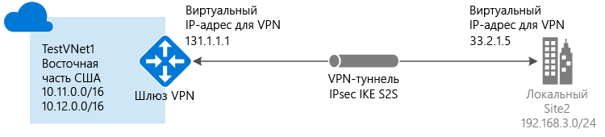

# Создание подключения типа "сеть — сеть" на портале Azure

В этой статье показано, как с помощью портала Azure создать подключение типа "сеть — сеть" с использованием VPN-шлюза между вашей локальной сетью к виртуальной. Приведенные в этой статье инструкции относятся к модели развертывания с помощью Resource Manager. Эту конфигурацию также можно создать с помощью разных средств или моделей развертывания, выбрав вариант из следующего списка:

> [!div class="op_single_selector"]
> * [Портал Azure](vpn-gateway-howto-site-to-site-resource-manager-portal.md)
> * [PowerShell](vpn-gateway-create-site-to-site-rm-powershell.md)
> * [ИНТЕРФЕЙС КОМАНДНОЙ СТРОКИ](vpn-gateway-howto-site-to-site-resource-manager-cli.md)
> * [Портал Azure (классический)](vpn-gateway-howto-site-to-site-classic-portal.md)
> 
>

Подключение VPN-шлюза типа "сеть — сеть" используется для подключения между локальной сетью и виртуальной сетью Azure через туннель VPN по протоколу IPsec/IKE (IKEv1 или IKEv2). Для этого типа подключения требуется локальное VPN-устройство, которому назначен внешний общедоступный IP-адрес. Дополнительные сведения о VPN-шлюзах см. в [этой статье](vpn-gateway-about-vpngateways.md).

## Перед началом работы

Перед началом настройки убедитесь, что удовлетворены следующие требования:

* Убедитесь, что у вас есть совместимое VPN–устройство и пользователь, который может настроить его. Дополнительные сведения о совместимых устройствах VPN и их настройке см. в [этой статье](vpn-gateway-about-vpn-devices.md).
* Убедитесь, что у вас есть общедоступный IPv4–адрес для вашего VPN–устройства. Этот IP-адрес не может располагаться вне преобразования сетевых адресов (NAT).
* Если вы не знаете диапазоны IP-адресов в своей конфигурации локальной сети, найдите того, кто сможет предоставить вам нужную информацию. При создании этой конфигурации необходимо указать префиксы диапазона IP-адресов, которые Azure будет направлять к локальному расположению. Ни одна из подсетей локальной сети не может перекрывать виртуальные подсети, к которым вы хотите подключиться. 

### Примеры значений

В примерах этой статьи мы используем следующие значения. Эти значения можно использовать для создания тестовой среды или для лучшего понимания примеров в этой статье. Общие сведения о параметрах VPN-шлюза см. в статье [Сведения о параметрах конфигурации VPN-шлюза](vpn-gateway-about-vpn-gateway-settings.md).

* **Имя виртуальной сети:** TestVNet1
* **Адресное пространство:** 
  * 10.11.0.0/16;
  * 10.12.0.0/16 (необязательно для этого упражнения).
* **Подсети:**
  * FrontEnd: 10.11.0.0/24
  * BackEnd: 10.12.0.0/24 (необязательно для этого упражнения).
* **Подсеть шлюза:** 10.11.255.0/27.
* **Группа ресурсов:** TestRG1
* **Расположение:** восточная часть США.
* **DNS-сервер:** (необязательно) IP-адрес вашего DNS-сервера.
* **Имя шлюза виртуальной сети:** VNet1GW.
* **Общедоступный IP-адрес:** VNet1GWIP
* **Тип VPN:** на основе маршрутов.
* **Тип подключения:** "сеть — сеть" (IPsec)
* **Тип шлюза:** VPN.
* **Имя шлюза локальной сети:** Site2
* **Имя подключения:** VNet1toSite2

## 1. Создать виртуальную сеть

[!INCLUDE [vpn-gateway-basic-vnet-rm-portal](../../includes/vpn-gateway-basic-vnet-s2s-rm-portal-include.md)]

## 2. Выбор DNS-сервера

DNS не является обязательным для создания подключений типа "точка —сеть". Но если для ресурсов, развернутых в вашей виртуальной сети, требуется разрешение имен, необходимо указать DNS-сервер. Этот параметр позволяет указать DNS-сервер, который вы хотите использовать для разрешения имен в этой виртуальной сети. Он не приводит к созданию DNS-сервера. См. дополнительные сведения о [разрешении имен для виртуальных машин и экземпляров ролей](../virtual-network/virtual-networks-name-resolution-for-vms-and-role-instances.md).

[!INCLUDE [vpn-gateway-add-dns-rm-portal](../../includes/vpn-gateway-add-dns-rm-portal-include.md)]

## 3. Создание подсети шлюза

[!INCLUDE [vpn-gateway-aboutgwsubnet](../../includes/vpn-gateway-about-gwsubnet-include.md)]

[!INCLUDE [vpn-gateway-add-gwsubnet-rm-portal](../../includes/vpn-gateway-add-gwsubnet-s2s-rm-portal-include.md)]

## 4. Создание VPN-шлюза

[!INCLUDE [vpn-gateway-add-gw-s2s-rm-portal](../../includes/vpn-gateway-add-gw-s2s-rm-portal-include.md)]

## 5. Создание шлюза локальной сети

Обычно термин "шлюз локальной сети" означает локальное расположение. Присвойте сайту имя, по которому Azure может обращаться к этому сайту, а затем укажите IP-адрес локального VPN-устройства, к которому вы подключитесь. Вы можете также указать префиксы IP-адресов, которые будут направляться через VPN-шлюз к VPN-устройству. Указываемые префиксы адресов расположены в локальной сети. Если вы внесли изменения в локальной сети или вам нужно изменить общедоступный IP-адрес для VPN-устройства, значения можно легко обновить позже.

[!INCLUDE [Add local network gateway](../../includes/vpn-gateway-add-lng-s2s-rm-portal-include.md)]

## 6. Настройка устройства VPN

Для подключения типа "сеть — сеть" к локальной сети требуется VPN-устройство. На этом этапе мы настроим VPN-устройство. Чтобы настроить локальное VPN-устройство, вам потребуется следующее:

- Общий ключ. Это тот же общий ключ, который указывается при создании VPN-подключения "сеть — сеть". В наших примерах мы используем простые общие ключи. Для практического использования рекомендуется создавать более сложные ключи.
- Общедоступный IP-адрес шлюза виртуальной сети. Общедоступный IP-адрес можно просмотреть с помощью портала Azure, PowerShell или CLI. Чтобы найти общедоступный IP-адрес VPN-шлюза с помощью портала Azure, перейдите к разделу **Шлюзы виртуальной сети** и щелкните имя шлюза.

[!INCLUDE [Configure a VPN device](../../includes/vpn-gateway-configure-vpn-device-rm-include.md)]

## 7. Создание VPN-подключения

Создайте VPN-подключение типа "сеть — сеть" между шлюзом виртуальной сети и локальным VPN-устройством.

[!INCLUDE [Add connections](../../includes/vpn-gateway-add-site-to-site-connection-s2s-rm-portal-include.md)]

## 8. Проверка VPN-подключения

[!INCLUDE [Verify - Azure portal](../../includes/vpn-gateway-verify-connection-portal-rm-include.md)]

## Подключение к виртуальной машине

[!INCLUDE [Connect to a VM](../../includes/vpn-gateway-connect-vm-s2s-include.md)]

## Как сбросить VPN-шлюз

Сброс настроек VPN-шлюза Azure полезен при потере распределенного VPN-подключения в одном или нескольких VPN-туннелях типа "сеть-сеть". В этой ситуации все локальные VPN-устройства работают правильно, но не могут взаимодействовать с VPN-шлюзами Azure через туннели IPsec. Пошаговые инструкции см. в статье [Сброс VPN-шлюза](vpn-gateway-resetgw-classic.md).

## Как изменить SKU шлюз (изменить размер шлюза)

Пошаговые инструкции для изменения SKU шлюза см. в статье [Работа со SKU шлюза виртуальной сети (старые версии SKU)](vpn-gateway-about-vpn-gateway-settings.md#gwsku).

## Дальнейшие действия

* Сведения о BGP см. в статьях [Обзор использования BGP с VPN-шлюзами Azure](vpn-gateway-bgp-overview.md) и [Настройка BGP на VPN-шлюзах Azure с помощью Azure Resource Manager и PowerShell](vpn-gateway-bgp-resource-manager-ps.md).
* Сведения о принудительном туннелировании см. в статье [Настройка принудительного туннелирования с помощью классической модели развертывания](vpn-gateway-forced-tunneling-rm.md).
* Сведения о высокодоступных подключениях в режиме "активный — активный" см. в статье [Настройка высокодоступных подключений: распределенных и между виртуальными сетями](vpn-gateway-highlyavailable.md).
* Сведения о создании VPN-подключения типа "сеть — сеть" с помощью шаблона Azure Resource Manager см. в разделе [Создание VPN-подключения типа "сеть — сеть"](https://azure.microsoft.com/resources/templates/101-site-to-site-vpn-create/).
* Сведения о создании VPN-подключения типа "виртуальная сеть — виртуальная сеть" с помощью шаблона Azure Resource Manager см. в разделе [Deploy HBase geo replication](https://azure.microsoft.com/resources/templates/101-hdinsight-hbase-replication-geo/) (Развертывание георепликации HBase).
