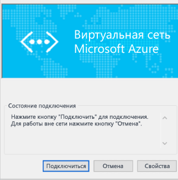

# Настройка подключения типа "точка — сеть" к виртуальной сети с помощью классического портала
> [!div class="op_single_selector"]
> * [Resource Manager — портал Azure](vpn-gateway-howto-point-to-site-resource-manager-portal.md)
> * [Resource Manager — PowerShell](vpn-gateway-howto-point-to-site-rm-ps.md)
> * [Классическая модель — портал Azure](vpn-gateway-howto-point-to-site-classic-azure-portal.md)
> * [Классическая модель — классический портал](vpn-gateway-point-to-site-create.md)
> 
> 

Конфигурация типа "точка — сеть" позволяет создать безопасное подключение к виртуальной сети с отдельного клиентского компьютера. Это эффективное решение для подключения к виртуальной сети из удаленного расположения, например, если вы находитесь дома или на конференции либо если подключение к виртуальной сети требуется всего нескольким клиентам.

Для подключения типа "точка–сеть" не требуется VPN-устройство или общедоступный IP-адрес. VPN-подключение сначала устанавливается с локального клиентского компьютера. Дополнительные сведения о подключениях типа "точка — сеть" см. в разделе [Часто задаваемые вопросы о подключениях типа "точка — сеть"](#faq) в конце этой статьи.

В этой статье рассматривается создание виртуальной сети с подключением типа "точка — сеть" в классической модели развертывания с помощью классического портала.

### Модели и методы развертывания для подключений типа "точка — сеть"
[!INCLUDE [deployment models](../../includes/vpn-gateway-deployment-models-include.md)]

В следующей таблице представлены две модели развертывания и доступные методы развертывания для конфигурации "точка — сеть". Когда появится статья с руководством по конфигурации, мы разместим прямую ссылку на нее в этой таблице.

[!INCLUDE [vpn-gateway-clasic-rm](../../includes/vpn-gateway-table-point-to-site-include.md)]

## Базовый рабочий процесс

Следующие инструкции помогут поэтапно выполнить создание безопасного подключения типа "точка — сеть" к виртуальной сети. 

Настройка подключения типа "точка — сеть" состоит из четырех этапов. Порядок настройки компонентов играет важную роль. Поэтому не пропускайте шаги и не меняйте их последовательность.

* **Раздел 1**. Создание виртуальной сети и VPN-шлюза.
* **Раздел 2**. Создание и передача сертификатов, используемых для проверки подлинности.
* **Раздел 3**. Экспорт и установка сертификатов клиента.
* **Раздел 4**. Настройка VPN-клиента.

## Раздел 1. Создание виртуальной сети и VPN-шлюза
### Часть 1. Создание виртуальной сети
1. Перейдите на [классический портал Azure](https://manage.windowsazure.com). В приведенных здесь инструкциях используется классический портал, а не портал Azure. В настоящее время создание подключения типа "точка — сеть" на портале Azure не поддерживается.
2. В нижнем левом углу экрана нажмите кнопку **Создать**. В области навигации щелкните **Сетевые службы**, а затем — **Виртуальная сеть**. Нажмите кнопку **Настраиваемое создание** для запуска мастера настройки.
3. На странице **Сведения о виртуальной сети** укажите следующие сведения и нажмите кнопку "Далее" в правом нижнем углу.
   
   * **Имя**: название виртуальной сети. Например, VNet1. Это имя используется при развертывании виртуальных машин в виртуальной сети.
   * **Расположение**: непосредственно связано с физическим расположением (регионом) ресурсов (виртуальных машин). Например, если вы хотите, чтобы виртуальные машины находились в виртуальной сети, которая физически расположена в восточной части США, выберите соответствующий регион. После создания виртуальной сети изменить связанное с ней расположение нельзя.
4. На странице **DNS-серверы и подключение VPN** укажите следующие сведения и щелкните стрелку «Далее» в правом нижнем углу.
   
   * **DNS-серверы**: введите имя и IP-адрес DNS-сервера или выберите из контекстного меню ранее зарегистрированный DNS-сервер. Этот параметр не приводит к созданию DNS-сервера. Он позволяет указать DNS-сервер, который вы хотите использовать для разрешения имен в этой виртуальной сети. Чтобы использовать службу разрешения имен Azure по умолчанию, не заполняйте этот раздел.
   * **Настройка VPN «точка-сеть»**: установите флажок.
5. На странице **Подключение типа "точка — сеть"** укажите диапазон IP-адресов, из которого VPN-клиенты будут получать адреса при подключении. Здесь также есть несколько правил для диапазонов адресов. При необходимости эти правила можно задействовать. Диапазон не должен пересекаться с другими диапазонами, расположенными в вашей локальной сети.
6. Укажите следующие сведения и нажмите кнопку "Далее".
   
   * **Адресное пространство**: начальный IP-адрес и значение CIDR (количество адресов).
   * **Добавить адресное пространство**: добавьте адресное пространство, только если это предусмотрено конфигурацией сети.
7. На странице **Адресное пространство виртуальной сети** укажите диапазон адресов, который вы хотите использовать для виртуальной сети. Это динамические IP-адреса (DIP), которые будут назначаться виртуальным машинам и другим экземплярам ролей, развертываемым в этой виртуальной сети.  Крайне важно выбрать диапазон, который не пересекается с другими диапазонами, используемыми в локальной сети. Этот момент необходимо согласовать с администратором, который может выделить для вашей виртуальной сети диапазон IP-адресов из адресного пространства локальной сети.
8. Введите указанную ниже информацию и установите флажок, чтобы приступить к созданию виртуальной сети.
   
   * **Адресное пространство**: задайте внутренний диапазон IP-адресов для своей виртуальной сети, включая начальный IP-адрес и количество. Важно выбрать диапазон, который не пересекается с другими диапазонами, используемыми в локальной сети. 
   * **Добавить подсеть**: дополнительные подсети не обязательны, однако вам может понадобиться создать отдельную подсеть для виртуальных машин со статическими адресами DIPS. Кроме того, вы можете захотеть разместить виртуальные машины в подсети отдельно от других экземпляров ролей.
   * **Добавить подсеть шлюза**: подсеть шлюза необходима для VPN-подключения «точка–сеть». Нажмите эту кнопку, чтобы добавить ее. Подсеть шлюза используется только для шлюза виртуальной сети.
9. Когда виртуальная сеть будет создана, на классическом портале Azure на странице сетей в столбце **Состояние** отобразится значение **Создано**. После создания виртуальной сети можно приступать к созданию шлюза динамической маршрутизации.

### Часть 2. Создание шлюза с динамической маршрутизацией
Тип шлюза должен быть динамическим. Эта функция не поддерживает шлюзы со статической маршрутизацией.

1. На классическом портале Azure на странице **Сети** щелкните созданную виртуальную сеть и откройте страницу **Панель мониторинга**.
2. В нижней части страницы **Панель мониторинга** щелкните **Создать шлюз**. Появится сообщение **Создать шлюз для виртуальной сети VNet1?** Нажмите кнопку **Да**, чтобы начать создание шлюза. Для создания шлюза потребуется до 45 минут.

## Раздел 2. Создание и отправка сертификатов
Сертификаты используются для проверки подлинности VPN-клиентов в VPN-подключениях типа "точка — сеть". Вы можете использовать как корневой сертификат, созданный корпоративным решением для создания сертификатов, так и самозаверяющий сертификат. Вы можете отправить на портал Azure до 20 корневых сертификатов. Когда CER-файл будет загружен, Azure сможет использовать содержащиеся в нем сведения для проверки подлинности клиентов, на которых установлен сертификат клиента. Клиентский сертификат необходимо создать на основе сертификата, представляемого CER-файлом.

В этом разделе вам предстоит сделать следующее:

* Получить CER-файл для корневого сертификата. Это может быть как самозаверяющий сертификат, так и сертификат, созданный с помощью корпоративной системы для создания сертификатов.
* Передать CER-файл в Azure.
* Создать сертификаты клиента.

### Часть 1. Получение CER-файла для корневого сертификата
Если используется корпоративная система для создания сертификатов, необходимо получить CER-файл для нужного корневого сертификата. В [части 3](#createclientcert)вы создадите сертификаты клиента на основе корневого сертификата.

Если вы не планируете использовать сертификат, созданный с помощью корпоративного решения, вам нужно создать самозаверяющий корневой сертификат. Действия для Windows 10 см. в статье [Работа с самозаверяющими сертификатами для подключений типа "точка — сеть"](vpn-gateway-certificates-point-to-site.md). В этой статье описано, как создать самозаверяющий сертификат с помощью служебной программы makecert, а затем экспортировать CER-файл.

### Часть 2. Отправка CER-файла корневого сертификата на классический портал Azure
Добавление доверенных сертификатов в Azure. При добавлении CER-файла Base64-encoded X.509 в Azure вы указываете Azure доверять корневому сертификату, который представляет собой файл.

1. На классическом портале Azure на странице **Сертификаты** для виртуальной сети щелкните **Загрузить корневой сертификат**.
2. На странице **Загрузка сертификата** найдите CER-файл корневого сертификата и установите флажок.

### Часть 3. Создание сертификата клиента
Теперь мы создадим сертификаты клиента. Можно создать уникальный сертификат для каждого клиента, который будет подключаться, или использовать один сертификат для нескольких клиентов. Преимущество уникальных клиентских сертификатов заключается в том, что при необходимости можно отозвать один сертификат. В противном случае, если все используют один и тот же сертификат клиента и вам необходимо отозвать сертификат для одного клиента, потребуется создать и установить новые сертификаты для всех клиентов, которые используют сертификат для проверки подлинности.

####Корпоративный сертификат
- При использовании корпоративного решения для создания сертификатов создайте сертификат клиента с общим именем в формате 'name@yourdomain.com',, а не в формате "доменное_имя\имя_пользователя".
- Убедитесь, что выдаваемый сертификат клиента основан на шаблоне сертификата User, в котором первым указан пункт "Проверка подлинности клиента", а не "Вход со смарт-картой" и т. д. Проверить сертификат можно, дважды щелкнув сертификат клиента и выбрав **Сведения > Улучшенный ключ**.

####Самозаверяющий сертификат 
Дополнительные сведения об использовании самозаверяющего сертификата для создания сертификата клиента см. в статье [Работа с самозаверяющими сертификатами для подключений типа "точка — сеть"](vpn-gateway-certificates-point-to-site.md).

## Раздел 3. Экспорт и установка сертификата клиента
Установите сертификат клиента на каждый компьютер, который будет подключаться к виртуальной сети. Этот сертификат требуется для проверки подлинности. Установку сертификата клиента можно выполнить автоматически или вручную. Описанные ниже шаги помогут вам экспортировать и установить сертификат клиента вручную.

1. Для экспорта сертификата клиента можно использовать команду *certmgr.msc*. Щелкните правой кнопкой мыши сертификат, который нужно экспортировать, щелкните **Все задачи** и выберите **Экспорт**.
2. Экспортируйте сертификат клиента с закрытым ключом. Это *PFX* -файл. Обязательно запишите или запомните пароль (ключ), который задали для этого сертификата.
3. Скопируйте *PFX* -файл на клиентский компьютер. На клиентском компьютере дважды щелкните *PFX* -файл, чтобы установить его. В окне запроса введите пароль. Не меняйте место установки.

## Раздел 4. Настройка VPN-клиента
Для подключения к виртуальной сети также потребуется настроить VPN-клиент. Для подключения ему необходим как сертификат клиента, так и правильные настройки. Чтобы настроить VPN-клиент, выполните по порядку приведенные ниже действия.

### Часть 1. Создание пакета конфигурации VPN-клиента
1. На классическом портале Azure на странице **Панель мониторинга** для виртуальной сети перейдите к меню быстрого обзора в правом углу. Пакет VPN-клиента содержит данные конфигурации для настройки программного обеспечения VPN-клиента, встроенного в Windows. Пакет не устанавливает никакого дополнительного программного обеспечения. Параметры соответствуют виртуальной сети, к которой нужно подключиться. Список поддерживаемых клиентских операционных систем см. в разделе [Часто задаваемые вопросы о подключениях типа "точка — сеть"](#faq) в конце этой статьи.  Выберите пакет загрузки для операционной системы, в которой требуется установить клиент.
   
   * Для 32-разрядных клиентов выбирайте вариант **Загрузить пакет VPN-клиента (32-разрядная версия)**.
   * Для 64-разрядных клиентов выбирайте вариант **Загрузить пакет VPN-клиента (64-разрядная версия)**.
2. Создание пакета занимает несколько минут. После завершения этой процедуры вы сможете скачать файл. Загруженный *EXE* -файл можно сохранить на локальном компьютере.
3. Создав и скачав пакет VPN-клиента с классического портала Azure, вы можете установить его на клиентском компьютере, с которого планируете подключаться к виртуальной сети. Если вы планируете установить пакет VPN-клиента на нескольких клиентских компьютерах, убедитесь, что на каждом из них также установлен сертификат клиента.

### Часть 2. Установка пакета конфигурации VPN на клиенте
1. Скопируйте файл конфигурации на локальный компьютер, который хотите подключить к виртуальной сети, и дважды щелкните EXE-файл. 
2. После установки пакета можно запускать VPN-подключение. Пакет конфигурации не подписан корпорацией Майкрософт. Вы можете подписать его с помощью корпоративной службы подписей или самостоятельно с помощью средства [SignTool](http://go.microsoft.com/fwlink/p/?LinkId=699327). Пакет можно использовать и без подписи. Однако если он не подписан, при его установке появится предупреждение.
3. На клиентском компьютере перейдите в раздел **Параметры сети** и щелкните **VPN**. Вы увидите подключение в списке. Оно будет содержать имя виртуальной сети, подключение к которой будет установлено, и выглядеть примерно так: 
   
    

### Часть 3. Подключение к Azure
1. Чтобы подключиться к виртуальной сети, откройте VPN-подключения на клиентском компьютере и найдите созданное VPN-подключение. Его имя совпадает с названием вашей виртуальной сети. Щелкните **Подключить**. Может появиться всплывающее сообщение об использовании сертификата. В таком случае щелкните **Продолжить** , чтобы использовать более высокий уровень привилегий. 
2. На странице состояния **подключения** щелкните **Подключить**. Если появится окно **Выбор сертификата** , убедитесь в том, что отображается сертификат клиента, с помощью которого вы хотите подключиться к сети. Если окно не появится, выберите нужный сертификат в раскрывающемся списке и нажмите кнопку **ОК**.
   
    
3. Теперь следует установить подключение.
   
    

> [!NOTE]
> Если используется сертификат, который был выдан с помощью корпоративного ЦС, и при аутентификации возникли проблемы, проверьте порядок прохождения аутентификации в сертификате клиента. Проверить список этапов аутентификации можно, дважды щелкнув сертификат клиента и выбрав **Сведения > Улучшенный ключ**. Убедитесь, что первым в списке отображается пункт "Проверка подлинности клиента" . В противном случае потребуется выдать сертификат клиента на основе шаблона User, в котором пункт "Проверка подлинности клиента" указан первым в списке. 
>
>

### Часть 4. Проверка VPN-подключения
1. Чтобы проверить, активно ли VPN-подключение, откройте окно командной строки от имени администратора и выполните команду *ipconfig/all*.
2. Просмотрите результаты. Обратите внимание, что полученный вами IP-адрес — это один из адресов в адресном пространстве подключения типа "точка — сеть", которое вы указали при создании виртуальной сети. Результаты должны выглядеть примерно так:

Пример:

    PPP adapter VNet1:
        Connection-specific DNS Suffix .:
        Description.....................: VNet1
        Physical Address................:
        DHCP Enabled....................: No
        Autoconfiguration Enabled.......: Yes
        IPv4 Address....................: 192.168.130.2(Preferred)
        Subnet Mask.....................: 255.255.255.255
        Default Gateway.................:
        NetBIOS over Tcpip..............: Enabled

## Часто задаваемые вопросы о подключениях типа "точка — сеть"

[!INCLUDE [Point-to-Site FAQ](../../includes/vpn-gateway-point-to-site-faq-include.md)]

## Дальнейшие действия

Установив подключение, можно добавить виртуальные машины в виртуальные сети. Дополнительные сведения о виртуальных машинах см. [здесь](https://docs.microsoft.com/azure/#pivot=services&panel=Compute).

Дополнительные сведения о виртуальных сетях см. на странице [документации по виртуальным сетям](/azure/virtual-network).

