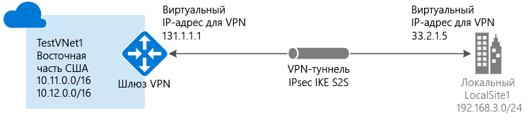

# Создание виртуальной сети с подключением типа "сайт — сайт" с помощью классического портала (классическая модель развертывания)

[!INCLUDE [deployment models](../../includes/vpn-gateway-classic-deployment-model-include.md)]

В этой статье показано, как с помощью классического портала создать подключение типа "сеть — сеть" с использованием VPN-шлюза между вашей локальной сетью к виртуальной. Приведенные в этой статье инструкции относятся к классической модели развертывания. Эту конфигурацию также можно создать с помощью разных средств или моделей развертывания, выбрав вариант из следующего списка:

> [!div class="op_single_selector"]
> * [Портал Azure](vpn-gateway-howto-site-to-site-resource-manager-portal.md)
> * [PowerShell](vpn-gateway-create-site-to-site-rm-powershell.md)
> * [ИНТЕРФЕЙС КОМАНДНОЙ СТРОКИ](vpn-gateway-howto-site-to-site-resource-manager-cli.md)
> * [Портал Azure (классический)](vpn-gateway-howto-site-to-site-classic-portal.md)
> * [Классический портал (классическая модель)](vpn-gateway-site-to-site-create.md)
> 
>

Подключение VPN-шлюза типа "сеть — сеть" используется для подключения между локальной сетью и виртуальной сетью Azure через туннель VPN по протоколу IPsec/IKE (IKEv1 или IKEv2). Для этого типа подключения требуется локальное VPN-устройство, которому назначен внешний общедоступный IP-адрес. Дополнительные сведения о VPN-шлюзах см. в [этой статье](vpn-gateway-about-vpngateways.md).

#### Дополнительные конфигурации

Если вы хотите объединить виртуальные сети, см. статью [Настройка подключения между виртуальными сетями для классической модели развертывания](virtual-networks-configure-vnet-to-vnet-connection.md). Если вы хотите добавить подключение "сеть — сеть" к виртуальной сети, в которой уже есть подключение, см. статью о [добавлении подключения "сеть — сеть" к виртуальной сети с существующим подключением через VPN-шлюз](vpn-gateway-multi-site.md).
## Перед началом работы

[!INCLUDE [deployment models](../../includes/vpn-gateway-deployment-models-include.md)]

Перед началом настройки убедитесь, что у вас есть следующее:

* Совместимое VPN-устройство и пользователь, который может настроить его. См. статью о [VPN-устройствах](vpn-gateway-about-vpn-devices.md). Если вы не умеете настраивать VPN-устройство или не знаете диапазоны IP-адресов в своей локальной сети, вам следует найти того, кто сможет предоставить вам нужную информацию.
* Внешний общедоступный IP-адрес для VPN-устройства. Этот IP-адрес не может располагаться вне преобразования сетевых адресов (NAT).
* Подписка Azure. Если у вас нет подписки Azure, вы можете [активировать преимущества для подписчиков MSDN](https://azure.microsoft.com/pricing/member-offers/msdn-benefits-details) или [зарегистрировать бесплатную учетную запись](https://azure.microsoft.com/pricing/free-trial).

## Создание виртуальной сети
1. Перейдите на [классический портал Azure](https://manage.windowsazure.com/).
2. В нижнем левом углу экрана нажмите кнопку **Создать**. В области навигации щелкните **Сетевые службы**, а затем — **Виртуальная сеть**. Нажмите кнопку **Настраиваемое создание** для запуска мастера настройки.
3. Чтобы создать виртуальную сеть, введите параметры конфигурации на указанных ниже страницах.

## Страница со сведениями о виртуальной сети
Введите следующие сведения:

* **Имя**: название виртуальной сети. Например, *EastUSVNet*. Так как это имя виртуальной сети будет использоваться при развертывании виртуальных машин и экземпляров PaaS, оно не должно быть слишком сложным.
* **Расположение**: непосредственно связано с физическим расположением (регионом) ресурсов (виртуальных машин). Например, если вы хотите, чтобы виртуальные машины в этой виртуальной сети были физически расположены в *восточной части США*, выберите соответствующий регион. После создания виртуальной сети изменить связанное с ней расположение нельзя.

## Страница со сведениями о DNS-серверах и подключении к VPN
Укажите следующие сведения и нажмите кнопку "Далее" в правом нижнем углу.

* **DNS-серверы**: введите имя и IP-адрес DNS-сервера или выберите из контекстного меню ранее зарегистрированный DNS-сервер. Этот параметр не приводит к созданию DNS-сервера. Он позволяет указать DNS-сервер, который вы хотите использовать для разрешения имен в этой виртуальной сети.
* **Настройка VPN-подключения "сеть —сеть"**: установите флажок **Настройка VPN-подключения "сеть —сеть"**.
* **Локальная сеть**представляет ваше физическое локальное расположение. Вы можете выбрать созданную ранее локальную сеть или создать новую. Если вы выбрали локальную сеть, которую ранее создали сами, перейдите на страницу настроек **Локальные сети** и проверьте, правильно ли указан IP-адрес VPN-устройства (общедоступный IPv4-адрес).

## Страница со сведениями о подключении типа "сеть —сеть"
Если вы создаете новую локальную сеть, отобразится страница **Подключение "сеть —сеть"** . Если же вы захотите использовать уже существующую локальную сеть, эта страница не откроется в мастере, и вы сможете перейти к следующему разделу.

Укажите следующие сведения и нажмите кнопку "Далее".

* **Имя**— имя расположения в локальной сети.
* **IP-адрес VPN-устройства**— это общедоступный IPv4-адрес локального VPN-устройства, которое используется для подключения к Azure. VPN-устройство невозможно найти вне преобразования сетевых адресов (NAT).
* **Адресное пространство**— начальный IP-адрес и значение CIDR (число адресов). Здесь можно указать диапазоны адресов, которые должны быть отправлены через шлюз виртуальной сети в ваше локальное расположение. Если конечный IP-адрес попадает в указанные здесь диапазоны, он маршрутизируется через шлюз виртуальной сети.
* **Добавить адресное пространство**— здесь указываются дополнительные диапазоны адресов (если у вас есть несколько диапазонов, которые нужно отправить через шлюз виртуальной сети). Диапазоны можно добавить или удалить позднее на странице **Локальная сеть** .

## Страница со сведениями об адресном пространстве виртуальной сети
Укажите диапазон адресов, который вы хотите использовать для виртуальной сети. Это динамические IP-адреса (DIP), которые будут назначаться виртуальным машинам и другим экземплярам ролей, развертываемым в этой виртуальной сети.

Особенно важно выбрать диапазон, который не пересекается с другими диапазонами, используемыми в локальной сети. В этом вам поможет сетевой администратор. Он может выделить для вашей виртуальной сети диапазон IP-адресов из адресного пространства локальной сети.

Введите следующую информацию и затем установите флажок в нижнем правом углу, чтобы настроить сеть.

* **Адресное пространство**— введите начальный IP-адрес и число адресов. Убедитесь, что указанные адресные пространства не перекрываются ни с одним из адресных пространств, которые используются в локальной сети.
* **Добавить подсеть**— введите начальный IP-адрес и число адресов. Дополнительные подсети не обязательны, но вам может понадобиться создать отдельную подсеть для виртуальных машин со статическими адресами DIPS. Или может потребоваться разместить виртуальные машины в подсети отдельно от других экземпляров ролей.
* **Добавить подсеть шлюза**— щелкните, чтобы добавить подсеть шлюза. Подсеть шлюза используется только для шлюза виртуальной сети и необходима в этой конфигурации.

Установите флажок в нижней части страницы, чтобы создать виртуальную сеть. Когда сеть будет создана, на классическом портале Azure на странице **Сети** в разделе **Состояние** отобразится значение **Создано**. После создания виртуальной сети можно настроить шлюз виртуальной сети.

[!INCLUDE [vpn-gateway-no-nsg](../../includes/vpn-gateway-no-nsg-include.md)]

## Настройка шлюза виртуальной сети
Настройте шлюз виртуальной сети для создания безопасного подключения типа "сеть — сеть". См. статью [Настройка VPN-шлюза для классической модели развертывания](vpn-gateway-configure-vpn-gateway-mp.md).

## Дальнейшие действия
 Установив подключение, можно добавить виртуальные машины в виртуальные сети. Дополнительные сведения о виртуальных машинах см. [здесь](https://docs.microsoft.com/azure/#pivot=services&panel=Compute).

