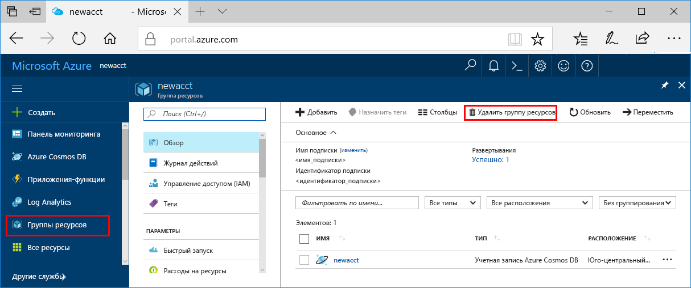

Если вы не собираетесь использовать это приложение дальше, удалите все ресурсы, созданные в ходе работы с этим кратким руководством, чтобы не оплачивать их.

>[!NOTE]
>Эти ресурсы полезны для работы с другими руководствами по службам Машинного обучения Azure.

1. На портале Azure выберите **Группы ресурсов** в левой части окна.  
 
   

2. Из списка групп ресурсов выберите созданную группу ресурсов и щелкните **Удалить группу ресурсов**.

3. Введите имя группы ресурсов, которую требуется удалить, затем щелкните **Удалить**.

