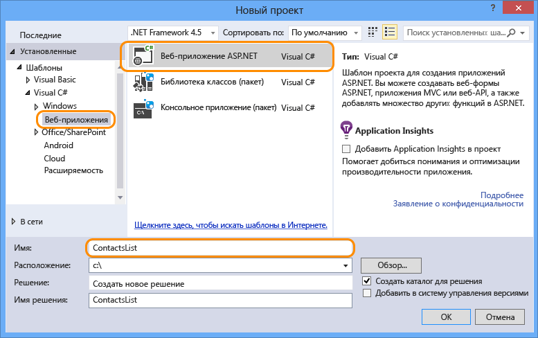
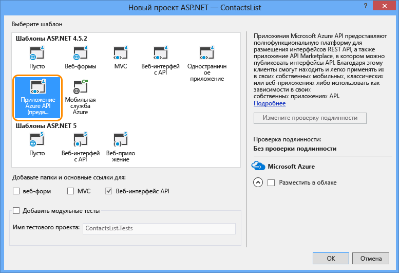

1. Откройте Visual Studio 2015 или Visual Studio 2013.
2. Выберите **Файл > Создать > Проект**.
3. Выберите шаблон **Веб-приложение ASP.NET**.
4. Убедитесь, что флажок **Добавить Application Insights в проект** снят.
5. Введите имя проекта.
   
    
6. Нажмите кнопку **ОК**.
7. В диалоговом окне **Новый проект ASP.NET** выберите шаблон **Приложение API Azure**.
   
    
8. Нажмите кнопку **ОК**, чтобы создать проект.

Visual Studio создает проект веб-API, настроенный для развертывания в виде приложения API.

<!---HONumber=Oct15_HO3-->