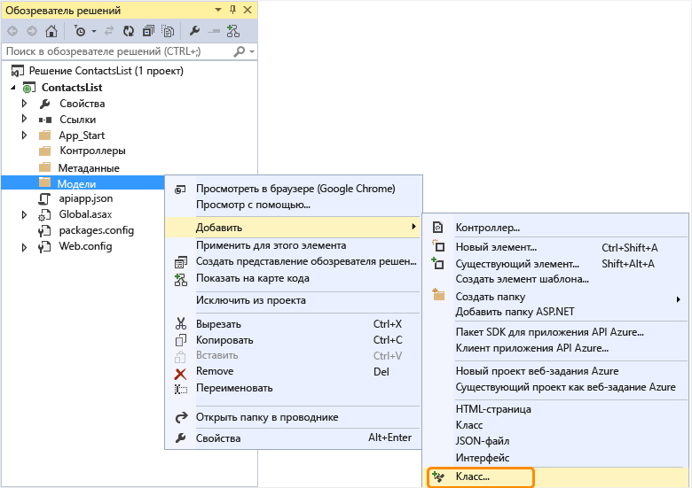
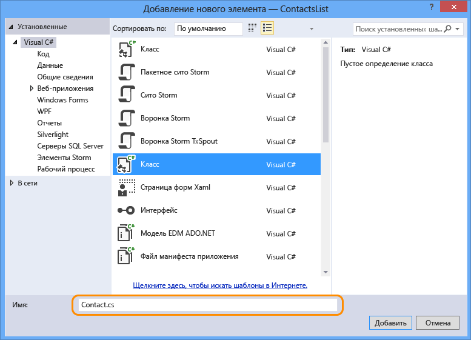
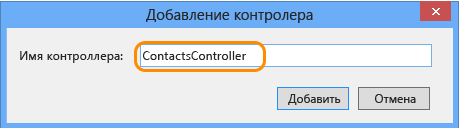

## Добавление кода веб-API

В следующих действиях вы будете добавлять код для простого метода HTTP Get, который возвращает жестко закодированный список контактов.

1. В обозревателе решений щелкните правой кнопкой мыши папку **Модели** и последовательно выберите пункты **Добавить > Класс**. 

	

2. Дайте этому новому файлу имя *Contact.cs*.

	

3. Щелкните **Добавить**.

4. После создания файла *Contact.cs* замените все его содержимое на следующий код.

		namespace ContactsList.Models
		{
			public class Contact
			{
				public int Id { get; set; }
				public string Name { get; set; }
				public string EmailAddress { get; set; }
			}
		}

5. Щелкните правой кнопкой мыши папку **Контроллеры**, а затем последовательно выберите пункты **Добавить > Контроллер.**

	

6. В диалоговом окне **Добавление Scaffold** выберите параметр **Контроллер веб-API 2 — пустой** и нажмите кнопку **Добавить**.

	

7. Назовите контроллер **ContactsController** и нажмите кнопку **Добавить**.

	

8. После создания файла ContactsController.cs замените все его содержимое следующим кодом.

		using ContactsList.Models;
		using System;
		using System.Collections.Generic;
		using System.Linq;
		using System.Net;
		using System.Net.Http;
		using System.Threading.Tasks;
		using System.Web.Http;
		
		namespace ContactsList.Controllers
		{
		    public class ContactsController : ApiController
		    {
		        [HttpGet]
		        public IEnumerable<Contact> Get()
		        {
		            return new Contact[]{
						new Contact { Id = 1, EmailAddress = "barney@contoso.com", Name = "Barney Poland"},
						new Contact { Id = 2, EmailAddress = "lacy@contoso.com", Name = "Lacy Barrera"},
	                	new Contact { Id = 3, EmailAddress = "lora@microsoft.com", Name = "Lora Riggs"}
		            };
		        }
		    }
		}

## Включение пользовательского интерфейса Swagger

По умолчанию проекты приложений API включены с автоматическим созданием метаданных [Swagger](http://swagger.io/ "Официальные сведения о Swagger"), и, если вы преобразуете проект веб-API с помощью пункта меню **Добавить пакет SDK приложения API**, также по умолчанию включается тестовая страница API.

Однако шаблон проекта нового приложения API Azure отключает эту тестовую страницу API. Если вы создали проект приложения API с помощью шаблона проекта приложения API, то для включения тестовой страницы необходимо выполнить следующие действия.

**Примечание**. Если вы развернете приложение API в качестве *общедоступного анонимного* приложения с включенным пользовательским интерфейсом Swagger, то любой сможет использовать пользовательский интерфейс Swagger для обнаружения и вызова ваших интерфейсов API.

1. Откройте файл *App_Start/SwaggerConfig.cs* и найдите **EnableSwaggerUI**:

	

2. Раскомментируйте следующие строки кода:

	        })
	    .EnableSwaggerUi(c =>
	        {

3. Когда все будет готово, файл должен выглядеть следующим образом:

	

## Тестирование веб-API

Для просмотра тестовой страницы API выполните следующие действия.

1. Запустите приложение локально (CTRL + F5) и перейдите к `/swagger`. 

	

2. Нажмите кнопку **Попробовать сейчас**. Вы увидите, что API функционирует и возвращает ожидаемый результат.

	

<!---HONumber=July15_HO4-->