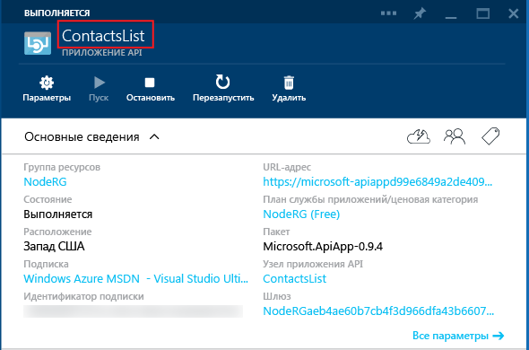

## Метаданные приложения API

В этом разделе приводятся дополнительные сведения о метаданных приложения API, которые можно настраивать.

Большинство свойств в файле *apiapp.json* и файлы в папке *Metadata* влияют на способ представления пакета приложения API в Azure Marketplace. В следующих разделах объясняется, какие свойства и файлы влияют на приложения API при развертывании вашего кода в приложение API в подписке Azure.

### Идентификатор приложения API 

Свойство `id` определяет имя приложения API. Например:

		"id": "ContactsList",

### Пространство имен

Задайте свойство `namespace` домену вашего клиента Azure Active Directory. Чтобы найти свой домен, откройте в браузере [классический портал Azure](https://manage.windowsazure.com/), перейдите в **Active Directory** и выберите вкладку **Домены**. Например:

		"namespace": "contoso.onmicrosoft.com",

### Динамическое определение API Swagger

Если приложение API может возвращать динамическое определение API [Swagger](http://swagger.io/), сохраните относительный URL-адрес для запроса GET, который возвращает JSON-файл определения API в свойстве `endpoints.apiDefinition`. Например:

		"endpoints": {
		    "apiDefinition": "/swagger/docs/v1"
		}

> **Примечание.** Если вы используете пакет Swashbuckle для создания определения API Swagger, перегрузки метода HTTP в контроллерах приводят к дублированию идентификаторов. Дополнительную информацию см. в разделе [Настройка идентификаторов операций, созданных с помощью Swashbuckle](../article/app-service-api/app-service-api-dotnet-swashbuckle-customize.md).
  
### Определение статического API Swagger

Для предоставления статического файла определения API [Swagger](http://swagger.io/) 2.0, сохраните файл в папке *Metadata* и присвойте ему имя *apiDefinition.swagger.json*.

Удалите `endpoints.apiDefinition` из файла *apiapp.json* или задайте для него значение null. Если вы оставите и URL-адрес `endpoints.apiDefinition`, и файл *apiDefinition.swagger.json*, URL-адрес будет иметь приоритет, а файл будет игнорироваться.

<!---HONumber=62-->