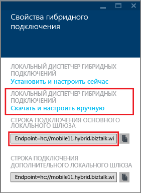
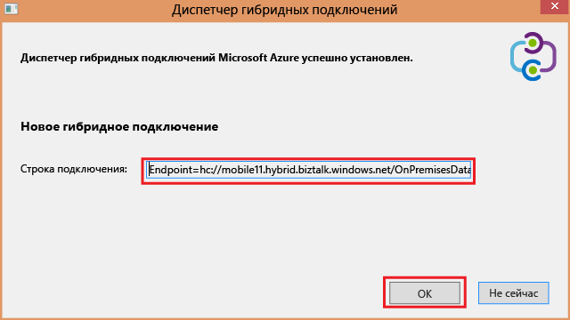
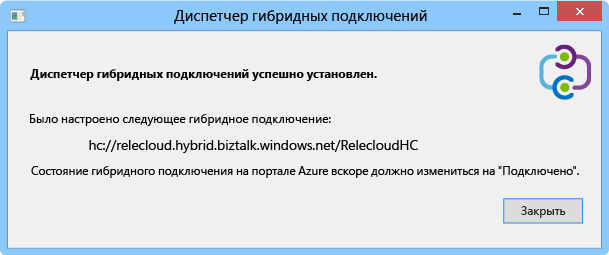
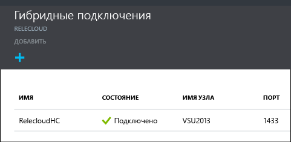

1. В колонке **Гибридные подключения** щелкните только что созданное гибридное подключение, а затем нажмите **Настройка прослушивателя**.
   
    
2. Откроется колонка **Свойства гибридного подключения**. В разделе **Локальный диспетчер гибридных соединений** выберите **Скачать и настроить вручную**, сохраните скачанный пакет HybridConnectionManager.msi и скопируйте строку подключения шлюза.
   
    
3. Введите следующую команду в командной строке администратора, чтобы запустить установщик:
   
        start HybridConnectionManager.msi
4. После запуска установщика щелкните **Подождать**, перейдите в папку %ProgramFiles%\\Microsoft\\HybridConnectionManager, запустите HCMConfigWizard.exe и нажмите кнопку **Да** в диалоговом окне **Контроль учетных записей пользователей**.
5. Вставьте заранее скопированную гибридную строку подключения и нажмите кнопку **ОК**.
   
    
6. После завершения установки щелкните кнопку **Закрыть**.
   
    
   
    На выноске **Гибридные подключения** в столбце **Состояние** теперь отображается **Подключено**.
   
    

<!---HONumber=AcomDC_1125_2015-->