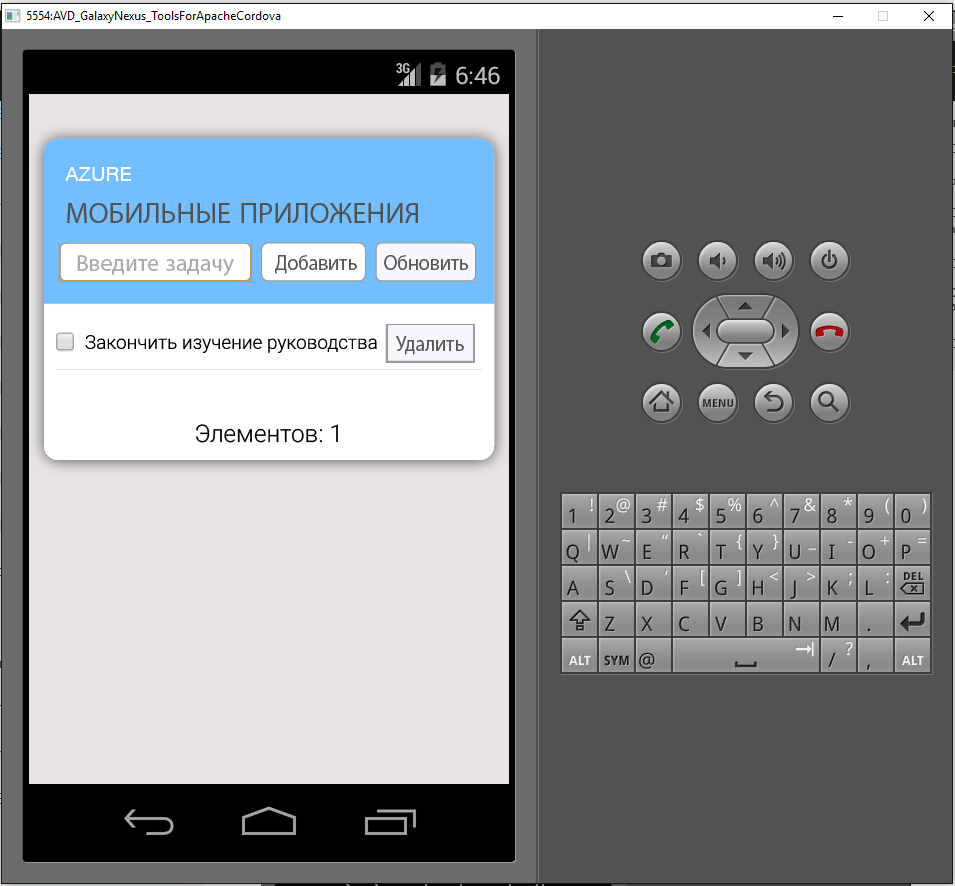

1. Откройте [портал Azure]. Щелкните **Просмотреть все** > **Мобильные приложения** и выберите только что созданную серверную часть приложения. В параметрах мобильного приложения щелкните **Быстрый старт** > **Cordova**. В разделе **Настройка клиентского приложения** выберите **Создание приложения**, а затем нажмите кнопку **Скачать**. Будет скачан полный проект Cordova для приложения, предварительно настроенный для подключения к серверу.
2. Распакуйте скачанный ZIP-файл в каталог на жестком диске, перейдите к файлу решения (SLN) и откройте его с помощью Visual Studio.
3. В Visual Studio выберите платформу решения (Android, iOS или Windows) в раскрывающемся меню, которое находится возле стрелки запуска, затем выберите устройство развертывания или эмулятор. Для этого щелкните зеленую стрелку, чтобы открылось раскрывающееся меню. Обратите внимание, что вы можете использовать стандартную платформу Android и эмулятор Ripple. В руководствах для продвинутых пользователей требуется выбрать поддерживаемое устройство или эмулятор.
4. Нажмите клавишу F5 или зеленую стрелку, чтобы создать и запустить приложение Cordova. Если отображается диалоговое окно безопасности в эмуляторе, которое требует доступ к сети, примите запрос.
5. После запуска приложения на устройстве или эмуляторе введите осмысленный текст в поле **Enter new text** (Ввод нового текста), например *Complete the tutorial* (Завершение работы с руководством), и нажмите кнопку **Добавить**. Это отправляет запрос POST на ранее развернутый внутренний сервер Azure. Сервер вносит данные из запроса в таблицу TodoItem в базе данных SQL и возвращает сведения о сохраненных элементах в мобильное приложение. В мобильном приложении эти данные отображаются в списке.
   
    .
6. Повторите предыдущие три этапа для каждой платформы устройства, которую вы планируете поддерживать.

[портал Azure]: https://portal.azure.com/

<!---HONumber=AcomDC_0817_2016-->