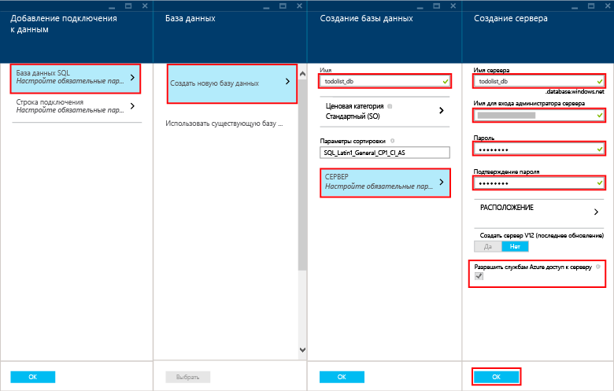

Чтобы создать мобильное приложение, сделайте вот что.

1. Войдите на [портал Azure]. В нижней левой части экрана нажмите кнопку **+СОЗДАТЬ**. Прокрутите до элемента **Мобильное приложение**.

    

    Отобразится колонка **Новое мобильное приложение**.

2. Введите имя для нового мобильного приложения. Оно должно содержать как минимум 8 строчных букв (a–z).

7. Выберите регион. В этом учебнике используется **Юго-центральный регион США**.

    > [AZURE.NOTE]В рамках данного учебника вы создадите новый экземпляр базы данных SQL и сервер. Эту новую базу данных можно потом использовать и администрировать ее, как и любой другой экземпляр базы данных SQL. Если в том же регионе, где хранится серверная часть нового мобильного приложения, у вас уже есть база данных, выберите ее с помощью команды **Использовать существующую базу данных**. Из-за затрат на увеличение пропускной способности и более длительных задержек не рекомендуется использовать базу данных в другом регионе.

3. Выберите свою подписку.

4. Создайте группу ресурсов с таким же именем, что и мобильное приложение.

5. В разделе **Параметры пакета** выберите пункт **USERDATABASE**. Здесь можно выбрать существующую базу данных или создать новую. Чтобы создать новую **базу данных**, введите ее имя, создайте новый **сервер**, введите его имя, а затем выберите **имя для входа** в систему, которое соответствует имени для входа администратора нового сервера базы данных SQL. После этого введите пароль, подтвердите его и нажмите кнопку "ОК", чтобы завершить процесс. При выборе существующей базы данных нужно будет указать **пароль администратора сервера**.

    

6. Создайте новый план веб-хостинга с тем же именем, что и у вашего мобильного приложения.

    > [AZURE.NOTE]Введите вручную имя плана веб-хостинга. Не используйте функцию копирования и вставки. В этом поле выполняется проверка имени. Если его не ввести вручную, проверка завершится ошибкой. Имя необязательно должно полностью совпадать с веб-сайтом (но оно должно соответствовать тем же правилам).

8. Выберите ценовую категорию. В этом учебнике мы используем **Standard 1**.

    Теперь страница параметров вашего нового мобильного приложения будет выглядеть приблизительно так:

    

9. Нажмите кнопку **Создать** внизу колонки, после чего в окне уведомлений будет виден процесс развертывания.

Создание серверной части нового мобильного приложения завершено, и ее можно использовать для мобильных приложений.

> [AZURE.NOTE]После создания мобильного приложения перейдите на портале к только что созданному серверу SQL (убедитесь, что выбран сервер, а не база данных SQL Azure). Щелкните раздел параметров, раскройте раздел брандмауэра и выберите пункт "Разрешить доступ к службам Azure". Если этого не сделать, приложение не будет работать.

<!-- URLs. -->
[портал Azure]: https://portal.azure.com/

<!---HONumber=July15_HO3-->