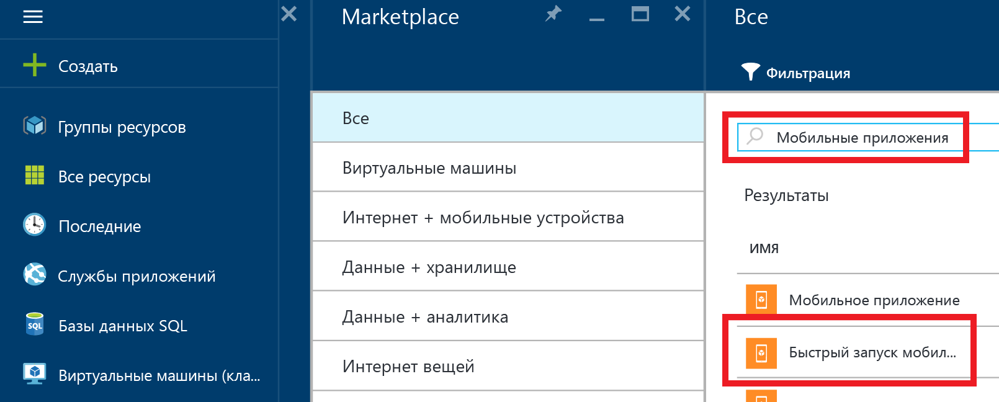

1. Войдите на [портал Azure].

2. Щелкните **+Создать** и в поле _Поиск по Marketplace_ введите **Мобильные приложения**. Выберите **Mobile Apps Quickstart** (Быстрый запуск мобильных приложений) и щелкните **Создать**.

	

3. В поле **Группа ресурсов** выберите существующую группу ресурсов или создайте новую (с тем же именем, что и у приложения).
 
4. Щелкните **Создать**. Прежде чем продолжать, подождите несколько минут, пока будет выполнено развертывание службы.

<!-- URLs. -->
[портал Azure]: https://portal.azure.com/

<!---HONumber=AcomDC_0803_2016---->