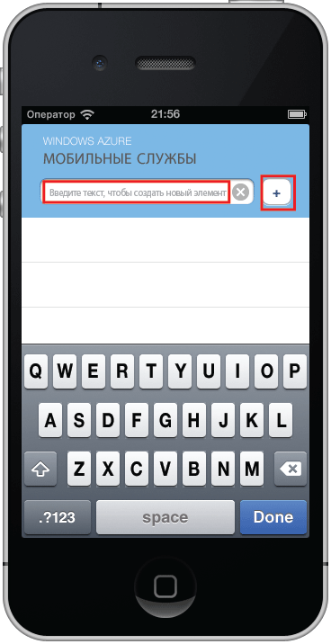

Последний раздел учебника — построение и выполнение нового приложения.

1. Перейдите в расположение, где были сохранены сжатые файлы проекта, извлеките файлы на компьютер и откройте файл проекта с помощью Xcode.

2. Нажмите кнопку **Запустить**, чтобы выполнить сборку проекта и запустить приложение в эмуляторе iPhone.

3. В приложении введите осмысленный текст, например _Работа с учебником_, и щелкните значок «плюс» (**+**).

   	

   	При этом в новое мобильное приложение, размещенное в Azure, будет отправлен запрос POST. Данные из запроса вставляются в таблицу TodoItem. Мобильное приложение возвращает элементы, хранящиеся в таблице, и данные отображаются в списке.

 	

<!---HONumber=August15_HO6-->