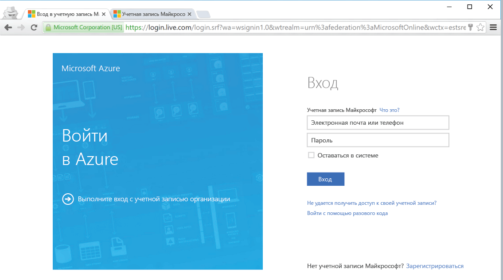

<!--
includes/azure-include-getting-started-v12portal-gettings-an-account.md

Latest Freshness check:  2016-04-11 , carlrab.

As of circa 2016-04-11, the following topics might include this include:
articles/sql-database/sql-database-get-started-tutorial.md

-->
## Подключение к порталу Microsoft Azure с помощью подписки

Для подключения к порталу Microsoft Azure вам нужна подписка.

### Получение новой учетной записи

Если у вас нет учетной записи Microsoft Azure, перейдите по одной из ссылок ниже, чтобы получить учетную запись.

- Получите [бесплатную учетную запись](https://azure.microsoft.com/get-started/)
- Используйте [подписку MSDN](https://azure.microsoft.com/pricing/member-offers/msdn-benefits/)

###Вход с помощью существующей учетной записи

Используя [существующую подписку](https://account.windowsazure.com/Home/Index), выполните следующие действия, чтобы подключиться к порталу Azure.

1. Откройте любой браузер и подключитесь к [порталу Azure](https://portal.azure.com/).

1. Войдите на [портал Azure](https://portal.azure.com/).

1. Когда появится страница входа, введите учетные данные своей подписки.

   
   

<!---HONumber=AcomDC_0420_2016-->