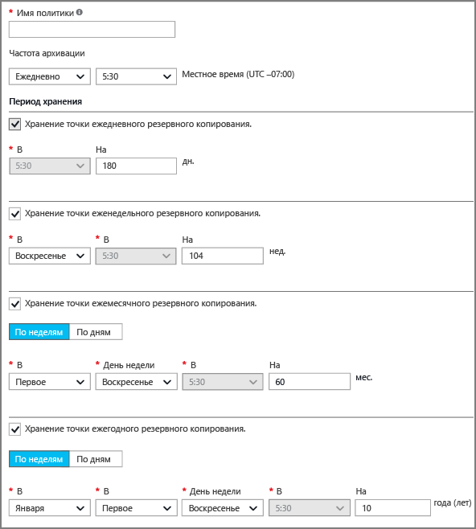
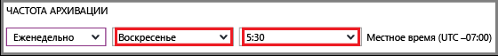

## Добавление политики резервного копирования
Политика резервного копирования определяет расписание создания моментальных снимков и период их хранения. В параметрах политики резервного копирования виртуальной машины можно задать *ежедневное*выполнение задания резервного копирования. Созданная политика применяется к хранилищу. Интерфейс политики резервного копирования выглядит следующим образом:

Чтобы создать политику, сделайте следующее:

1. Введите **имя политики**.
2. Моментальные снимки данных можно создавать ежедневно или еженедельно. Этот интервал можно выбрать с помощью раскрывающегося меню **Частота архивации** .
   
   * При выборе ежедневного интервала используйте выделенный элемент управления, чтобы выбрать время создания моментального снимка. Чтобы изменить время, отмените выбор установленного времени и задайте новое.
     
       
   * При выборе еженедельного интервала используйте выделенные элементы управления, чтобы выбрать день и время создания моментального снимка. В раскрывающемся списке дней выберите один или несколько дней. В раскрывающемся списке времени выберите время. Чтобы изменить время, отмените выбор установленного времени и задайте новое.
     
     
3. По умолчанию для параметра **Диапазон хранения** выбраны все значения. Если вам нужно оставить лишь определенные значения, оставьте флажки напротив соответствующих значений. Затем укажите нужные интервалы.
   
    С помощью параметров ежемесячного и ежегодного хранения можно задать период хранения моментальных снимков по мере добавления новых снимков каждый день или каждую неделю.
   
   > [!NOTE]
   > В рамках защиты виртуальной машины задание резервного копирования выполняется раз в день. Время запуска резервного копирования одинаковое независимо от диапазона хранения.
   > 
   > 
4. После настройки всех параметров политики нажмите кнопку **Сохранить**в верхней части колонки.
   
    Новая политика будет немедленно применена к хранилищу.

