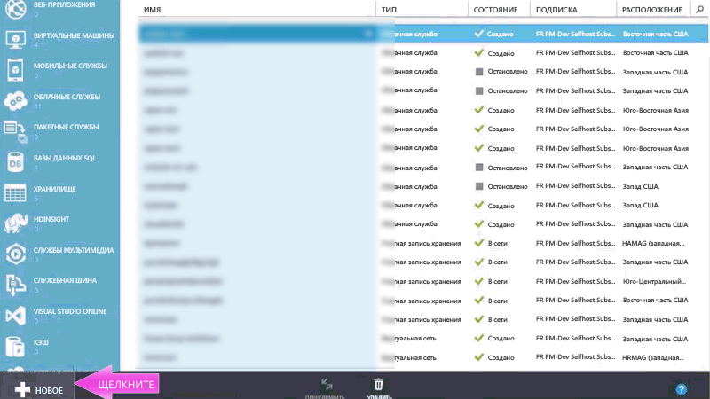
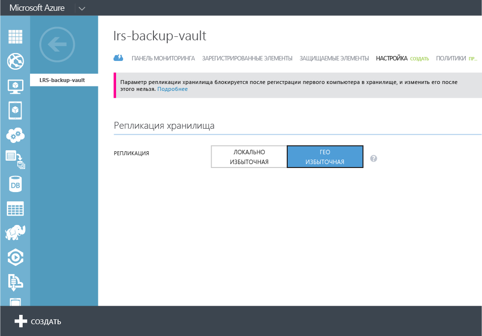
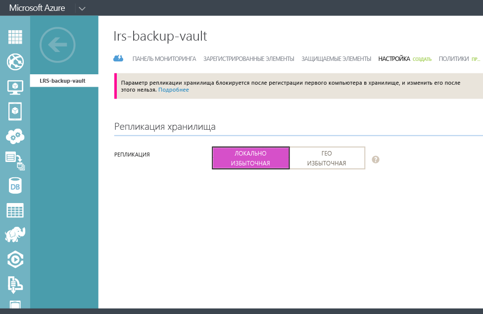

## Создание хранилища службы архивации
Для резервного копирования файлов и данных из Windows Server или System Center Data Protection Manager (SCDPM) в Azure либо для резервного копирования виртуальных машин IaaS в Azure необходимо создать хранилище службы архивации в том географическом регионе, где вы хотите хранить данные.

В этой статье мы расскажем, как создать хранилище, в котором будут храниться резервные копии.

## Видеоруководство

Краткая видеозапись процесса.

[AZURE.VIDEO azure-backup-vault-creation]

Ниже описаны действия по созданию хранилища, используемого для хранения резервных копий.

### Создание резервного хранилища
1. Войдите на [портал управления](https://manage.windowsazure.com/).
2. Последовательно выберите пункты **Создать**, **Службы данных**, **Службы восстановления**, **Хранилище архивации** и **Быстрое создание**.
3. В поле **Имя** укажите понятное имя для идентификации хранилища. Это имя должно быть уникальным для каждой подписки.
4. В поле **Регион** выберите географический регион хранилища. Этот выбор определяет географический регион, в который будут отправляться архивируемые данные. Выбрав географический регион, который находится недалеко от вашего расположения, можно уменьшить задержки в сети при архивации данных в Azure.
5. Для завершения процесса выберите команду **Создать хранилище**. Для создания резервного хранилища может потребоваться некоторое время. Для проверки состояния можно отслеживать уведомления в нижней части портала.

    

6. После создания хранилища архивации отобразится сообщение о том, что оно успешно создано. Кроме того, это хранилище отобразится в списке ресурсов служб восстановления с состоянием **Активное**.

### Служба архивации Azure и параметры избыточности хранилища

Наилучшее время для определения параметров избыточности хранилища — сразу после его создания и перед регистрацией в нем любых компьютеров. После регистрации элемента в хранилище параметр избыточности хранилища блокируется и в последствии не может быть изменен.

Избыточность серверного хранилища службы архивации Azure определяется бизнес-потребностями. Если Azure используется как основная конечная точка хранилища резервных копий (например, резервное копирование в Azure выполняется с Windows Server), рекомендуем выбрать параметр геоизбыточного хранилища (значение по умолчанию). Этот параметр находится в разделе **Настройка** хранилища архивации.

#### Геоизбыточное хранилище (GRS)
GRS хранит шесть копий ваших данных. С GRS ваши данные реплицируются три раза в первичном регионе, а также три раза во вторичном регионе, который находится с сотнях километров от первичного, для самого высокого уровня устойчивости. При сохранении данных в геоизбыточном хранилище служба архивации Azure хранит данные в двух разных регионах на случай, если хранилище в основном регионе станет недоступным.

#### Локально избыточное хранилище (LRS)
Локально избыточное хранилище (LRS) обслуживает три копии ваших данных. LRS реплицируется три раза в рамках одного помещения одного региона. LRS защищает ваши данные от стандартных сбоев оборудования, но не от сбоев всего комплекса Azure.

При использовании Azure как конечной точки хранилища резервных копий третьего уровня (например, вы используете SCDPM, чтобы иметь локальную резервную копию, и используете Azure для длительного хранения) для параметра **Настройка** в хранилище службы архивации следует выбрать локально избыточное хранилище. Это снизит затраты на хранение данных в Azure, но при этом также снизится уровень устойчивости данных, что может быть допустимо для копий третьего уровня.

<!---HONumber=August15_HO9-->