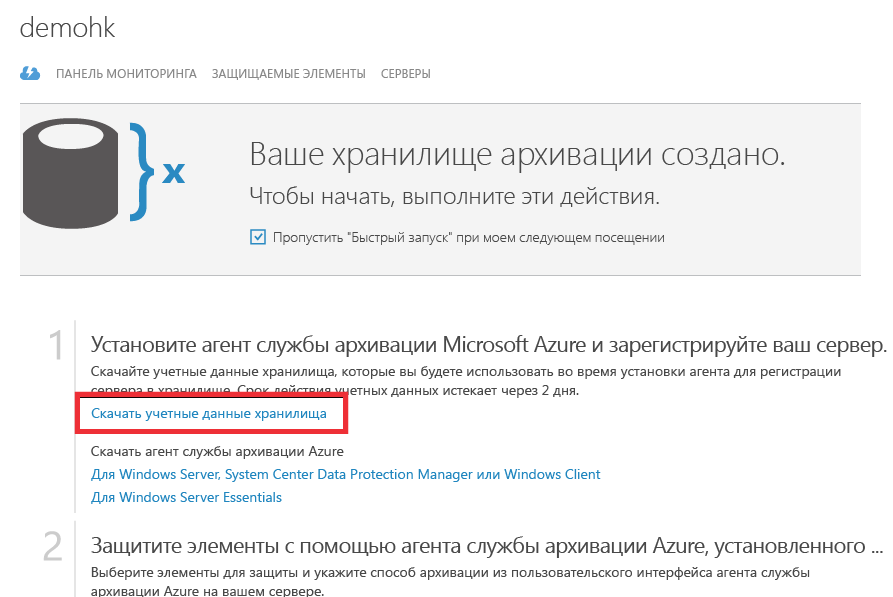

## Использование учетных данных хранилища для проверки подлинности в службе архивации Azure
Перед архивированием данных локального сервера в Azure (клиент Windows, Windows Server или сервер Data Protection Manager) сервер должен пройти проверку подлинности в службах восстановления. Используйте файл учетных данных хранилища для проверки подлинности сервера с помощью Azure. Файл учетных данных хранилища выполняет те же функции, что и файл publish settings в Azure PowerShell.

### Что такое файл учетных данных хранилища
Файл учетных данных хранилища представляет собой сертификат, который создается порталом для каждого хранилища архивации. Затем портал отправляет открытый ключ в службу контроля доступа (ACS). Закрытый ключ сертификата предоставляется пользователю. Его нужно указывать в качестве входных данных во время регистрации компьютера. Это позволяет компьютеру проходить проверку подлинности и отправлять резервные копии данных в указанное хранилище в службе архивации Azure.

Учетные данные хранилища используются только в рабочем процессе регистрации. За безопасность файла учетных данных хранилища отвечает сам пользователь. Если файл попадет в руки посторонних лиц, им могут воспользоваться для регистрации других компьютеров в том же хранилище. Тем не менее, так как резервные копии данных зашифрованы с помощью парольной фразы, которая принадлежит клиенту, имеющиеся резервные данные не будут скомпрометированы. Чтобы устранить эту проблему, срок действия учетных данных хранилища истекает через 48 ч. Учетные данные хранилища можно загружать неограниченное количество раз, но только последний загруженный файл с учетными данными подходит для регистрации.

### Скачивание файла учетных данных хранилища
Файл учетных данных хранилища скачивается с портала Azure через безопасный канал. Служба архивации Azure не знает о существовании закрытого ключа сертификата, а сам закрытый ключ не хранится ни на портале, ни в службе. Чтобы скачать файл учетных данных хранилища на локальный компьютер, выполните указанные ниже действия.

1. Откройте [портал Azure](https://ms.azure.portal.com/).
2. В левом меню выберите **Все службы** и в списке служб введите **службы восстановления**. Щелкните **Хранилища служб восстановления**.

   
3. На странице быстрого запуска щелкните элемент **Скачать учетные данные хранилища**. Портал создаст необходимый файл учетных данных, который можно скачать.
   
   
4. Портал создаст учетные данные хранилища с помощью сочетания имени хранилища и текущей даты. Щелкните **Сохранить**, чтобы скачать учетные данные хранилища в папку скачиваемых файлов в локальной учетной записи. Кроме того, в меню "Сохранить" можно выбрать пункт "Сохранить как" и указать любую папку, в которую будет сохранен скачиваемый файл.

### Примечание
* Убедитесь, что учетные данные хранилища сохраняются в расположении, к которому у вашего компьютера есть доступ. Если они сохраняются на файловый ресурс, доступ к которому осуществляется по протоколу SMB, убедитесь, что у вас есть необходимые разрешения на доступ к этому ресурсу.
* Файл учетных данных хранилища используется только во время регистрации.
* Срок действия файла учетных данных хранилища истекает через 48 часов. Новый файл можно загрузить с портала.
* Если у вас возникли вопросы об описанном процессе, см. [часто задаваемые вопросы](../articles/backup/backup-azure-backup-faq.md) о службе архивации Azure.

