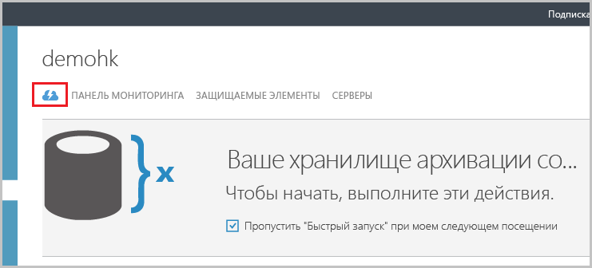
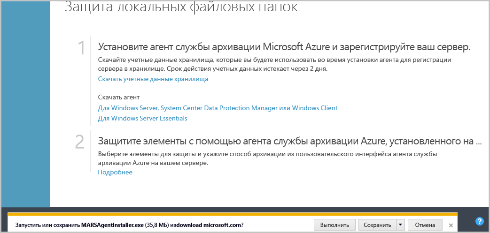
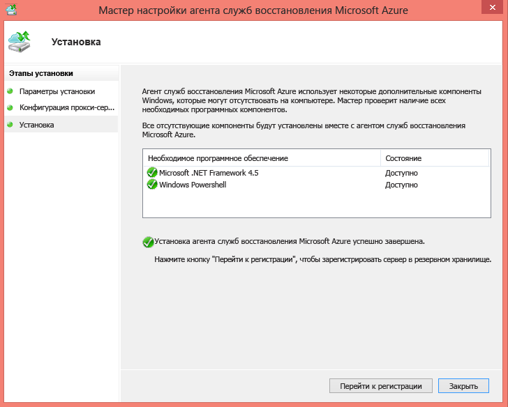
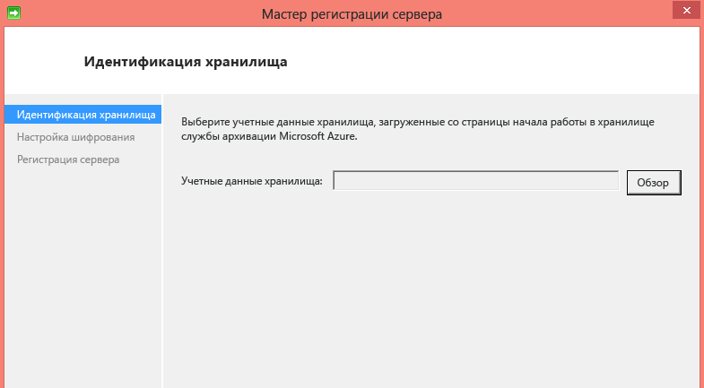
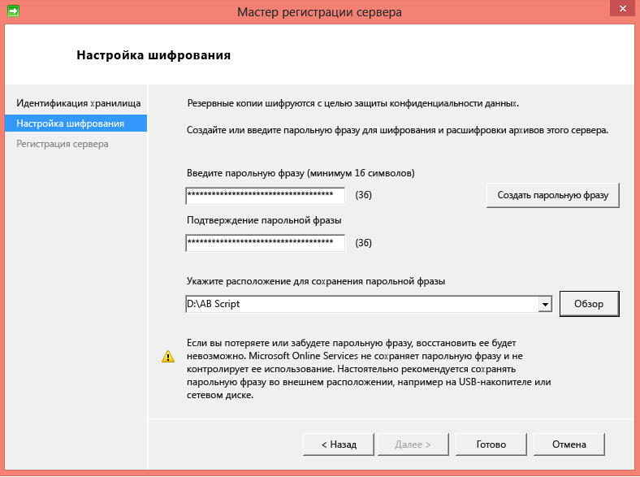
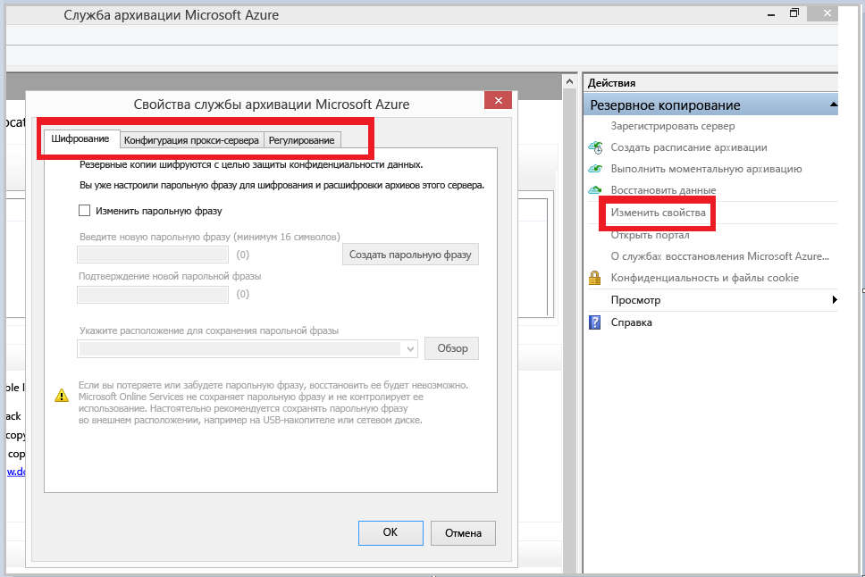
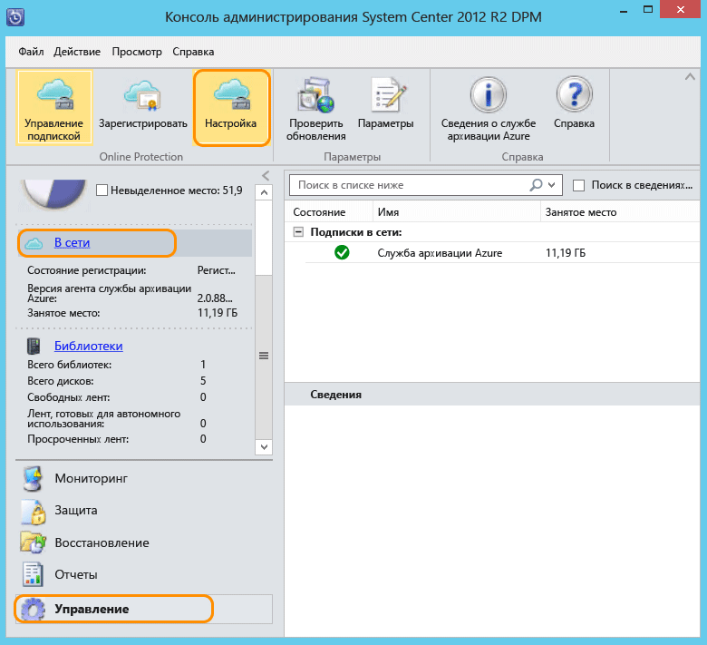

## Скачивание, установка и регистрация агента службы архивации Azure
После создания хранилища службы архивации Azure на каждом компьютере под управлением Windows (Windows Server, клиент Windows, сервер System Center Data Protection Manager и компьютер с сервером службы архивации Azure) необходимо установить агент, который позволяет архивировать данные и приложения в Azure.

1. Войдите на [портал управления](https://manage.windowsazure.com/)
2. Щелкните **Службы восстановления**, затем выберите хранилище архивации, которое необходимо зарегистрировать на сервере. Появится страница «Быстрый запуск» для этого хранилища архивации.
   
    
3. На странице быстрого запуска в разделе **Скачивание агента** выберите пункт **Для Windows Server, System Center Data Protection Manager или клиента Windows**. Нажмите кнопку **Сохранить** , чтобы скопировать его на локальный компьютер.
   
    
4. После установки агента дважды щелкните файл MARSAgentInstaller.exe, чтобы начать установку агента службы архивации Azure. Выберите папку установки и временную папку для агента. Указанное расположение кэша должно иметь свободное место, равное по крайней мере 5 % размера резервной копии данных.
5. При использовании прокси-сервера для подключения к Интернету на экране **Конфигурация прокси-сервера** введите данные прокси-сервера. Если используется проверенный прокси-сервер, введите имя пользователя и пароль.
6. В конце процесса установки агент службы архивации Azure установит .NET Framework 4.5 и Windows PowerShell (если эти компоненты еще не установлены).
7. После установки агента нажмите кнопку **Перейти к регистрации** .
   
   
8. На экране учетных данных хранилища найдите и выберите ранее скачанный файл учетных данных хранилища.
   
    
   
    Файл учетных данных хранилища действителен только в течение 48 часов после загрузки с портала. Если на этом этапе отобразится ошибка (например, «Срок действия файла учетных данных истек»), войдите на портал Azure и загрузите файл учетных данных хранилища еще раз.
   
    Убедитесь, что файл учетных данных хранилища находится в расположении, к которому может получить доступ программа установки. При возникновении ошибок, связанных с доступом, скопируйте файл учетных данных хранилища во временное расположение на этом компьютере и повторите операцию.
   
    Если возникает ошибка недопустимых учетных данных хранилища (например, "Указаны недопустимые учетные данные хранилища"), это означает, что либо файл поврежден, либо в нем нет последних учетных данных, сопоставленных со службой восстановления. Скачайте новый файл учетных данных хранилища на портале, а затем повторите операцию. Эта ошибка обычно возникает, если несколько раз подряд нажать кнопку **Загрузить учетные данные хранилища** . В этом случае действительным является только второй файл учетных данных хранилища.
9. На экране **Параметры шифрования** можно создать парольную фразу или ввести уже имеющуюся (длиной не менее 16 символов). Не забудьте сохранить парольную фразу в безопасном месте.
   
    
   
   > [!WARNING]
   > Если вы потеряли или забыли парольную фразу, корпорация Майкрософт не сможет помочь при восстановлении резервной копии данных. Парольная фраза принадлежит конечному пользователю, и корпорация Майкрософт не имеет возможности ее просматривать. Сохраните файл в безопасном месте, так как он потребуется при выполнении операции восстановления.
   > 
   > 
10. После нажатия кнопки **Готово** компьютер будет зарегистрирован в хранилище. Теперь все готово для резервного копирования в Microsoft Azure.
11. При автономном использовании службы архивации Microsoft Azure параметры, указанные при регистрации, можно изменить с помощью команды **Изменить свойства** в оснастке MMC службы архивации Azure.
    
    
    
    Кроме того, при использовании Data Protection Manager можно изменить параметры, заданные в процессе регистрации. Для этого на вкладке **Управление** выберите пункт **В сети** и нажмите кнопку **Настроить**.
    
    

<!--HONumber=Nov16_HO3-->

