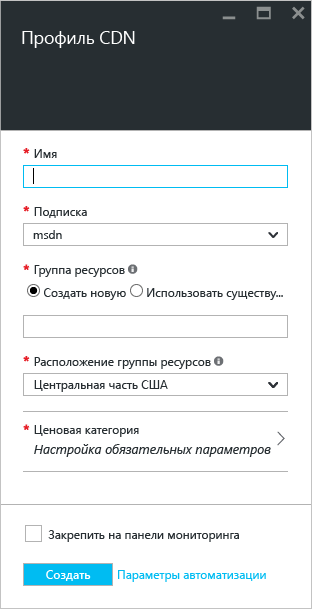
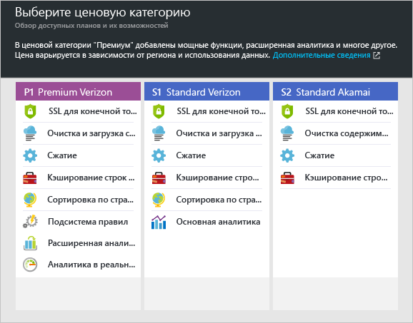

**Создание нового профиля сети CDN**

1. На [портале Azure](https://portal.azure.com)слева вверху щелкните **Создать**.  В колонке **создания** выберите **Интернет и мобильные устройства**, а затем **CDN**.
   
    Появится колонка нового профиля сети CDN.
   
    
2. Введите имя профиля сети CDN.
3. Выберите **расположение**.  Это расположение Azure, где будут храниться данные профиля сети CDN.  Оно не влияет на расположение конечных точек сети CDN.
4. Выберите или создайте **группу ресурсов**.  Дополнительные сведения о группах ресурсов см. в статье [Общие сведения об Azure Resource Manager](../articles/azure-resource-manager/resource-group-overview.md#resource-groups).
5. Выберите **ценовую категорию**.  Сравнение ценовых категорий см. в [обзоре CDN](../articles/cdn/cdn-overview.md#azure-cdn-features).
   
    
6. Выберите **подписку** для этого профиля сети CDN.
7. Нажмите кнопку **Создать** , чтобы создать новый профиль. 

