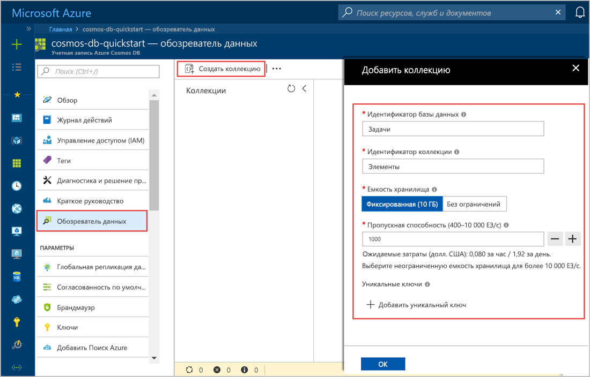
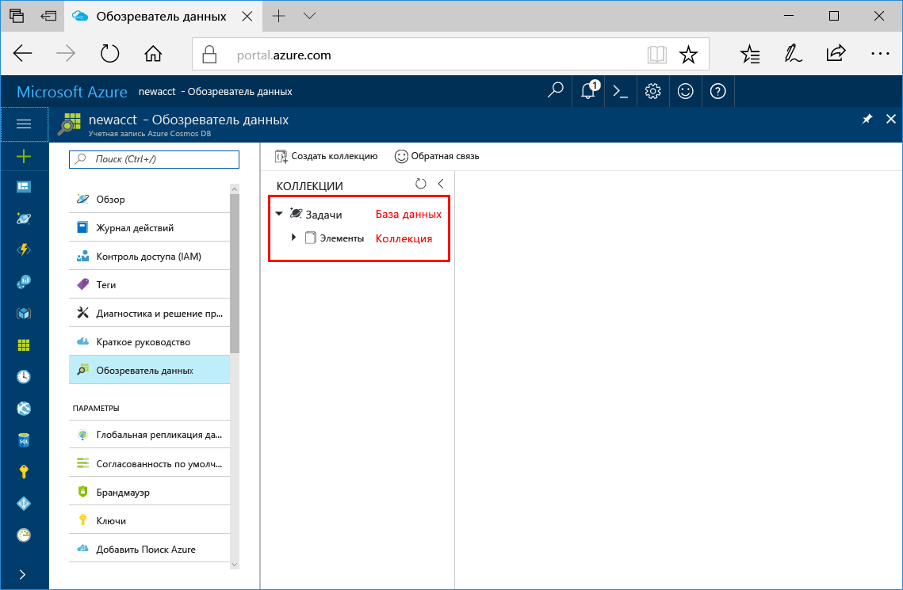

Теперь вы можете использовать средство обозреватель данных на портале Azure для создания базы данных и коллекции. 

1. Щелкните **Обозреватель данных** > **Новая коллекция**. 
    
    Справа отобразится область **Добавление коллекции** (вам может потребоваться прокрутить вправо, чтобы увидеть ее).

    

2. На странице **Добавление коллекции** введите параметры для новой коллекции.

    Параметр|Рекомендуемое значение|ОПИСАНИЕ
    ---|---|---
    Идентификатор базы данных|Задачи|Введите *Задача* в качестве имени новой базы данных. Имена баз данных должны быть длиной от 1 до 255 символов и не могут содержать символы /, \\, #, ? или пробел.
    Идентификатор коллекции|Items|Введите *Элементы* в качестве имени новой коллекции. Для идентификаторов коллекций предусмотрены те же требования к символам, что и для имен баз данных.
    Емкость хранилища| Фиксированный (10 ГБ)|Используйте значение по умолчанию — **Fixed (10 GB)** (Фиксированный (10 ГБ)). Это значение представляет емкость хранилища базы данных.
    Throughput|400 ЕЗ|Укажите для пропускной способности 400 единиц запросов в секунду. Следует выбрать емкость хранилища **Fixed (10 GB)** (Фиксированная (10 ГБ)), чтобы пропускная способность составляла 400 единиц запроса в секунду. Чтобы сократить задержку, позже вы можете увеличить масштаб пропускной способности. 
    
    Помимо указанных выше параметров вы также можете добавить **уникальные ключи** для коллекции. В рамках этого примера оставим это поле пустым. Уникальные ключи предоставляют разработчикам возможность добавить слой целостности данных в базу данных. Создавая политику уникальных ключей при создании коллекции, вы гарантируете уникальность одного или нескольких значений ключа секции. Дополнительные сведения см. в статье [Уникальные ключи в Azure Cosmos DB](../articles/cosmos-db/unique-keys.md).
    
    Последовательно выберите **ОК**.

    В обозревателе данных отобразится новая база данных и коллекция.

    