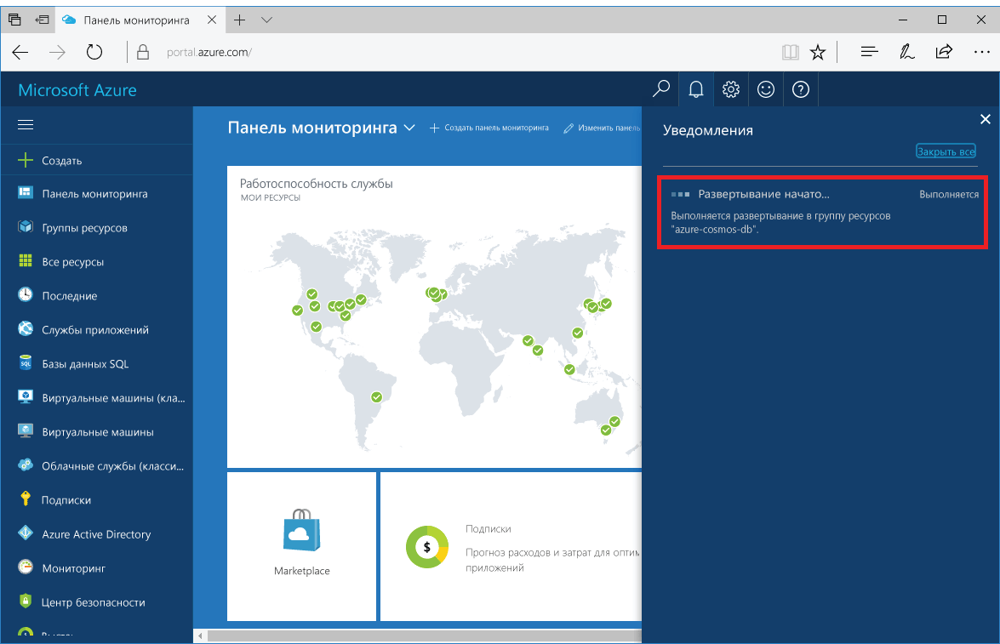
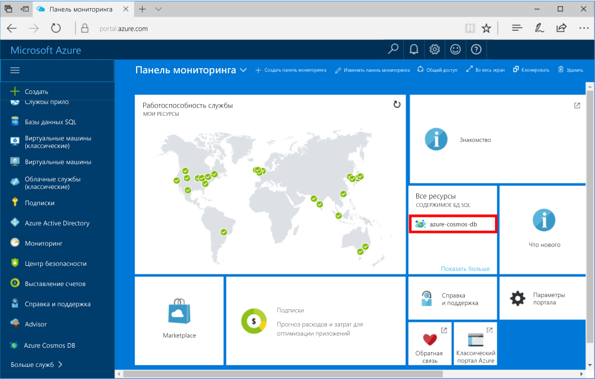

1. В новом окне войдите на [портал Azure](https://portal.azure.com/).
2. В меню слева щелкните **Создать ресурс**, **Базы данных**, а затем в разделе **Azure Cosmos DB** выберите **Создать**.
   
   

3. В колонке **Новая учетная запись** укажите **MongoDB** в качестве API и укажите желаемую конфигурацию учетной записи Azure Cosmos DB.
 
    

    * **Идентификатор** должен быть уникальным именем, выбранным для идентификации учетной записи Azure Cosmos DB. В нем могут использоваться только строчные буквы, цифры и символ -, а его длина должна составлять от 3 до 50 символов.
    * **Подписка.** Ваша подписка Azure. Она будет указана автоматически.
    * **Группа ресурсов.** Имя группы ресурсов для вашей учетной записи Azure Cosmos DB.
    * **Расположение.** Географическое расположение, в котором будет размещен экземпляр Azure Cosmos DB. Выберите ближайшее к пользователям расположение.

4. Щелкните **Создать** , чтобы создать учетную запись.
5. На панели инструментов щелкните **Уведомления**, чтобы отслеживать процесс развертывания.

    

6.  После завершения развертывания откройте новую учетную запись из плитки "Все ресурсы". 

    
