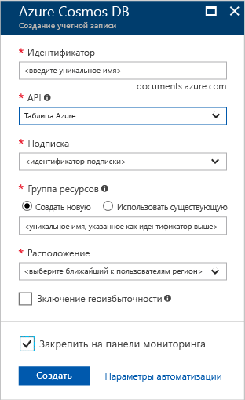

1. В новом окне браузера войдите на [портал Azure](https://portal.azure.com/).
2. В меню слева щелкните **Создать**, далее — **Базы данных**, затем выберите **Azure Cosmos DB** > **Создать**. 
   
   

3. На странице **Новая учетная запись** введите параметры для новой учетной записи Azure Cosmos DB. 
 
    Настройка|Рекомендуемое значение|Описание
    ---|---|---
    ИД|*Укажите уникальное имя*|Введите уникальное имя для идентификации этой учетной записи Azure Cosmos DB. Так как элемент *documents.azure.com* добавляется к указанному идентификатору для создания URI, используйте уникальный, но узнаваемый идентификатор.  В идентификаторе должны использоваться только строчные буквы, цифры и знак дефиса (-). Длина идентификатора должна составлять от 3 до 50 символов.
    API|таблице Azure|API определяет тип учетной записи, которую нужно создать. Azure Cosmos DB предоставляет пять API, чтобы обеспечить соответствие требованиям вашего приложения : SQL (база данных документов), Gremlin (база данных графов), MongoDB (база данных документов), таблица Azure и Cassandra. Сейчас для каждой модели требуется отдельная учетная запись.  Выберите **таблицу Azure**, так как в этом кратком руководстве создается таблица, которая работает с API таблиц.  [Дополнительные сведения об API таблицы](../articles/cosmos-db/table-introduction.md) |
    Подписки|*Введите уникальное имя, указанное ранее в идентификаторе*.|Выберите подписку Azure, которую планируете использовать для этой учетной записи Azure Cosmos DB. 
    Группа ресурсов|*То же значение, что и для идентификатора*|Введите новое имя группы ресурсов для учетной записи. Для удобства можно использовать то же имя, которое присвоено идентификатору. 
    Расположение|*Выберите ближайший к пользователям регион*|Выберите географическое расположение, в котором будет размещена учетная запись Azure Cosmos DB. Используйте ближайшее к пользователям расположение, чтобы предоставить им максимально быстрый доступ к данным.
    Включение геоизбыточности| Не указывайте | Будет создана реплицированная версия базы данных во втором регионе (из пары). Оставьте это поле пустым.  
    Закрепить на панели мониторинга | Выберите пункт | Установите этот флажок, чтобы добавить новую учетную запись базы данных на панель мониторинга портала для быстрого доступа.

    Затем щелкните **Создать**.  

    

4. Создание учетной записи займет несколько минут. При создании учетной записи на портале отображается плитка **развертывания Azure Cosmos DB**.

    

    После создания учетной записи появится страница с сообщением **Congratulations! Your Azure Cosmos DB account was created** (Поздравляем! Ваша учетная запись Azure Cosmos DB создана).
