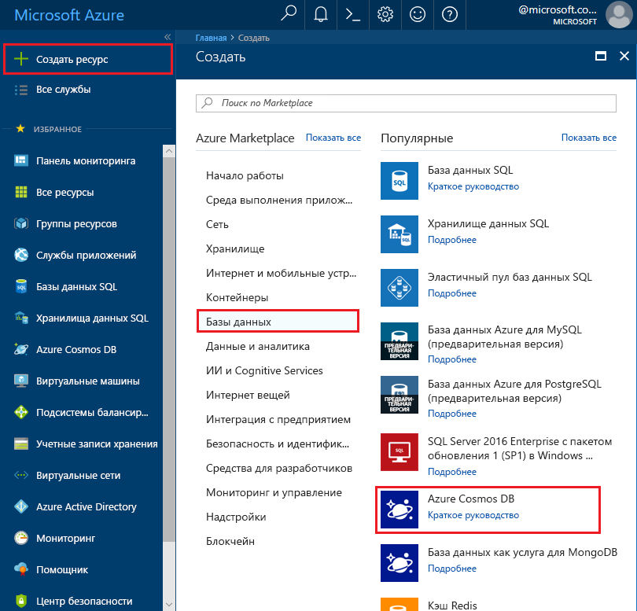
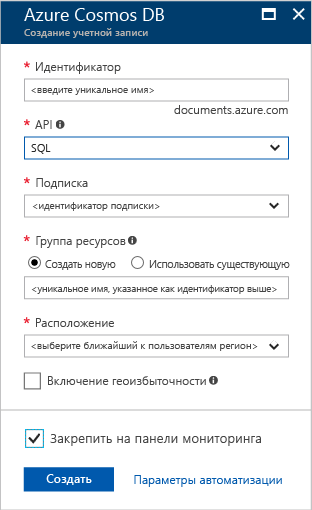

1. В новом окне войдите на [портал Azure](https://portal.azure.com/).
2. В области слева щелкните **Создать**, выберите **Базы данных**, а затем — **Azure Cosmos DB**.
   
   

3. В колонке **Новая учетная запись** укажите необходимую конфигурацию учетной записи Azure Cosmos DB. 

    C помощью Azure Cosmos DB можно выбрать одну из четырех моделей программирования: Gremlin (граф), MongoDB, SQL (DocumentDB) и таблица (ключ — значение). 
    
    В этом кратком руководстве мы будем программировать API DocumentDB. Поэтому, заполняя форму, выберите **SQL (DocumentDB)**. Но при наличии данных графа для приложения социальных сетей, данных таблицы или данных типа "ключ — значение", а также данных, перемещенных из приложения MongoDB, учтите, что Azure Cosmos DB может предоставить высокодоступную глобально распределенную платформу службы базы данных для всех критически важных приложений.

    Заполните поля колонки **Новая учетная запись**, используя сведения на снимке экрана для справки. При настройке учетной записи выберите уникальные значения, чтобы они не соответствовали снимку экрана. 
 
    

    Настройка|Рекомендуемое значение|Описание
    ---|---|---
    ИД|*Уникальное значение*|Уникальное имя, идентифицирующее учетную запись Azure Cosmos DB. Строка *documents.azure.com* добавляется к указанному идентификатору для создания URI. Поэтому используйте уникальный, но узнаваемый идентификатор. В идентификаторе должны использоваться только строчные буквы, цифры и знак дефиса (-). Длина идентификатора должна составлять от 3 до 50 символов.
    API|SQL (DocumentDB)|Мы будем программировать [API DocumentDB](../articles/documentdb/documentdb-introduction.md) далее в этой статье.|
    Подписка|*Ваша подписка*|Подписка Azure, которую вы хотите использовать для учетной записи Azure Cosmos DB. 
    Группа ресурсов|*То же значение, что и для идентификатора*|Новое имя группы ресурсов для учетной записи. Для удобства можно использовать то же имя, которое присвоено идентификатору. 
    Расположение|*Ближайший к пользователям регион*|Географическое расположение, в котором будет размещена учетная запись Azure Cosmos DB. Выберите ближайшее к пользователям расположение, чтобы предоставить им быстрый доступ к данным.
4. Щелкните **Создать** , чтобы создать учетную запись.
5. В верхней области на панели инструментов щелкните **Уведомления**, чтобы отслеживать процесс развертывания.

    

6.  После завершения развертывания откройте новую учетную запись с помощью плитки **Все ресурсы**. 

    
 
