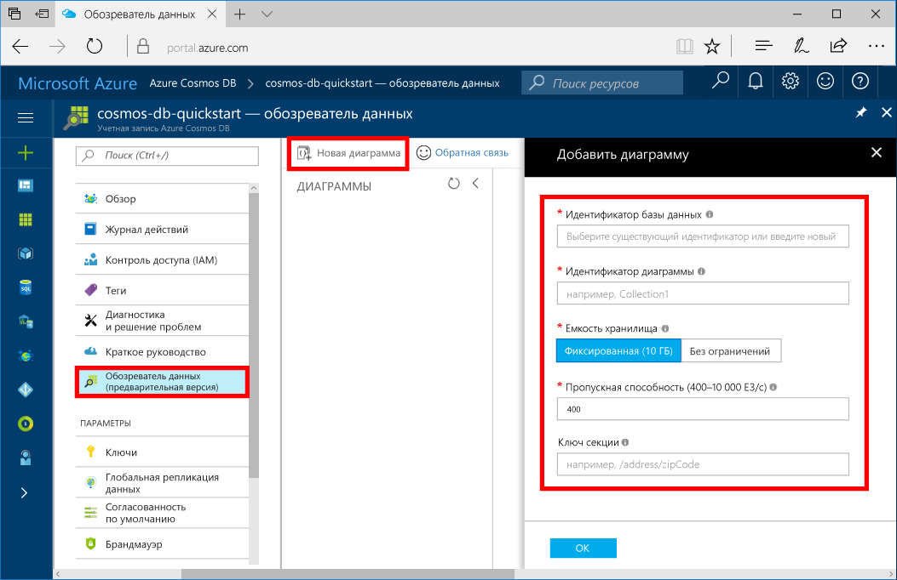

Теперь вы можете использовать обозреватель данных на портале Azure для создания базы данных графов. 

1. На портале Azure в меню слева щелкните **Обозреватель данных (предварительная версия)**.

2. В разделе **Обозреватель данных (предварительная версия)** выберите **Создать граф**. Затем заполните страницу, используя следующие сведения:

    

    Настройка|Рекомендуемое значение|Описание
    ---|---|---
    Идентификатор базы данных|sample-database|Введите имя новой базы данных, например *sample-database*. Имя базы данных может включать от 1 до 255 символов и не может содержать `/ \ # ?` или пробел.
    Идентификатор графа|sample-graph|Введите имя новой коллекции, например *sample-graph*. Для имен графов предусмотрены те же требования к символам, что и для идентификаторов баз данных.
    Емкость хранилища| 10 ГБ|Оставьте значение по умолчанию. Это емкость хранилища базы данных.
    Пропускная способность|400 ЕЗ|Оставьте значение по умолчанию. Вы можете увеличить масштаб пропускной способности позже, если необходимо уменьшить задержку.
    Ключ секции|/firstName|Ключ секции, который равномерно распределяет данные в каждой секции. Для создания высокопроизводительного графа важно выбрать правильный ключ раздела. Дополнительные сведения см. в [руководстве по секционированию](../articles/cosmos-db/partition-data.md#designing-for-partitioning).

3. После заполнения формы нажмите кнопку **ОК**.
