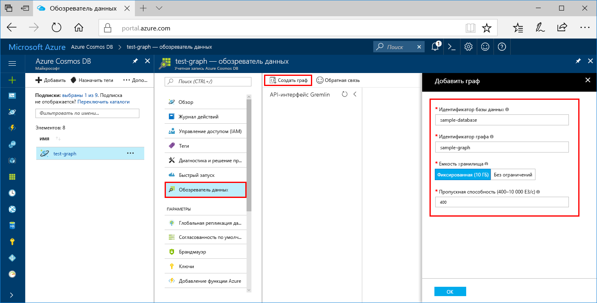

Теперь вы можете использовать обозреватель данных на портале Azure для создания базы данных графов. 

1. Щелкните **Обозреватель данных** > **Новый граф**.

    Справа отобразится область **Добавление графа** (вам может потребоваться прокрутить вправо, чтобы увидеть ее).

    

2. На странице **Добавление графа** введите параметры для нового графа.

    Параметр|Рекомендуемое значение|ОПИСАНИЕ
    ---|---|---
    Идентификатор базы данных|sample-database|Введите имя новой базы данных, например *sample-database*. Имя базы данных может иметь длину от 1 до 255 символов и не может содержать `/ \ # ?` или пробел.
    Идентификатор графа|sample-graph|Введите имя новой коллекции, например *sample-graph*. Для имен графов предусмотрены те же требования к символам, что и для идентификаторов баз данных.
    Емкость хранилища|Фиксированный (10 ГБ)|Оставьте значение по умолчанию — **Fixed (10 GB)** (Фиксированный (10 ГБ)). Это значение представляет емкость хранилища базы данных.
    Throughput|400 ЕЗ|Укажите для пропускной способности 400 единиц запросов в секунду. Чтобы сократить задержку, позже вы можете увеличить масштаб пропускной способности.

3. После заполнения формы нажмите кнопку **ОК**.
