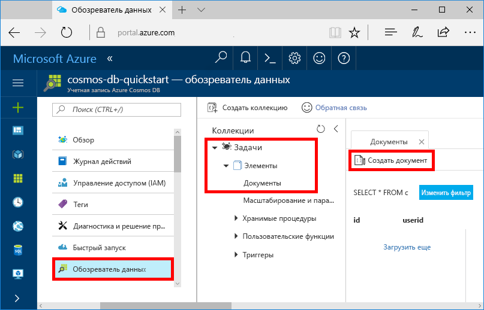
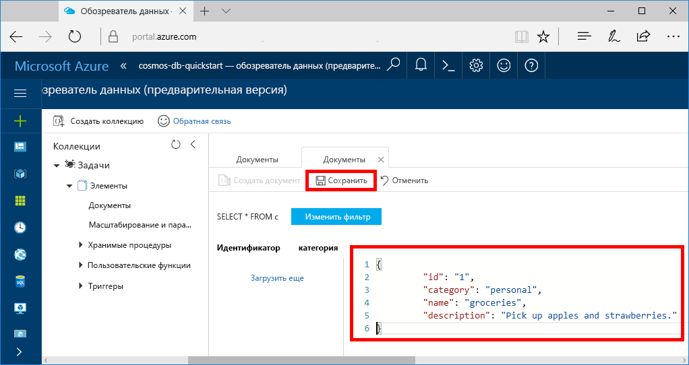

Теперь вы можете добавить данные в новую коллекцию с помощью обозревателя данных.

1. В обозревателе данных новая база данных отображается в области "Коллекции". Разверните базу данных **Задачи** и коллекцию **Элементы**, выберите **Документы**, а затем щелкните **Новые документы**. 

   
  
2. Теперь можно добавить документ в коллекцию со следующей структурой:

     ```json
     {
         "id": "1",
         "category": "personal",
         "name": "groceries",
         "description": "Pick up apples and strawberries.",
         "isComplete": false
     }
     ```

3. Добавив данные JSON на вкладке **Документы**, щелкните **Сохранить**.

    

4.  Создайте и сохраните один или несколько документов, задав уникальное значение для свойства `id`, и измените другие свойства по своему усмотрению. Новые документы могут иметь любую структуру, так как Azure Cosmos DB не устанавливает определенные схемы данных.