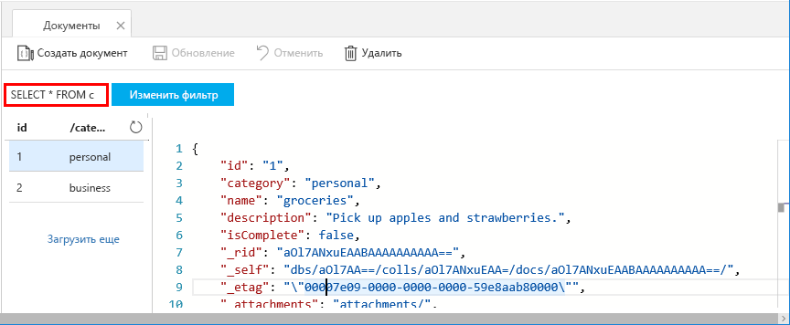
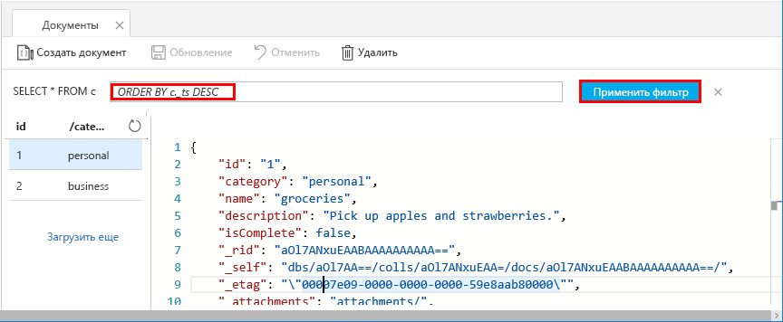

Теперь вы можете применить запросы в обозревателе данных для получения и фильтрации данных.

1. Как вы видите, по умолчанию выбран запрос `SELECT * FROM c`. Этот запрос по умолчанию извлекает и отображает все документы в коллекции. 

    

2. Оставайтесь на вкладке **Документы**. Чтобы изменить запрос, нажмите кнопку **Изменить фильтр** и добавьте `ORDER BY c._ts DESC` в поле предиката запроса, а затем выберите действие **Применить фильтр**.

    

Новый запрос перечисляет все документы в порядке убывания метки времени, поэтому теперь первым в списке будет второй документ. Если вы знакомы с синтаксисом SQL, используйте в этом поле любой поддерживаемый [SQL-запрос](../articles/cosmos-db/sql-api-sql-query.md). 

На этом мы завершим работу с обозревателем данных. Прежде чем продолжить работу с кодом, мы хотим напомнить вам вот о чем. В обозревателе данных вы можете создавать хранимые процедуры, триггеры и определяемые пользователем функции, чтобы реализовать бизнес-логику на стороне сервера и масштабировать пропускную способность. Это средство позволяет использовать все встроенные возможности программного доступа к данным, доступные в API-интерфейсах, к которым вы можете быстро получить доступ на портале Azure.