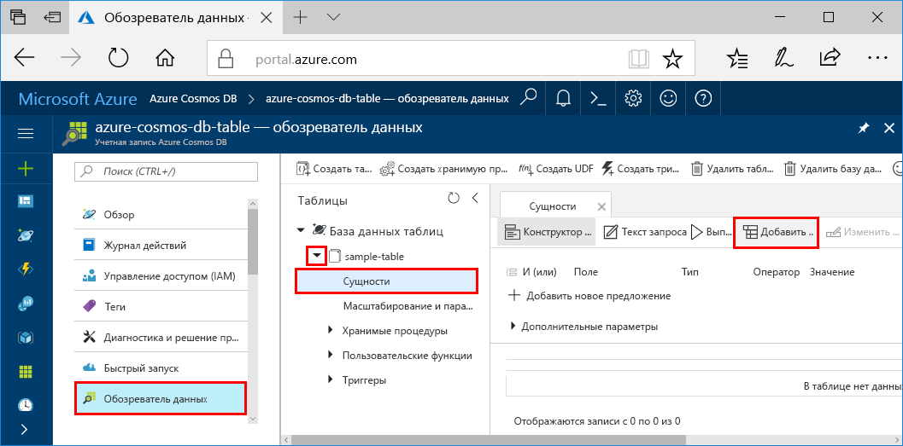
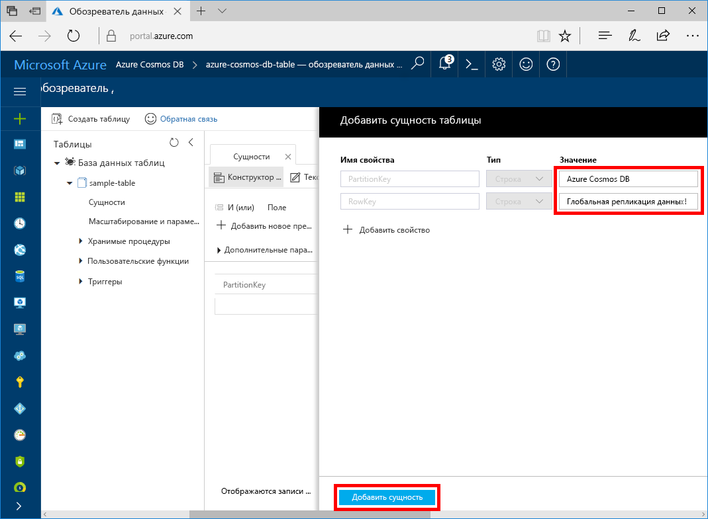

Теперь вы можете добавить данные в созданную таблицу с помощью обозревателя данных.

1. В обозревателе данных разверните **пример таблицы**, затем щелкните **Сущности** и нажмите кнопку **Добавление сущности**.

   
2. Теперь добавьте данные в поля значений свойств PartitionKey и RowKey, а затем нажмите кнопку **Добавление сущности**.

   
  
    Теперь вы можете добавить больше сущностей в свою таблицу, изменить эти сущности или выполнить запрос данных в обозревателе данных. В обозревателе данных вы можете масштабировать пропускную способность, а также добавлять хранимые процедуры, определенные пользователем функции и триггеры в свою таблицу.