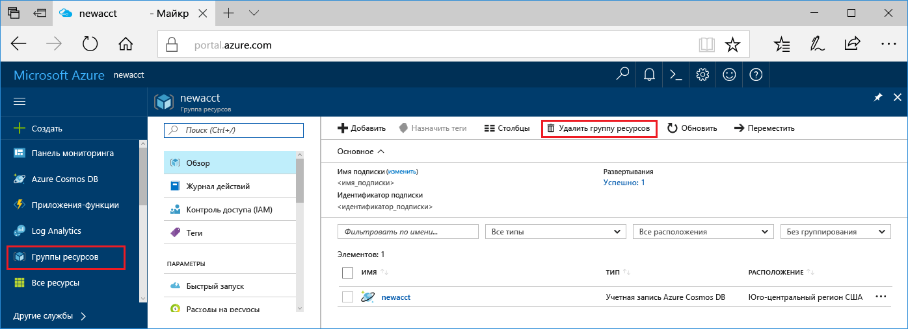

Если вы не собираетесь использовать это приложение дальше, удалите все ресурсы, созданные в ходе работы с этим кратким руководством, чтобы не оплачивать их.

1. Выберите **Группы ресурсов** и щелкните **Удалить группу ресурсов**. 

   

2. Введите имя группы ресурсов, которую требуется удалить, затем щелкните **Удалить**.

