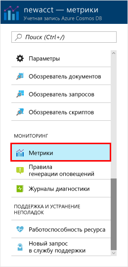
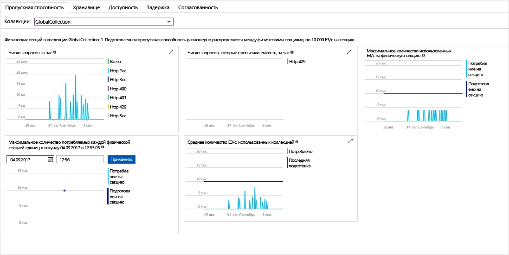

На портале Azure можно отслеживать показатели пропускной способности и ресурсов хранилища, а также уровни доступности, задержки и согласованности ресурсов учетной записи. Кратко рассмотрим эти показатели. 

1. Щелкните **Метрики** в меню переходов.

   

2. Ознакомьтесь с метриками, предоставляемыми Azure Cosmos DB, переходя между вкладками. 

    Каждая диаграмма, связанная с [соглашениями об уровне обслуживания Azure Cosmos DB](https://azure.microsoft.com/support/legal/sla/cosmos-db/), включает строку со сведениями о нарушениях требований соглашения об уровне обслуживания. Предоставляя этот набор метрик, Azure Cosmos DB делает мониторинг выполнения требований прозрачным. 

   