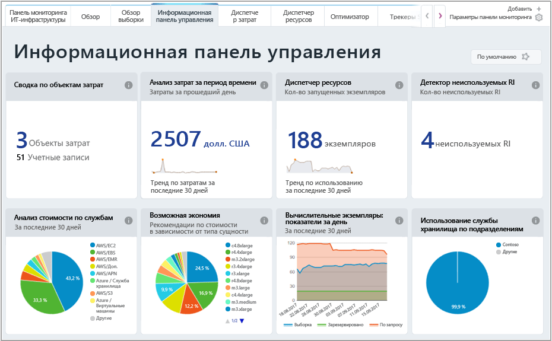
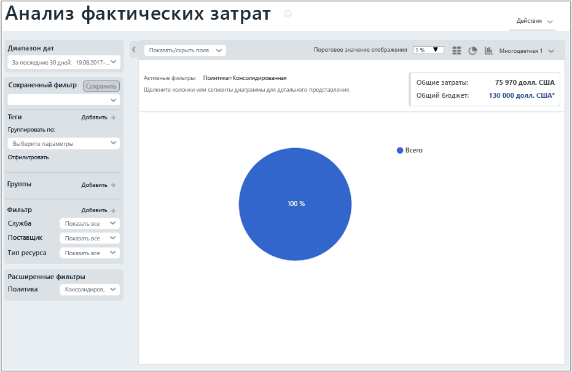
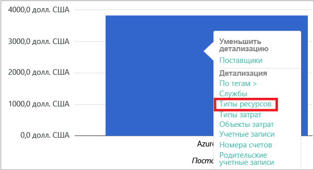
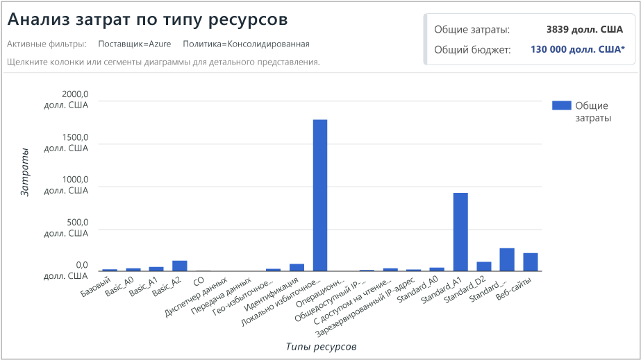
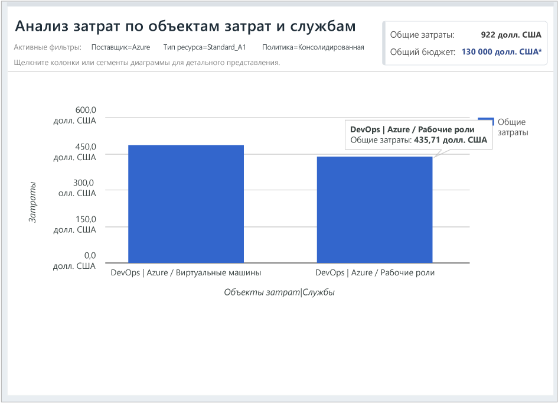

## Просмотр данных о затратах

Служба управления затратами Azure от Cloudyn предоставляет доступ ко всем данным ресурсов в облаке. Среди отчетов на панели мониторинга вы можете увидеть стандартные и настраиваемые отчеты в представлении с вкладками. Ниже приведены примеры распространенных представлений панелей мониторинга и отчетов с актуальными данными о затратах.

В этом примере на панели мониторинга для управления показаны объединенные затраты компании Contoso по всем облачным ресурсам. Contoso использует Azure, AWS и Google. Панели мониторинга содержат краткие сведения и позволяют быстро переходить к отчетам.  

Если вы не уверены в предназначении отчета на панели мониторинга, наведите указатель мыши на символ **i**, чтобы просмотреть объяснение. Щелкните любой отчет на панели мониторинга, чтобы просмотреть его полностью.

Отчеты также можно просматривать с помощью меню отчетов в верхней части портала. Давайте посмотрим, сколько средств потратила компания Contoso на ресурсы Azure за последние 30 дней. Выберите **Cost** > **Cost Analysis** > **Actual Cost Analysis** (Затраты > Анализ затрат > Анализ фактических затрат). Удалите все значения, заданные для тегов, групп или фильтров в отчете.

В этом примере сумма общих затрат составляет 75 970 $, а бюджет — 130 000 $.

Теперь давайте изменим формат отчета и зададим группы и фильтры, чтобы ограничить результаты для затрат Azure. В поле **Date Range** (Диапазон дат) выберите Last 30 days (Последние 30 дней). В правом верхнем углу щелкните значок столбца, чтобы отформатировать отчет как линейчатую диаграмму, а в разделе Groups (Группы) выберите **Provider** (Поставщик). Затем для параметра **Provider** (Поставщик) установите фильтр **Azure**.

В этом примере общая сумма затрат на ресурсы Azure за последние 30 дней составляет 3839 $.

Щелкните правой кнопкой мыши столбец поставщика (Azure) и выберите детализацию до **типов ресурсов**.

На следующем рисунке показаны затраты компании Contoso на ресурсы Azure. Общая сумма составляет 3839 $. В этом примере приблизительно половина затрат приходится на локально избыточное хранилище, а другая половина — на различные экземпляры виртуальных машин.

Щелкните тип ресурса правой кнопкой мыши и выберите **Cost Entities** (Сущности затрат), чтобы просмотреть сущности затрат и службы, которые потребляют ресурс. В этом примере затраты на потребление службами виртуальных машин и рабочих ролей в DevOps составляют 486,60 $ и 435,71 $. Общая сума затрат — 922 $.

Руководство по просмотру данных выставления счетов за использование облака см. в видео [Analyzing your cloud billing data with Azure Cost Management by Cloudyn](https://youtu.be/G0pvI3iLH-Y) (Анализ данных выставления счетов за использование облака с помощью службы управления затратами Azure от Cloudyn).
