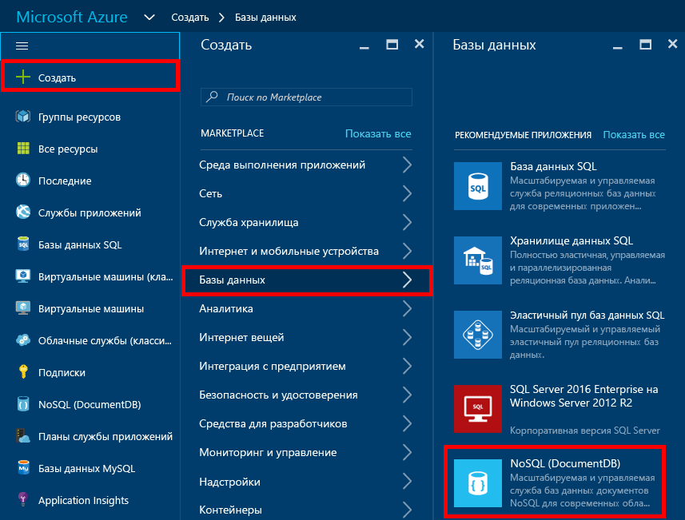
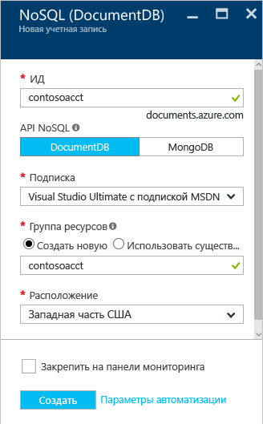
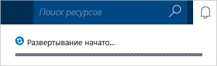
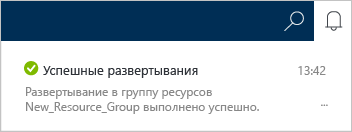
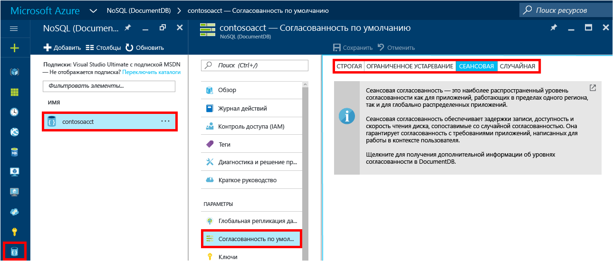

1. В новом окне войдите на [портал Azure](https://portal.azure.com/).
2. На навигационной панели щелкните **Создать**, выберите **Базы данных**, а затем щелкните **NoSQL (DocumentDB)**.
   
     
3. В колонке **Создание учетной записи** укажите желаемую конфигурацию учетной записи DocumentDB.
   
    
   
   * В поле **Идентификатор** введите имя для идентификации учетной записи DocumentDB.  После успешной проверки **идентификатора** в поле **Идентификатор** отображается зеленая галочка. Значение **идентификатора** становится именем узла в универсальном коде ресурса (URI). В **идентификаторе** могут использоваться только строчные буквы, цифры и знак "-". Его длина должна быть от 3 до 50 знаков. Обратите внимание, что к выбранному имени конечной точки добавляется *documents.azure.com*. Итоговое полное имя будет использоваться в качестве имени конечной точки вашей учетной записи DocumentDB.
   * В поле **NoSQL API** выберите **DocumentDB**.  
   * В поле **Подписка**выберите подписку Azure, которую требуется использовать для учетной записи DocumentDB. Если ваша учетная запись включает только одну подписку, эта учетная запись будет выбрана по умолчанию.
   * В разделе **Группа ресурсов** выберите или создайте группу ресурсов для вашей учетной записи DocumentDB.  По умолчанию будет создана новая группа ресурсов. Дополнительные сведения см. в статье [Управление ресурсами Azure с помощью портала Azure](../articles/azure-portal/resource-group-portal.md).
   * В поле **Расположение** укажите географическое расположение, где будет размещена учетная запись DocumentDB. 
4. После настройки параметров DocumentDB нажмите кнопку **Создать**. Чтобы узнать о состоянии развертывания, просмотрите информацию в центре уведомлений.  
   
     
   
   
5. После создания учетной записи DocumentDB она готова для использования с параметрами по умолчанию. Чтобы просмотреть параметры по умолчанию, щелкните значок **NoSQL (DocumentDB)** на навигационной панели, выберите новую учетную запись и щелкните **Согласованность по умолчанию** в меню ресурсов.

     

   Согласованность учетной записи DocumentDB по умолчанию настроена на уровне **сеанса**.  Согласованность по умолчанию можно изменить, выбрав один из доступных вариантов согласованности. Дополнительные сведения об уровнях согласованности в DocumentDB см. в статье [Уровни согласованности в DocumentDB](../articles/documentdb/documentdb-consistency-levels.md).

[How to: Create a DocumentDB account]: #Howto
[Next steps]: #NextSteps
[documentdb-manage]:../articles/documentdb/documentdb-manage.md

<!--HONumber=Jan17_HO1-->

