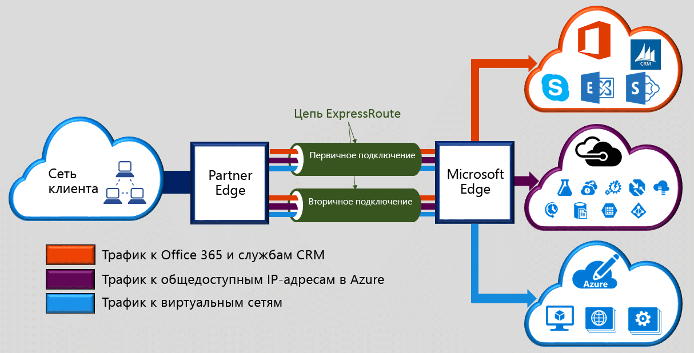

Microsoft Azure ExpressRoute позволяет переносить локальные сети в облако Microsoft по выделенному закрытому соединению, которое обеспечивается поставщиком услуг подключения. ExpressRoute позволяет устанавливать подключения к облачным службам Майкрософт, таким как Microsoft Azure, Office 365 и CRM Online. Это может быть подключение типа "любой к любому" (IP VPN), подключение Ethernet типа "точка-точка" или виртуальное кросс-подключение через поставщика услуг подключения на совместно используемом сервере. Подключения ExpressRoute не проходят через общедоступный Интернет. Это обеспечивает повышенный уровень безопасности, надежности и быстродействия подключений ExpressRoute и более низкий уровень задержки по сравнению с типовыми подключениями через Интернет.  

<!--HONumber=Jan17_HO1-->

