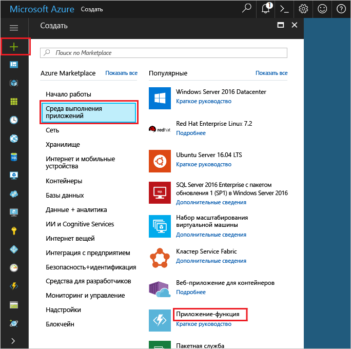

1. Щелкните **Создать** в верхнем левом углу портала Azure.

1. Щелкните **Среда выполнения приложений** > **Приложение-функция**. Затем используйте настройки приложения-функции, указанные в таблице.

    

    | Настройка      | Рекомендуемое значение  | Описание                                        |
    | ------------ |  ------- | -------------------------------------------------- |
    | **Имя приложения** | Глобально уникальное имя | Имя, которое идентифицирует ваше новое приложение-функцию. Допустимые символы: `a-z`, `0-9` и `-`.  | 
    | **Подписка** | Ваша подписка | Подписка, в которой будет создано приложение-функция. | 
    | **[Группа ресурсов](../articles/azure-resource-manager/resource-group-overview.md)** |  myResourceGroup | Имя новой группы ресурсов, в которой создается приложение-функция. | 
    | **[План размещения](../articles/azure-functions/functions-scale.md)** |   План потребления | План размещения, который определяет выделение ресурсов в приложении-функции. В **плане потребления** по умолчанию ресурсы добавляются динамически в соответствии с потребностями функций. Вы платите только за время выполнения функций.   |
    | **Расположение** | Западная Европа | Выберите ближайшее расположение или расположение рядом с другими службами, к которому будут получать доступ ваши функции. |
    | **[Учетная запись хранения](../articles/storage/common/storage-create-storage-account.md#create-a-storage-account)** |  Глобально уникальное имя |  Имя учетной записи хранения, используемой вашим приложением-функцией. Имя учетной записи хранения должно содержать от 3 до 24 символов и состоять только из цифр и строчных букв. Вы также можете использовать имеющуюся учетную запись. |

1. Щелкните **Создать** , чтобы подготовить и развернуть новое приложение-функцию.
