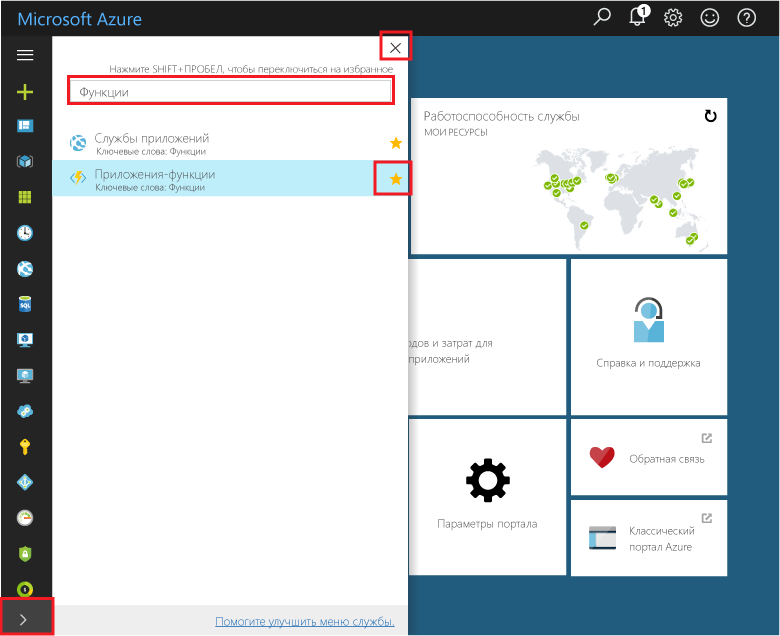

## Избранные функции на портале 

Добавьте приложения-функции в "Избранное" на портале Azure, если вы еще этого не сделали. Это облегчает поиск приложения-функции. Если вы уже сделали это, перейдите к следующему разделу. 

1. Войдите на [портал Azure](https://portal.azure.com/).

2. Щелкните стрелку в нижнем левом углу, чтобы развернуть все службы, введите `Functions` в поле **Фильтр**, а затем щелкните звездочку рядом с пунктом **Приложения-функции**.  
 
    

    При этом значок Функций добавится в меню слева на портале.

3. Закройте меню, а затем прокрутите вниз, чтобы увидеть значок функции. Щелкните этот значок, чтобы просмотреть список всех приложений-функций. Щелкните приложение-функцию для работы с функциями в этом приложении. 
 
    
 
     