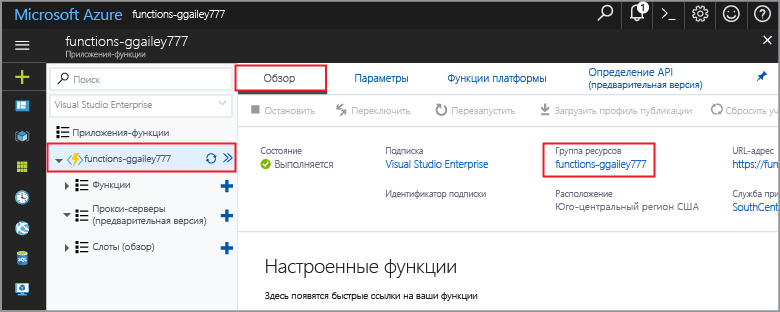

Другие краткие руководства в этой коллекции созданы на основе этого документа. Если вы планируете работать с последующими краткими руководствами или с любыми службами, созданными при работе с этим руководством, не очищайте ресурсы.

Под *ресурсами* в Azure подразумеваются приложения-функции, функции, учетные записи хранения и т. д. Они объединяются в *группы ресурсов*, при удалении которых удаляются и все данные в них. 

Вы создали ресурсы для завершения этих кратких руководств. Вам могут быть выставлены счета за эти ресурсы в зависимости от [состояния учетной записи](https://azure.microsoft.com/account/) и [цен на службы](https://azure.microsoft.com/pricing/). Если вам больше не нужны ресурсы, их можно удалить следующим образом:

1. На портале Azure перейдите на страницу **Resource group** (Группа ресурсов). 

   Чтобы перейти на эту страницу со страницы приложения-функции, выберите вкладку **Обзор**, а затем выберите ссылку в разделе **Resource group** (Группа ресурсов).

   

   Чтобы перейти на эту страницу с панели управления, выберите **Resource groups** (Группы ресурсов), а затем выберите группу ресурсов, которая использовалась в этом кратком руководстве.

2. На странице **Resource group** (Группа ресурсов) просмотрите список включенных ресурсов и убедитесь, что именно их требуется удалить.
 
3. Выберите **Удалить группу ресурсов** и следуйте инструкциям.

   Удаление может занять несколько минут. После этого на несколько секунд появится уведомление. Кроме того, можно выбрать значок колокольчика в верхней части страницы, чтобы просмотреть уведомление.
