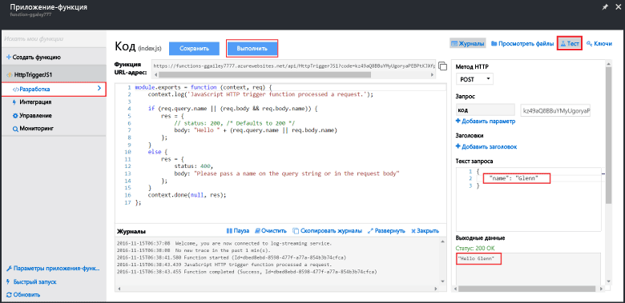

Так как при быстрой настройке функций Azure используется функциональный код, вы можете протестировать функцию сразу же.

1. На вкладке **Разработка** откройте окно **Код** и убедитесь, что этот код Node.js ожидает HTTP-запрос со значением свойства *name*, передаваемым либо в тексте сообщения, либо в строке запроса. При выполнении функции это значение возвращается в сообщении с ответом.
   
2. Щелкните **Тестировать**, чтобы отобразилась встроенная область тестового HTTP-запроса для функции.
 
    

3. В текстовом поле **Текст запроса** измените значение свойства *name* и щелкните **Запуск**. Вы видите, что выполнение активируется HTTP-запросом, данные записываются в журналы, а ответ "hello..." отображается в окне **выходных данных**. 

4. Чтобы запустить выполнение этой же функции в средстве тестирования HTTP или в другом окне браузера, скопируйте **URL-адрес функции** на вкладке **Разработка** и вставьте его в средстве или в адресной строке браузера. Добавьте значение строки запроса `&name=yourname` в URL-адрес и выполните запрос. Обратите внимание, что в журналы записывается та же информация, а текст ответного сообщения содержит аналогичную строку.

    

<!--HONumber=Feb17_HO2-->

