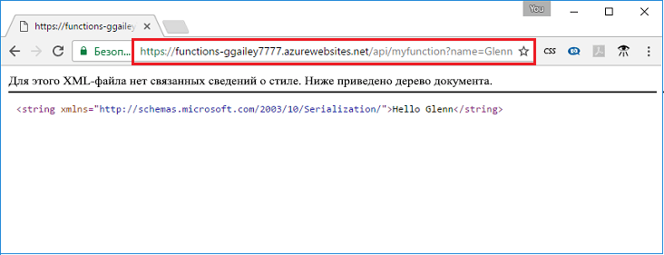

## <a name="test"></a>Проверка функции

Используйте cURL, чтобы проверить развернутую функцию на компьютере Mac или Linux, или Bash для компьютера с Windows. Выполните следующую команду cURL, заменив заполнитель `<app_name>` именем вашего приложения-функции. Добавьте строку запроса `&name=<yourname>` к URL-адресу.

```bash
curl http://<app_name>.azurewebsites.net/api/HttpTriggerJS1?name=<yourname>
```  

  

Если у вас нет доступного cURL в командной строке, введите тот же URL-адрес в адресной строке браузера. Еще раз замените заполнитель `<app_name>` именем приложения-функции, добавьте строку запроса `&name=<yourname>` к URL-адресу и выполните запрос. 

    http://<app_name>.azurewebsites.net/api/HttpTriggerJS1?name=<yourname>
   
  
