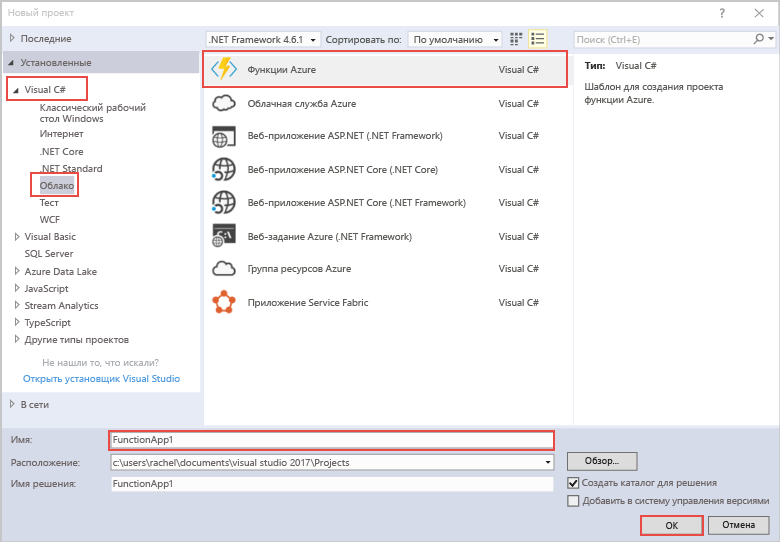
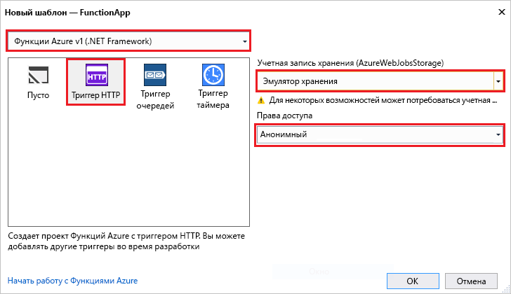

С помощью шаблона проекта функций Azure в Visual Studio можно создать проект, который затем можно опубликовать в приложении-функции в Azure. Приложение-функция позволяет группировать функции в логические единицы для развертывания и совместного использования ресурсов, а также управления ими.

1. В Visual Studio в меню **Файл** выберите **Создать** > **Проект**.

2. В диалоговом окне **Новый проект** выберите **Установленные**, разверните узел **Visual C#** > **Облако**, выберите **Функции Azure**, укажите **имя** проекта и нажмите кнопку **ОК**. Имя приложения-функции должно быть допустимым в качестве пространства имен C#, поэтому не используйте символы подчеркивания, дефисы и другие символы, не являющиеся буквенно-цифровыми.

    

3. Используйте настройки, указанные в таблице под изображением.

     

    | Параметр      | Рекомендуемое значение  | ОПИСАНИЕ                      |
    | ------------ |  ------- |----------------------------------------- |
    | **Версия** | Функции Azure v1  (.NET Framework) | Создает проект функции, для которого используется среда выполнения версии 1 решения "Функции Azure". Среда выполнения версии 2, которая поддерживает .NET Core, сейчас доступна в предварительной версии. Дополнительные сведения см. в статье [Выбор целевых версий среды выполнения Функций Azure](../articles/azure-functions/functions-versions.md).   |
    | **Шаблон** | Триггер HTTP | Создает функцию, которая активируется с помощью HTTP-запроса. |
    | **Учетная запись хранения**  | Эмулятор хранения | Триггер HTTP не использует подключение к учетной записи хранения. Для всех триггеров других типов требуется допустимая строка подключения к учетной записи хранения. |
    | **Права доступа** | Анонимные | Создаваемую функцию может активировать любой клиент без указания ключа. Этот параметр авторизации позволяет легко тестировать новые функции. Дополнительные сведения о ключах и авторизации см. в разделе [Ключи авторизации](../articles/azure-functions/functions-bindings-http-webhook.md#authorization-keys) статьи [Привязки HTTP и webhook в функциях Azure](../articles/azure-functions/functions-bindings-http-webhook.md). |
4. Нажмите кнопку **ОК**, чтобы создать проект функции и функцию, активируемую с помощью HTTP.

