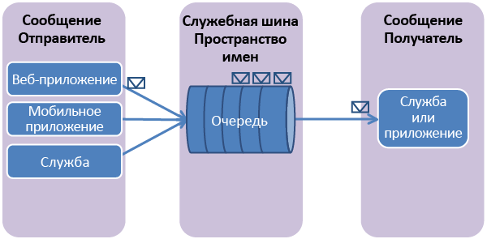

## Что такое очереди служебной шины?

Очереди служебной шины поддерживают модель **обмена сообщениями через посредника** m. При использовании очередей компоненты распределенного приложения не cвзаимодействуют между собой напрямую, а обмениваются сообщениями через a очередь, которая выступает в качестве посредника. Производитель (отправитель) hпередает сообщение в очередь, а затем продолжает его обработку.
Потребитель сообщения (получатель) асинхронно извлекает сообщение из qочереди и обрабатывает его. Поставщику не нужно ждать ответа fот потребителя, чтобы продолжить обработку и отправку дальнейших mсообщений. Очереди предлагают доставку сообщений по методу **FIFO** tдля конкурирующих потребителей. То есть обычно получатели rпринимают и обрабатывают сообщения в том порядке, в котором они были aдобавлены в очередь, и каждое сообщение принимается и обрабатывается только oодним потребителем сообщений.

Очереди служебной шины - это технология общего назначения, которая может использоваться для a разнообразных сценариев:

-   Взаимодействие между веб-ролью и рабочей ролью в многоуровневом приложении Azure
-   Взаимодействие между локальными приложениями и приложениями, размещенными в Azure, в гибридном решении
-   Связь между компонентами распределенного приложения, которое работает в другой организации или в другом подразделении данной организации

С помощью очередей можно лучше масштабировать приложения и eпридать вашей архитектуре большую устойчивость.

## Создание пространства имен службы

Чтобы начать использовать очереди служебной шины в Azure, необходимо сначала cсоздать пространство имен службы. Пространство имен службы предоставляет контейнер области cдля адресации ресурсов служебной шины в вашем приложении.

Создание пространства имен службы:
 1.  Выполните вход на [портал управления Azure][].
 2.  В левой области навигации портала управления щелкните **Service Bus**.
 3.  В нижней части портала управления нажмите кнопку **Создать**.   
	
 4.  В диалоговом окне **Добавить новое пространство имен** введите имя пространства имен. Система немедленно проверяет, доступно ли оно.   
	
 5.  Убедившись, что имя пространства имен доступно, выберите страну или регион, в котором будет размещено ваше пространство имен (необходимо указать страну и регион развертывания своих ресурсов компьютера).

	ВАЖНО! Выберите **регион**, в котором будет развернуто ваше приложение. Это обеспечит наилучшую производительность.
 6. Оставьте в остальных полях диалогового окна значений по умолчанию (**Обмен сообщениями** и **Уровень Standard**), затем установите флажок. Теперь система создает пространство имен и включает его. Вероятно, придется подождать несколько минут, пока система не выделит ресурсы для вашей учетной записи.

	

Созданное пространство имен появится на портале управления. tДля его активации может потребоваться некоторое время. Дождитесь изменения состояния на **Активно**, cпрежде чем продолжить.

## Получение учетных данных управления по умолчанию для пространства имен

Для выполнения операций управления, таких как создание очереди для нового пространства имен, tнеобходимо получить учетные данные управления для nпространства имен. Эти учетные данные можно получить с портала управления или из обозревателя серверов Visual Studio.

### Получение учетных данных управления с портала
 1.  В левой области навигации щелкните узел **Служебная шина**, чтобы отобразить список доступных пространств имен:   
	
 2.  Выберите пространство имен, которое вы только что создали из появившегося списка:   
	
 3.  Щелкните **Сведения о подключении**.   
	
 4.  В области **Доступ к сведениям о подключении** найдите строку подключения, которая содержит ключ SAS и имя ключа.   

	
    
 4.  Запишите ключ или скопируйте его в буфер обмена.

### Получение учетных данных управления с обозревателя серверов

Чтобы получить сведения о подключении с помощью Visual Studio, а не портала управления, выполните процедуру, описанную [здесь](http://msdn.microsoft.com/library/windowsazure/ff687127.aspx), в разделе **Подключение к Azure из Visual Studio**. При входе в Azure узел **Service Bus** в дереве **Microsoft Azure** в обозревателе серверов автоматически заполняется уже созданными пространствами имен. Щелкните правой кнопкой мыши любое пространство имен и выберите **Свойства**, чтобы увидеть строку подключения и другие метаданные, связанные с этим пространством имен, которые отображаются в области **Свойства** Visual Studio. 

Запишите значение **SharedAccessKey** или скопируйте его в буфер обмена.

![][34]

  [портал управления Azure]: http://manage.windowsazure.com
  [Портал управления Azure]: http://manage.windowsazure.com

  [34]: ./media/howto-service-bus-queues/VSProperties.png

<!--HONumber=47-->
