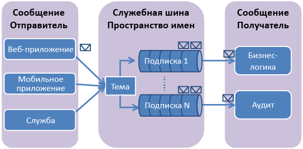

## Общая информация о разделах и подписках служебной шины

Разделы и подписки служебной шины поддерживают модель обмена сообщениями *публикации/подписки*. При использовании разделов и подписок компоненты распределенного приложения не взаимодействуют между собой напрямую, а обмениваются сообщениями через раздел, который выступает в качестве посредника.

В отличие от очередей служебной шины, где каждое сообщение обрабатывается одним потребителем, разделы и подписки предоставляют вид связи одного со многими с помощью шаблона публикации/подписки. Можно зарегистрировать несколько подписок на раздел. Когда сообщение отправляется в раздел, оно затем может обрабатываться независимо каждой подпиской.

Раздел подписки напоминает виртуальную очередь, которая получает копии сообщений, отправленных в раздел. Вы можете зарегистрировать правила фильтрации для раздела на основе подписки, которые позволят указать, какие сообщения и от каких подписок могут быть получены разделом.

Разделы и подписки Service Bus обеспечивают возможность масштабирования для обработки очень большого количества сообщений для очень большого количества пользователей и приложений.

## Создание пространства имен службы

Чтобы начать использование разделов и подписок служебной шины в Azure, необходимо сначала создать пространство имен службы. Это пространство имен службы предоставляет контейнер для адресации ресурсов служебной шины в вашем приложении.

Создание пространства имен службы:

1.  Выполните вход на [портал управления Azure][].

2.  В левой области навигации портала управления нажмите кнопку **Service Bus**.

3.  В нижней части портала управления нажмите кнопку **Создать**. ![][0]

4.  В диалоговом окне**Добавление нового пространства имен** введите имя пространства имен. Система немедленно проверит, доступно ли это имя. ![][2]

5.  Убедившись, что имя пространства имен доступно, выберите страну или регион, где будет размещено ваше пространство имен (необходимо указать страну и регион развертывания своих вычислительных ресурсов).

	ВАЖНО! Выберите **тот же регион**, который собираетесь выбрать для развертывания приложения. Это обеспечит наилучшую производительность.

6. 	Оставьте в остальных полях диалогового окна значения по умолчанию (**Обмен сообщениями** и **Уровень Standard**), а затем щелкните значок галочки. Теперь система создает пространство имен службы и включает его. Возможно, вам придется подождать несколько минут, пока система выделит ресурсы для вашей учетной записи.

	![][6]

## Получение учетных данных управления по умолчанию для пространства имен

Для выполнения операций управления, таких как создание раздела или подписки в новом пространстве имен, необходимо получить учетные данные управления для пространства имен. Эти учетные данные можно получить с портала управления Azure или из обозревателя серверов Visual Studio.

### Получение учетных данных управления с портала

1.  В левой области навигации щелкните узел **Служебная шина**, чтобы отобразить список доступных пространств имен: ![][0]

2.  Выберите пространство имен, которое вы только что создали, из появившегося списка: ![][3]

3.  Щелкните **Сведения о подключении**. ![][4]

4.  В диалоговом окне **Сведения по доступу к подключению** найдите строку подключения, которая содержит ключ SAS и имя ключа. Запишите эти значения, они понадобятся вам в дальнейшем для выполнения операций с пространством имен.

### Получение учетных данных управления с обозревателя серверов

Чтобы получить сведения о подключении с помощью Visual Studio, а не портала управления, выполните процедуру, описанную [здесь](http://msdn.microsoft.com/library/azure/ff687127.aspx), в разделе **Подключение к Azure из Visual Studio**. При входе в Azure узел **служебной шины** в дереве **Azure** в обозревателе серверов автоматически заполняется уже созданными пространствами имен. Щелкните правой кнопкой мыши любое пространство имен и выберите **Свойства**, чтобы увидеть строку подключения и другие метаданные, связанные с этим пространством имен, которые отображаются в области **Свойства** Visual Studio.

Запишите значение **SharedAccessKey** или скопируйте его в буфер обмена.

![][34]

 
  [портал управления Azure]: http://manage.windowsazure.com
  [0]: ./media/howto-service-bus-topics/sb-queues-13.png
  [2]: ./media/howto-service-bus-topics/sb-queues-04.png
  [3]: ./media/howto-service-bus-topics/sb-queues-09.png
  [4]: ./media/howto-service-bus-topics/sb-queues-06.png
  
  [6]: ./media/howto-service-bus-topics/getting-started-multi-tier-27.png
  [34]: ./media/howto-service-bus-topics/VSProperties.png

<!---HONumber=August15_HO6-->