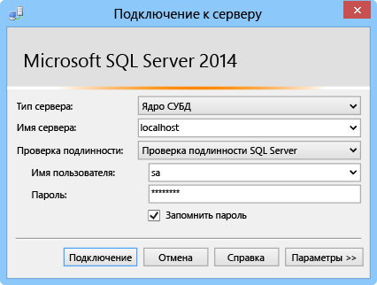

В этом разделе показано, как установить SQL Server Express, включить TCP/IP, задать статический порт и создать базу данных, используемую для гибридных подключений.

### Установка SQL Server Express
Для использования локальной базы данных SQL Server или SQL Server Express с помощью гибридного подключения в статическом порте должен быть включен протокол TCP/IP. Экземпляры SQL Server по умолчанию используют статический порт 1433, а именованные экземпляры не используют этот порт. По этой причине мы установим экземпляр по умолчанию. Если экземпляр SQL Server Express уже установлен по умолчанию, этот раздел можно пропустить.

1. Чтобы установить SQL Server Express, запустите скачанный файл **SQLEXPRWT\_x64\_ENU.exe** или **SQLEXPR\_x86\_ENU.exe**. Появится мастер центра установки SQL Server.
2. Нажмите кнопку **Создать изолированную установку SQL Server или добавить компоненты к существующему экземпляру** и следуйте инструкциям, принимая значения по умолчанию и параметры, пока вы не попадете на страницу **Конфигурация экземпляров**.
3. На странице **Конфигурация экземпляров** выберите **Экземпляр по умолчанию** и примите параметры по умолчанию на странице **Конфигурация сервера**.
   
   > [!NOTE]
   > Если экземпляр SQL Server уже установлен по умолчанию, можно перейти к следующему разделу и использовать этот экземпляр для гибридных подключений.
   > 
   > 
4. На странице **Конфигурация модуля базы данных** в разделе **Режим проверки подлинности** выберите **Смешанный режим (проверка подлинности SQL Server и Windows)** и укажите надежный пароль встроенной учетной записи администратора **sa**.
   
    В этом учебнике вы будете использовать проверку подлинности SQL Server. Убедитесь, что запомнили указанный пароль, поскольку он понадобится вам позже.
5. Завершите работу инструкции мастера, чтобы завершить установку.

### Включение TCP/IP и определение статического порта
В этом разделе для включения TCP/IP и определения статического IP-адреса используется диспетчер конфигурации SQL Server, установленный при установке SQL Server Express.

1. Выполните действия, описанные в разделе [Включение протокола сети TCP/IP для SQL Server](http://technet.microsoft.com/library/hh231672%28v=sql.110%29.aspx), чтобы активировать доступ TCP/IP к экземпляру.
2. (Необязательно) Если не удается использовать экземпляр по умолчанию, выполните действия, описанные в разделе [Конфигурация сервера для прослушивания определенного TCP-порта ](https://msdn.microsoft.com/library/ms177440.aspx), чтобы присвоить статический порт экземпляру. По завершении этого действия вы сможете подключиться с помощью нового заданного порта вместо порта 1433.
3. (Необязательно) При необходимости добавьте в брандмауэре исключения, чтобы разрешить удаленный доступ к процессу SQL Server (sqlservr.exe).

### Создание новой базы данных в локальном экземпляре SQL Server
1. В SQL Server Management Studio подключитесь к установленному SQL Server. (Если диалоговое окно **Подключение к серверу** не появляется автоматически, перейдите к **обозревателю объектов** на левой панели, щелкните **Подключение**, а затем щелкните **Ядро СУБД**.)     
   
    
   
    В качестве **типа сервера** выберите **модуль базы данных**. В качестве **имени сервера** можно использовать **localhost** или имя компьютера, где установлен SQL Server. Выберите **Проверка подлинности SQL Server** и укажите пароль для созданного ранее имени пользователя sa.
2. Чтобы создать новую базу данных, используя SQL Server Management Studio, щелкните правой кнопкой мыши **Базы данных** в обозревателе сервера, а затем нажмите кнопку **Создать базу данных**.
3. В диалоговом окне **Новая база данных** введите `OnPremisesDB`, а затем щелкните **OK**.
4. Если развернуть в обозревателе объектов **Базы данных**, вы увидите, что была создана новая база данных.

### Создание нового имени входа SQL Server и задание разрешений
В конце создается новое имя входа SQL Server с ограниченными разрешениями. Служба Azure подключится к локальному экземпляру SQL Server с помощью этого имени входа, а не встроенного имени пользователя входа sa, у которого есть все разрешения на сервере.

1. В обозревателе объектов SQL Server Management Studio щелкните правой кнопкой мыши базу данных **OnPremisesDB** и выберите **Создать запрос**.
2. Вставьте следующий запрос TSQL в окно запроса.
   
       USE [master]
       GO
   
       /* Replace the PASSWORD in the following statement with a secure password. 
          If you save this script, make sure that you secure the file to 
          securely maintain the password. */ 
       CREATE LOGIN [HybridConnectionLogin] WITH PASSWORD=N'<**secure_password**>', 
           DEFAULT_DATABASE=[OnPremisesDB], DEFAULT_LANGUAGE=[us_english], 
           CHECK_EXPIRATION=OFF, CHECK_POLICY=ON
       GO
   
       USE [OnPremisesDB]
       GO
   
       CREATE USER [HybridConnectionLogin] FOR LOGIN [HybridConnectionLogin] 
       WITH DEFAULT_SCHEMA=[dbo]
       GO
   
       GRANT CONNECT TO [HybridConnectionLogin]
       GRANT CREATE TABLE TO [HybridConnectionLogin]
       GRANT CREATE SCHEMA TO [HybridConnectionLogin]
       GO  
3. В приведенном выше сценарии замените строку `<**secure_password**>` на надежный пароль для нового имени *HybridConnectionsLogin*.
4. **Выполните** запрос, чтобы создать новое имя входа и предоставить необходимые разрешения в локальных базах данных.

<!---HONumber=Oct15_HO3-->