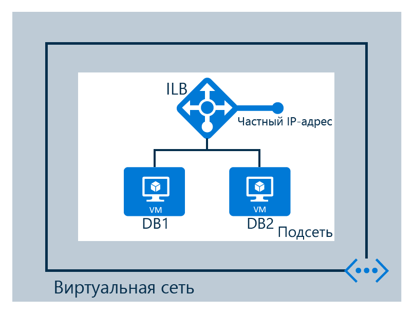

## Сценарий

Внутренний балансировщик нагрузки создается в соответствии со следующим сценарием

Внутренний балансировщик нагрузки настроен в виртуальной сети 
- 2 виртуальные машины с названием DB1 и DB2  
- конечные точки   
- внутренний балансировщик нагрузки .

<!-----HONumber=AcomDC_1223_2015-->
