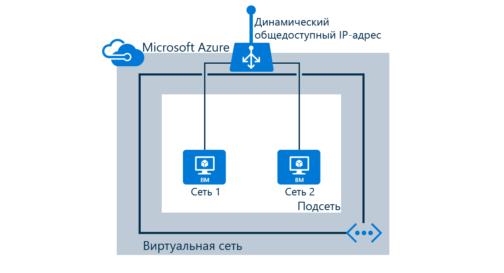

В этом сценарии будут выполняться следующие задачи:

* Создание балансировщика нагрузки, принимающего сетевой трафик через порт 80 и отправляющего трафик с балансировкой нагрузки на виртуальные машины web1 и web2.
* Создание правил NAT для доступа к виртуальным машинам, управляемым балансировщиком нагрузки, через удаленный рабочий стол или SSH.
* Создание проб работоспособности

