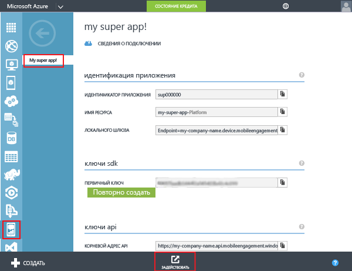
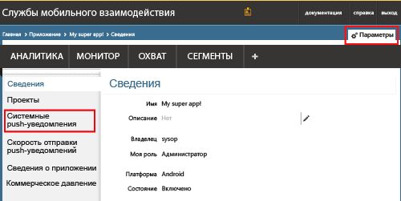
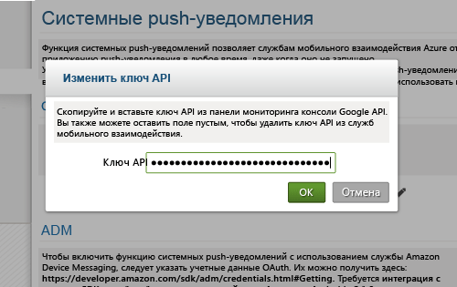
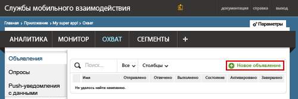
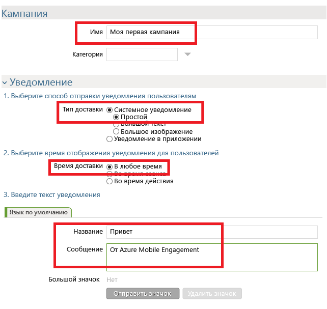
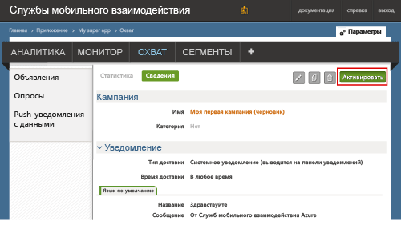

### Предоставление Mobile Engagement доступа к ключу API GCM
Чтобы разрешить службе Mobile Engagement отправлять push-уведомления от вашего имени, необходимо предоставить ей доступ к ключу API. Это можно сделать, настроив и введя ключ в портал Mobile Engagement.

1. На портале Azure войдите в приложение, которое используется для этого проекта, и нажмите кнопку **Выполнить охват** внизу страницы.
   
    
2. Затем последовательно выберите **Параметры** -> **Системное push-уведомление**, чтобы ввести ключ GCM.
   
    
3. В разделе **Параметры GCM** возле элемента **Ключ API** щелкните значок **правки**, как показано ниже:
   
    
4. Во всплывающем окне вставьте ключ сервера GCM, полученный ранее, и нажмите кнопку **Ok**.
   
    

## Отправка уведомления в приложение
Теперь мы создадим простую кампанию push-уведомлений, которая будет отправлять push-уведомления в приложение.

1. Перейдите на вкладку **РЕКЛАМНАЯ КАМПАНИЯ** на портале Mobile Engagement.
2. Щелкните **Создать объявление** , чтобы создать кампанию push-уведомлений.
   
    
3. Выполните следующие шаги, чтобы настроить первое поле кампании:
   
    
   
    а. Присвойте имя кампании.
   
    b. Выберите для параметра **Тип доставки** значение *Системное уведомление -> Простое*. Это простой тип push-уведомлений Android, в состав которых входит заголовок и небольшая строка текста.
   
    c. Выберите для параметра **Время доставки** значение *Любое время* , чтобы приложение могло принимать уведомления независимо от того, запущено оно или нет.
   
    d. В тексте уведомления введите **заголовок**, который будет отображаться в push-уведомлении полужирным шрифтом.
   
    д. Затем введите текст **сообщения**
4. Прокрутите окно вниз и в разделе **содержимого** выберите пункт **Только уведомления**.
   
    
5. Вы настроили простейшую базовую кампанию. Теперь прокрутите окно вниз и нажмите кнопку **Создать** , чтобы сохранить кампанию.
6. Затем щелкните **Активировать** , чтобы активировать кампанию и начать отправку push-уведомлений.
   
    

<!--HONumber=Nov16_HO2-->

