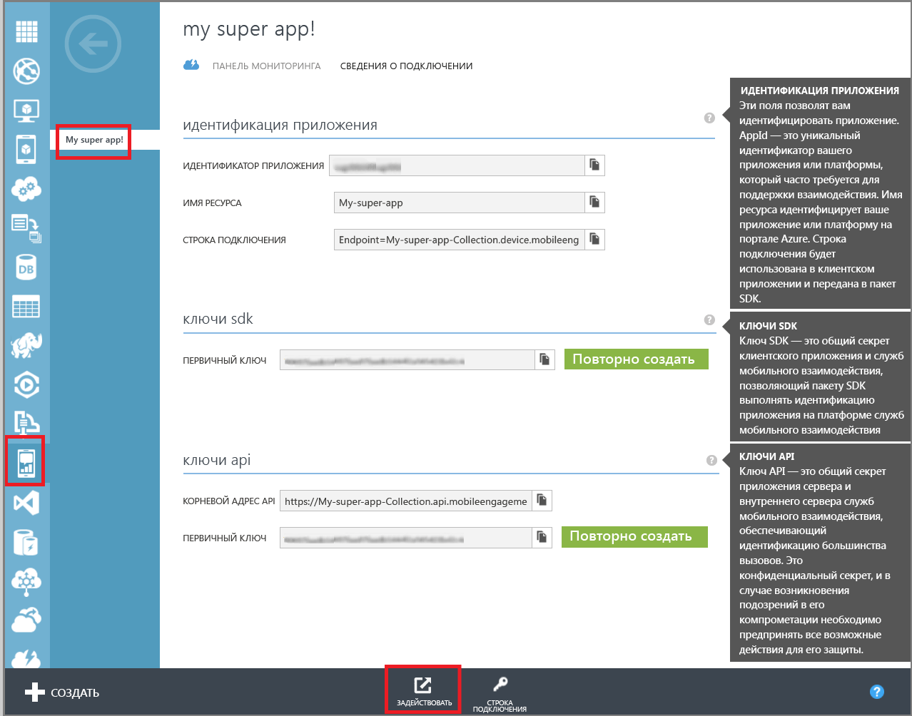
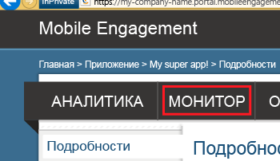

В этом разделе показано, как настроить приложение, чтобы оно подключалось к серверной части Mobile Engagement с помощью функции мониторинга в реальном времени.

1. Перейдите на портал Mobile Engagement. Убедитесь, что вы используете требуемое приложение для этого проекта, и нажмите кнопку **Выполнить охват** внизу.

	 

2. Вы попадете на портал Mobile Engagement. Щелкните вкладку **Монитор**.
	 
	

3. Здесь будут показаны все устройства в режиме реального времени, на которых будет запущено приложение.
	 
4. Запустите приложение в эмуляторе (симуляторе) или на подключенном устройстве. Вы увидите один сеанс в мониторе, если интеграция выполнена правильно, то есть теперь приложение подключено к серверной части Mobile Engagement и отправляет в нее данные.
	
	 

<!---HONumber=Oct15_HO1-->