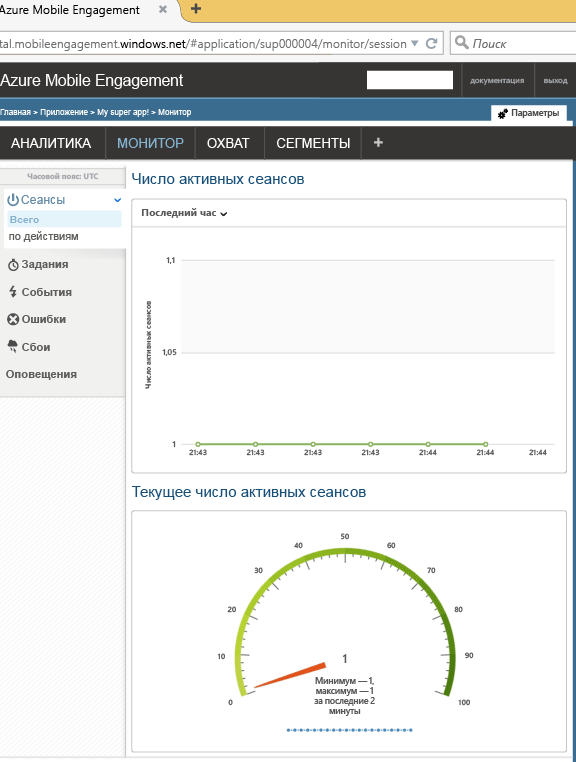

В этом разделе показано, как подключить приложение к серверной части Служб мобильного взаимодействия с помощью функции мониторинга в реальном времени. 

1. Выберите в своей учетной записи **Служб мобильного взаимодействия Azure** приложение, которое хотите отслеживать и которым нужно управлять на портале **Служб мобильного взаимодействия**. Перейдите на портал Служб мобильного взаимодействия, щелкнув внизу кнопку **Выполнить охват**. 
   
     
2. Вы попадете на портал Служб мобильного взаимодействия. Если вкладка **Монитор**не выбрана, щелкните ее.
3. Здесь будут показаны все устройства в режиме реального времени, на которых будет запущено приложение.
4. Теперь запустите приложение. Вы увидите один сеанс в мониторе, если интеграция выполнена правильно, то есть теперь приложение подключено к серверной части Служб мобильного взаимодействия и отправляет в нее данные.  
   
     

